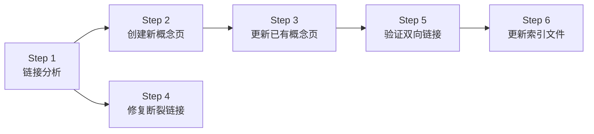
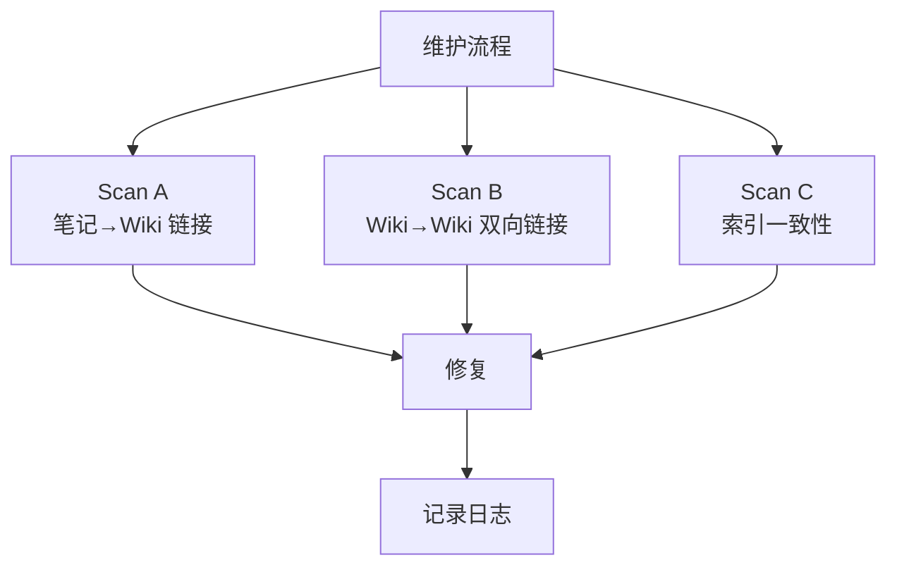
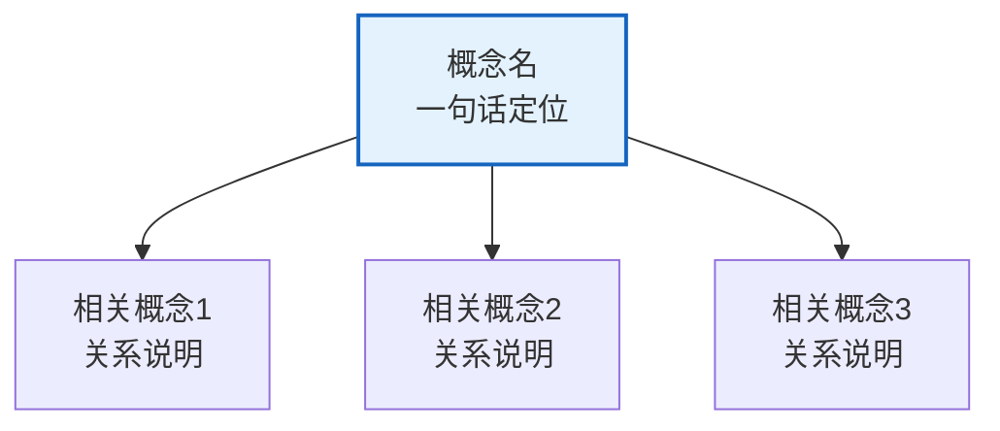

# 知识库架构规范

> [!abstract] 概览
> 本文件是知识库的"宪法"，定义了目录结构、文件类型、命名规则、标签体系、操作流程与格式规范等核心规范。任何结构调整都必须先更新此文件，并在 [[Wiki/log]] 中记录 `restructure` 操作。
>
> **第一部分**（架构定义）：目录结构、文件类型、命名规则、标签体系
> **第二部分**（操作流程与格式规范）：Learn/Ingest/Maintenance 三大工作流、笔记/概念页/对比页格式规范、别名策略、双向链接规则、经验教训

---

# 第一部分：架构定义

## 四层内容模型

```
┌─────────────────────────────────────────────────┐
│  导航层（Navigation）                             │
│  Content/index.md — 首页，课程入口                │
│  Wiki/index.md   — 多学科 Wiki 总目录             │
├─────────────────────────────────────────────────┤
│  Wiki 层（Knowledge Synthesis）                   │
│  {学科}/concepts/ — 跨章节核心概念提炼             │
│  {学科}/theorems/ — 重要定理独立页面               │
│  {学科}/comparisons/ — 跨概念对比分析              │
│  {学科}/queries/ — 常问问题与深度解答              │
├─────────────────────────────────────────────────┤
│  笔记层（Raw Notes）                              │
│  {学科}/notes/   — 按章节组织的学习笔记            │
│  {学科}/canvas/  — 可视化知识图谱                  │
└─────────────────────────────────────────────────┘
```

---

## 目录结构

```
Content/
├── index.md                  # 首页 — 课程导航
├── Wiki/                     # 全局元数据（不含学科内容）
│   ├── SCHEMA.md             # 架构规范定义（本文件）
│   ├── index.md              # 多学科 Wiki 总目录
│   ├── log.md                # 操作日志（append-only）
│   └── health/               # Lint 健康报告
│       └── YYYY-MM-DD.md
│
├── {学科}/
│   ├── index.md              # 学科知识库总览
│   ├── concepts/             # 核心概念页
│   ├── theorems/             # 重要定理页
│   ├── comparisons/          # 跨概念对比分析
│   ├── queries/              # 常问问题与深度解答
│   ├── notes/                # 章节笔记
│   │   ├── 第01章 {章标题}/  # 补零排序
│   │   │   ├── NA 节标题.md
│   │   │   └── 第01章 {章标题} — 章节汇总.md
│   │   └── ...
│   └── canvas/               # 可视化图谱
│       ├── 第01章 {章标题}/
│       │   └── NA 节标题.canvas
│       └── ...
│
├── _assets/                  # 全局静态资源
└── _templates/               # 笔记模板
```

---

## 文件类型与定位

| 类型 | 粒度 | 核心功能 | 创建时机 | 目录 |
|:-----|:-----|:---------|:---------|:-----|
| 节笔记 | 1节 | 知识点完整记录 | 学完每节后 | `notes/` |
| 章节汇总 | 1章 | 章级复习 | 学完每章后 | `notes/` |
| 全书路线 | 全书 | 全局视角 | 全书学完后 | `notes/` |
| Canvas | 1节 | 可视化图谱 | 与节笔记同步 | `canvas/` |
| 概念页 | 跨章节 | 核心概念提炼 | Ingest 时 | `concepts/` |
| 定理页 | 跨章节 | 重要定理 | Ingest 时 | `theorems/` |
| 对比页 | 跨概念 | 对比分析 | Ingest 时 | `comparisons/` |
| 常问问题 | 跨章节 | 深度解答 | Query 时 | `queries/` |

---

## 命名规则

| 类型 | 格式 | 示例 |
|:-----|:-----|:-----|
| 节笔记 | `{节号} {节标题}.md` | `7E 奇异值分解.md` |
| 章节汇总 | `第{N}章 {章标题} — 章节汇总.md` | `第3章 线性映射 — 章节汇总.md` |
| 全书路线 | `{书名} 全书学习路线规划.md` | `LADR 全书学习路线规划.md` |
| Canvas | `{节号} {节标题}.canvas` | `7E 奇异值分解.canvas` |
| 概念页(英文) | kebab-case | `vector-space.md` |
| 概念页(中文) | 中文原名 | `随机变量.md` |
| 定理页(英文) | kebab-case | `spectral-theorem.md` |
| 定理页(中文) | 中文原名 | `大数定律.md` |
| 对比页 | `{A}-vs-{B}.md` | `同构-vs-相似.md` |

---

## 关键设计决策

| 决策 | 选择 | 理由 |
|:-----|:-----|:-----|
| Wiki 页面位置 | 各学科目录下 | 学科自包含，便于独立管理和迁移 |
| Wiki/ 目录 | 仅存元数据 | 避免内容与元数据混杂，职责清晰 |
| notes/canvas 分离 | 顶层分离 | 便于批量搜索、备份、链接检查 |
| 章节目录名 | 第0X章 补零 | 解决中文排序问题 |
| Wikilink 策略 | Quartz shortest | 文件移动后链接自动解析 |
| 数学渲染 | KaTeX | 构建时预渲染，加载快 |

---

## Domain 注册表

> [!info] 说明
> 新增学科时在此注册学科域名。

| 学科 | 域名 | 创建日期 | 状态 |
|:-----|:-----|:---------|:-----|
| 离散数学 | `离散数学` | 2026-04-19 | 学习中 |
| 逻辑学 | `逻辑学` | 2026-04-19 | ✅ 已完成 |
| 算法导论 | `算法导论` | 2026-04-21 | 学习中 |

---

## Tag Taxonomy（标签层级）

> [!info] 说明
> 新增学科时在此追加标签层级定义。

```
#学习/{学科}/{子领域}/{关键词}
```

| 学科 | 标签层级 | 示例 |
|:-----|:---------|:-----|
| 离散数学 | `#学习/离散数学/{子领域}/{关键词}` | `#学习/离散数学/逻辑/命题` |
| 逻辑学 | `#学习/逻辑学/{子领域}/{关键词}` | `#学习/逻辑学/谬误/诉诸人身` |
| 算法导论 | `#学习/算法导论/{子领域}/{关键词}` | `#学习/算法导论/排序/快速排序` |

---

## 新增学科流程（7 步）

> [!tip] 宏观 vs 微观
> 本流程是==宏观层面==的学科初始化流程。具体到每一章的 Learn → Ingest → Maintenance 操作，参见第二部分的三大工作流。

1. **创建学科目录**：`Content/{学科名}/` 及其子目录（concepts/、theorems/、comparisons/、queries/、notes/、canvas/）
2. **编写学科 index.md**：参照 [[_templates/学科首页模板]]
3. **导入/编写章节笔记**：存放到 `notes/` 目录下
4. **提炼 Wiki 页面（Ingest）**：从笔记中识别跨章节概念，创建 Wiki 页面
5. **更新 Wiki Index**：在 [[Wiki/index]] 中新增学科 section
6. **更新 SCHEMA**：更新本文件的 Domain、Tag Taxonomy、Directory Structure
7. **更新首页 + 记录日志**：在 [[index]] 中增加学科入口，在 [[Wiki/log]] 中 append `init` 记录

---
---

# 第二部分：操作流程与格式规范

> [!info] 来源
> 以下内容从 14 章（104 篇笔记 + 92 个 Wiki 页面）的真实构建经验中提炼，适用于任何基于本架构的学科知识库。

---

## 章节学习流程（Learn Workflow）

> [!abstract] 概览
> 每章的学习遵循固定的 7 步流程：PDF 提取 → 并行子代理笔记生成 → 格式验证 → 修复跨笔记链接 → 章节汇总 → 更新学科索引 → 更新学习路线。


### Step 1：PDF 内容提取

- 从 `00-Raw素材/{学科}/` 提取本章所有小节 PDF 的文本内容
- 记录每节的内容长度（行数），用于 Step 2 的负载均衡

### Step 2：并行子代理笔记生成

- 根据内容长度将小节分配给 2-3 个子代理，确保负载均衡
- 每个子代理的 prompt 必须包含：
  - 标杆文件路径（如 `Content/逻辑学/notes/第10章_谓词逻辑/10.6 无效性证明.md`）
  - 负责的小节编号
  - 输出目录路径
  - 格式要求（参见 [[#笔记格式规范（11 段式标杆）]]）
- 详见 [[#子代理并行策略]]

### Step 3：格式验证

- 以标杆文件的 11 段式结构为基准，逐项验证每篇笔记
- 验证清单：

| # | 检查项 | 要求 |
|:--|:-------|:-----|
| 1 | frontmatter 完整性 | 10 个字段（title, book, chapter, section, author, translator, tags, aliases, date, cssclasses） |
| 2 | 相关笔记链接 | `[[前节]] \| [[后节]]` 格式，目标文件存在 |
| 3 | [!abstract] 概览 | 存在且含 `==高亮==` 核心术语 + 4-6 个要点列表 |
| 4 | mermaid 知识结构图 | `graph TB` 或 `graph LR`，节点使用中文 |
| 5 | 核心思想 callouts | 含 `[!tip]`/`[!def]`/`[!example]` |
| 6 | 补充理解 ×2 | `[!info]` callout，含学术来源（作者+年份+URL） |
| 7 | 易混淆点 ×2 | `[!warning]` callout，含 ❌→✅ 对比 |
| 8 | 习题概览 | 表格格式 `| 题号 \| 核心考点 \| 难度 \|` |
| 9 | 视频资源 | 表格格式 `| 资源 \| 链接 \| 对应内容 \| 备注 \|` |
| 10 | [!quote] 教材原文 | 引用教材关键段落 |
| 11 | 参见 Wiki | wikilinks 到相关概念页 |

### Step 4：修复跨笔记链接

- 检查所有 `[[N.M 节标题]]` 链接，确认目标文件实际存在
- 常见问题：PDF 节标题 ≠ 笔记文件名
  - 例：`[[12.1 因果联系]]` → 实际文件名 `12.1 原因与结果.md`
- 修复方法：使用别名语法 `[[实际文件名|显示名称]]`
  - 例：`[[12.1 原因与结果|12.1 因果联系]]`

### Step 5：章节汇总

- 创建 `第{N}章_{章标题}-章节汇总.md`
- 内容包括：全章知识框架、各节核心知识点汇总、学习脉络、跨章关联、复习题、笔记索引

### Step 6：更新学科索引

- 更新 `{学科}/index.md`：已学章节+1、笔记数+N、本章状态→已完成

### Step 7：更新学习路线

- 更新 `学习路线 v0.1.md`：追加本章微型学习单元并标记为已完成

---

## 知识编译流程（Ingest Workflow）

> [!abstract] 概览
> 每章学习完成后，执行 6 步知识编译流程，将笔记中的知识点提炼为跨章节的 Wiki 概念页和对比页，并建立双向链接网络。



### Step 1：链接分析

- 扫描本章所有笔记中的 `[[...]]` 链接
- 分类为三类：

| 类型 | 含义 | 后续动作 |
|:-----|:-----|:---------|
| 已有链接 | 目标概念页已存在 | → Step 3 |
| 断裂链接 | 目标文件不存在 | → Step 4 |
| 跨笔记链接 | 指向同章其他笔记 | → 确认正确性 |

### Step 2：创建新概念页

- 从笔记中识别本章核心概念
- 判断标准（详见 [[#别名链接策略]]）：
  - ✅ 创建新概念页：核心章节概念（占一节以上篇幅）、在 2+ 章节出现的概念
  - ❌ 使用别名链接：顺带提及的概念、替代名称
- 概念页格式参见 [[#概念页格式规范]]
- 对比页格式参见 [[#对比页格式规范]]

### Step 3：更新已有概念页

- 对每个已被本章讨论的已有概念页，追加 `### 第N章：{章标题}` 子节
- 在子节中补充本章对该概念的新讨论内容
- 更新 frontmatter 中的 `related` 字段（如有新关联概念）

### Step 4：修复断裂链接

- 使用别名语法 `[[实际文件名|显示名称]]` 修复
- 常见场景：

| 场景 | 示例 | 修复方式 |
|:-----|:-----|:---------|
| 概念别名 | "逻辑类比" | `[[类比推理\|逻辑类比]]` |
| 不同名称 | "因果推理" | `[[因果联系\|因果推理]]` |
| 合并策略 | "肯定前件式/否定后件式" | 并入 `[[推论规则]]` |
| 跨笔记引用 | `[[12.4 密尔五法]]` | `[[12.4 因果分析的方法\|12.4 密尔五法]]` |

### Step 5：验证双向链接

- 对每个概念页的 `related` 字段中的每个条目，检查目标概念页是否也包含反向链接
- 如缺失，在目标概念页的 `related` 字段中追加反向条目
- 详见 [[#双向链接规则]]

### Step 6：更新索引文件

- 同步更新 3 个索引文件，详见 [[#索引更新协议]]

---

## 知识库维护流程（Maintenance Workflow）

> [!abstract] 概览
> 定期执行 3 个并行扫描代理，检查知识库的一致性和完整性。建议每完成 2-3 章后执行一次全面维护。



### Scan A：笔记 → Wiki 链接检查

- 扫描所有笔记文件中的 `## 参见 Wiki` 部分
- 验证每个 `[[概念名]]` 链接是否指向实际存在的概念页
- 输出：断裂链接列表

### Scan B：Wiki → Wiki 双向链接检查

- 扫描所有概念页/对比页的 `related` 字段
- 对每个 `[[target]]` 条目，检查 target 的 `related` 字段是否包含反向链接
- 输出：缺失反向链接的配对列表

### Scan C：索引一致性检查

- 统计 `concepts/`、`comparisons/`、`theorems/`、`queries/` 目录下的实际文件数
- 与 `Wiki/index.md` 中的 Total pages 计数对比
- 与 `{学科}/index.md` 中的 Wiki 页面入口数量对比
- 输出：数量不一致的报告

### 修复流程

1. 根据 Scan A 结果修复断裂链接（别名或创建新概念页）
2. 根据 Scan B 结果补充缺失的双向链接
3. 根据 Scan C 结果修正索引文件中的计数
4. 在 `Wiki/log.md` 中记录 `lint` 或 `fix` 操作

---

## 笔记格式规范（11 段式标杆）

> [!info] 标杆文件
> 格式基准：`Content/逻辑学/notes/第10章_谓词逻辑/10.6 无效性证明.md`

### 完整结构（按顺序）

#### 1. Frontmatter

```yaml
---
title: "{节号} {节标题}"
book: "{书名}（第{N}版）"
chapter: "第{N}章 {章标题}"
section: "{节号}"
author: "{作者}"
translator: "{译者}"
tags:
  - {学科}
  - {子领域}
  - {关键词1}
  - {关键词2}
aliases:
  - "{英文名}"
  - "{别名}"
date: YYYY-MM-DD
cssclasses:
  - wide-page
---
```

#### 2. 相关笔记

```markdown
**相关笔记：** [[前节笔记]] | [[后节笔记]]
```

#### 3. [!abstract] 概览

- 含 `==高亮==` 的核心术语（2-4 个）
- 用无序列表列出本节 4-6 个核心知识点

#### 4. Mermaid 知识结构图

- 使用 `graph TB` 或 `graph LR`
- 节点使用中文，边使用有意义的标签
- 从核心主题分支出 4-6 个子主题

#### 5. 核心思想（多个子节）

- 使用 `[!tip]` 标注核心思想/方法
- 使用 `[!def]` 标注形式化定义（含 LaTeX 公式）
- 使用 `[!example]` 标注示例（含完整推导过程，逐步展示状态变化）
- 使用 `[!warning]` 标注重要提示/常见错误

#### 6. [!info] 补充理解 ×2

每个补充理解必须包含：
- 学术来源（作者+年份+标题+URL）
- 与本节知识的关联说明
- 具体的知识扩展内容

#### 7. [!warning] 易混淆点 ×2

- 格式：`❌ 错误理解` → `✅ 正确理解`
- 含对比表格或详细辨析

#### 8. 习题概览

- 表格格式：`| 题号 | 核心考点 | 难度 |`
- 每题含 `[!faq]-` 折叠解答

#### 9. 视频资源

- 表格格式：`| 资源 | 链接 | 对应内容 | 备注 |`

#### 10. [!quote] 教材原文

- 引用教材中的关键段落
- 标注来源章节

#### 11. 参见 Wiki + 标签

```markdown
## 参见 Wiki

- [[概念名]] — 简要说明关联

#学习/{学科}/{子领域}
```

---

## 概念页格式规范

> [!info] 参考文件
> - 完整示例：`Content/逻辑学/concepts/概率.md`（多章节扩展的复杂概念页）
> - 简洁示例：`Content/逻辑学/concepts/命题.md`（单章节的简洁概念页）

### Frontmatter

```yaml
---
title: "{概念名}"
type: concept
chapter: "{首次出现的章节号}"
tags:
  - {学科}
  - {子领域1}
  - {子领域2}
sources:
  - {来源1}
  - {来源2}
date: YYYY-MM-DD
related:
  - "[[相关概念1]]"
  - "[[相关概念2]]"
---
```

### 正文结构（按顺序）

| # | 章节 | 内容要求 |
|:--|:-----|:---------|
| 1 | `# 概念名` | 一级标题 |
| 2 | `[!abstract] 概述` | 2-4 句话定义核心含义和在知识体系中的地位，含 `==高亮==` |
| 3 | `## 定义` | 使用 `[!def]` callout，含数学公式（如适用） |
| 4 | `## 核心性质` | 表格格式，列出 4-8 个关键性质 |
| 5 | `## 关系网络` | mermaid 图 + 无序列表说明与每个相关概念的关系 |
| 6 | `## 章节扩展` | `### 第N章：{章标题}` 子节，每章补充新内容 |
| 7 | `## 补充` | `[!info]` callouts，含学术来源（作者+年份+URL） |
| 8 | `## 应用`（可选） | 列举实际应用场景 |
| 9 | `## 参见` | 无序列表，每项含 `[[概念名]] — 简要说明` |

### 关系网络 Mermaid 模板



### 章节扩展格式

当概念在多个章节中被讨论时，每个章节追加一个三级子节：

```markdown
## 章节扩展

### 第5章：直言命题

第5章从以下角度讨论了本概念：
- 要点1
- 要点2

### 第8章：命题逻辑Ⅰ

第8章进一步扩展了本概念：
- 要点1
- 要点2
```

---

## 对比页格式规范

> [!info] 参考文件
> `Content/逻辑学/comparisons/演绎论证-vs-归纳论证.md`

### Frontmatter

```yaml
---
title: "{A} vs {B}"
type: comparison
tags:
  - {学科}
  - {标签1}
  - {标签2}
sources:
  - {来源}
date: YYYY-MM-DD
related:
  - "[[概念A]]"
  - "[[概念B]]"
---
```

### 正文结构

| # | 章节 | 内容要求 |
|:--|:-----|:---------|
| 1 | `# {A} vs {B}` | 一级标题 |
| 2 | `[!abstract] 一句话总结` | 用 `==高亮==` 标注最核心的区别 |
| 3 | `## 共同点` | 无序列表 |
| 4 | `## 关键区别` | 表格格式 `\| 维度 \| [[A]] \| [[B]] \|` |
| 5 | `## 深层联系` | `[!info]` callouts，含学术来源+URL |
| 6 | `## 参见` | 无序列表 |

---

## 别名链接策略

> [!abstract] 概览
> 当笔记中提到的概念名称与概念页文件名不一致时，使用 Obsidian 别名语法 `[[实际文件名|显示名称]]` 来创建链接。

### 使用别名链接的场景

| 场景 | 判断标准 | 示例 |
|:-----|:---------|:-----|
| 概念仅被顺带提及 | 不值得创建独立概念页 | "逻辑类比" → `[[类比推理\|逻辑类比]]` |
| 概念有多个名称 | 同一概念的不同叫法 | "因果推理" → `[[因果联系\|因果推理]]` |
| 跨笔记引用 | 显示名称与目标文件名不同 | `[[12.4 因果分析的方法\|12.4 密尔五法]]` |
| 合并策略 | 多个细粒度概念并入主概念页 | "肯定前件式" → `[[推论规则\|肯定前件式]]` |

### 创建新概念页的场景

| 场景 | 判断标准 |
|:-----|:---------|
| 核心章节概念 | 在本章有深度讨论（占一节或以上篇幅） |
| 跨章节概念 | 在 2+ 章节中出现 |
| 独立知识实体 | 有独立的定义、性质、关系网络 |

### 文件命名注意事项

> [!warning] Obsidian 路径分隔符陷阱
> Obsidian 将 `/` 解释为路径分隔符。因此：
> - ❌ `[[A/E/I/O 四种命题]]` — 会被 Obsidian 解析为路径 `A/E/I/O 四种命题`
> - ✅ 文件名中使用 `_` 替代 `/`：`A_E_I_O 四种命题.md`
> - ✅ 或使用别名：`[[A_E_I_O 四种命题\|A/E/I/O 四种命题]]`

---

## 双向链接规则

> [!abstract] 概览
> 每个概念页的 `related` 字段必须与所有目标概念页互相关联。这是知识图谱完整性的核心保障。

### 三条规则

1. **创建新概念页时**：检查 `related` 列表中的每个目标，如果目标尚未包含反向链接，则在目标的 `related` 字段中追加 `[[本概念]]`
2. **更新已有概念页时**：如果新增了 `related` 条目，同步检查并更新所有新关联目标的反向链接
3. **Ingest 完成时**：批量验证本章涉及的所有概念页的双向链接

### 验证方法

- **自动**：使用 Maintenance Workflow 的 Scan B（参见 [[#知识库维护流程（Maintenance Workflow）]]）
- **手动**：对概念页 A 的 `related` 中的每个 B，打开 B 确认 A 也在 B 的 `related` 中

### frontmatter 中的 related 语法

```yaml
related:
  - "[[概念名]]"    # ✅ 使用 [[wikilink]] 语法
  - "概念名"         # ❌ 纯文本不会被 Obsidian 识别为链接
```

### 实际修复统计

| 章节 | 双向链接修复数 |
|:-----|:--------------|
| 第11章 | 7 |
| 第12章 | 2 |
| 第13章 | 4 |
| 第14章 | 5 |
| **合计** | **18** |

---

## 子代理并行策略

> [!abstract] 概览
> 笔记生成阶段使用 2-3 个并行子代理，按内容长度均衡分配小节，提高生成效率。

### 分组原则

1. 统计每节 PDF 的内容行数
2. 将小节按行数从大到小排序
3. 贪心分配：每次将最长的小节分配给当前负载最轻的子代理
4. 目标：各子代理的总行数差异不超过 30%

### 实际案例

| 章节 | 子代理 A | 子代理 B | 子代理 C |
|:-----|:---------|:---------|:---------|
| 第12章 | 12.1+12.2+12.3 (228行) | 12.4 (908行) | 12.5 (373行) |
| 第14章 | 14.1+14.2 (515行) | 14.3 (516行) | — |

### 子代理 Prompt 要素

每个子代理的 prompt 必须包含：

| 要素 | 说明 |
|:-----|:-----|
| 标杆文件路径 | 指向一篇格式完美的笔记作为参考 |
| 小节编号列表 | 明确该子代理负责哪些小节 |
| 输出目录 | 笔记文件的存放位置 |
| 格式要求 | 引用 SCHEMA 中的 [[#笔记格式规范（11 段式标杆）]] |
| 前后节链接 | 告知相邻小节的文件名，用于生成"相关笔记"链接 |

---

## 索引更新协议

> [!abstract] 概览
> 每次 Ingest 操作完成后，必须同步更新 3 个索引文件。这是保持知识库导航一致性的关键步骤。

### 3 个索引文件

#### 1. Wiki/index.md

- 在对应学科的表格中追加新概念页/对比页条目
- 更新 `**Total pages:**` 计数
- 格式：`| [[概念名]] | \`标签1\` \`标签2\` | [[相关1]] [[相关2]] | YYYY-MM-DD |`

#### 2. {学科}/index.md

- 更新 `## Wiki 页面入口` 表格中的数量
- 更新 `## 学习进度` 中的已学章节、笔记数

#### 3. Wiki/log.md

- append 一条操作记录（append-only，禁止修改已有条目）
- 格式模板：

```markdown
## [YYYY-MM-DD] ingest | {学科}·第{N}章 Wiki编译
- 新建 X 个概念页：[[概念1]] [[概念2]] ...
- 新建 Y 个对比页：[[对比1]] [[对比2]] ...
- 更新 Z 个已有概念页（补充第N章内容段落）：[[概念A]] [[概念B]] ...
- 修复 N 个断裂链接：...
- 更新 N 个已有概念页双向链接：...
- 更新 Wiki/index.md（Total pages X→Y、概念页 A→B、对比页 C→D）
- 更新 {学科}/index.md（Wiki页面数 X→Y、概念页 A→B、对比页 C→D）
```

### 一致性验证

| 验证项 | 规则 |
|:-------|:-----|
| Total pages | = 概念页数 + 对比页数 + 定理页数 + 常问问题数 |
| 学科 Wiki 页面数 | = Wiki/index.md 的 Total pages |
| 表格行数 | = 对应目录下的实际文件数 |

---

## 经验教训

> [!warning] 以下是从 14 章 104 篇笔记的构建过程中总结出的实际踩坑记录。

### 工具相关

| 问题 | 教训 |
|:-----|:-----|
| `SearchReplace` 只替换第一个匹配 | 批量替换使用 `sed` 命令而非 SearchReplace 工具 |
| PDF 节标题 ≠ 笔记文件名 | 创建链接前必须验证目标文件的实际文件名 |
| 标签名必须精确匹配 | 如 `#科学与假说` 不是 `#科学方法`，标签是精确字符串匹配 |

### 链接相关

| 问题 | 教训 |
|:-----|:-----|
| `/` 在 wikilink 中被解释为路径 | 文件名中避免 `/`，使用 `_` 替代 |
| `related` 字段语法 | 必须使用 `[["概念名"]]` 格式，不是纯文本 |
| 别名链接格式 | `[[实际文件名\|显示名称]]`，管道符分隔 |
| 跨笔记链接易出错 | 笔记间引用时，显示名称常与实际文件名不一致 |

### 格式相关

| 问题 | 教训 |
|:-----|:-----|
| callout 类型不统一 | 严格使用 Obsidian 标准类型：`[!info]` `[!tip]` `[!warning]` `[!def]` `[!example]` `[!quote]` `[!abstract]` |
| 标题层级不一致 | 笔记正文使用 `##`（二级标题），子节使用 `###`（三级标题） |
| 习题解答格式 | 使用 `[!faq]-` 折叠语法，不用 HTML `<details>` |
| 高亮语法 | 使用 `==文本==`，不用 HTML `<mark>` |

### 流程相关

| 问题 | 教训 |
|:-----|:-----|
| 双向链接遗漏率高 | 每章 Ingest 平均遗漏 3-7 个双向链接，必须系统性检查 |
| 索引计数漂移 | 3 个索引文件必须同步更新，否则导航数据不一致 |
| 概念页 vs 别名的判断 | 核心标准：概念是否在本章有深度讨论（≥1 节篇幅） |

---

## 附录：知识库最终统计（验证基准）

> [!info] 数据截止 2026-04-24

### 算法导论（CLRS 第4版）

| 指标 | 数量 |
|:-----|:-----|
| 节笔记 | 143 |
| 章节汇总 | 35 |
| 概念页 | 148 |
| 定理页 | 26 |
| 对比页 | 13 |
| **Wiki 页面总计** | **187** |
| 已完成章节 | 35 / 35 |

### 离散数学（Rosen）

| 指标 | 数量 |
|:-----|:-----|
| 节笔记 | 96 |
| 章节汇总 | 13 |
| 概念页 | 106 |
| 定理页 | 15 |
| 对比页 | 10 |
| **Wiki 页面总计** | **131** |
| 已完成章节 | 13 / 13 |

### 逻辑学（Copi 第15版）

| 指标 | 数量 |
|:-----|:-----|
| 节笔记 | 104 |
| 章节汇总 | 14 |
| 概念页 | 67 |
| 定理页 | 15 |
| 对比页 | 22 |
| **Wiki 页面总计** | **104** |
| 已完成章节 | 14 / 14 |

### 全局汇总

| 指标 | 数量 |
|:-----|:-----|
| Wiki 页面总计 | **422** |
| 笔记总计 | **343** |
| 维护轮次 | 8 |
| 链接修复累计 | ~1000+ |

#学习/obsidian-quartz/架构规范
