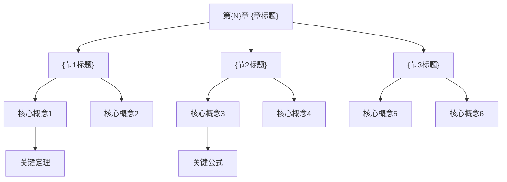

> [!abstract] 概览
> 本章介绍 {一句话概括本章核心内容}。共包含 {节数} 节，核心主题涵盖 {主题1}、{主题2}、{主题3}。

---

## 一、全章知识框架

---

## 二、核心知识点与重点公式汇总

### {节1标题}

> [!def] {核心定义名称}
> {定义内容，使用 LaTeX 公式}

| 性质 | 公式/描述 | 备注 |
|:-----|:----------|:-----|
| 性质1 | $a + b = c$ | 条件：... |
| 性质2 | $f(x) = g(x)$ | 当 $x > 0$ 时 |

> [!tip] {核心定理名称}
> **陈述：** {定理内容}
> **公式：** $\|T\| = \sup_{\|v\|=1} \|Tv\|$

### {节2标题}

> [!def] {核心定义名称}
> {定义内容}

| 公式 | 含义 | 适用条件 |
|:-----|:-----|:---------|
| $\mathbb{E}[X] = \sum x_i p_i$ | 期望值 | 离散随机变量 |
| $\text{Var}(X) = \mathbb{E}[X^2] - (\mathbb{E}[X])^2$ | 方差 | 二阶矩存在 |

---

## 三、章节学习脉络

> [!info] 学习脉络
> 本章的学习逻辑为：
>
> 1. **从{基础概念}到{进阶概念}**：首先引入{基础概念}（{节1}），建立基本框架，然后在此基础上展开{进阶概念}（{节2}）
> 2. **从{理论}到{应用}**：{节3}建立了核心理论，{节4}将其应用于具体问题
> 3. **从{特殊}到{一般}**：先讨论{特殊情况}（{节X}），再推广到{一般情况}（{节Y}）
>
> **学习建议：** {对本章学习顺序和重点的建议}

---

## 四、跨章关联

| 本章概念 | 关联章节 | 关联概念 | 关联类型 | 说明 |
|:---------|:---------|:---------|:---------|:-----|
| {概念A} | 第{M}章 {标题} | [[概念B]] | 前置依赖 | 理解概念A需要先掌握概念B |
| {概念C} | 第{K}章 {标题} | [[概念D]] | 推广关系 | 概念C是概念D在更一般情形下的推广 |
| {概念E} | 第{J}章 {标题} | [[概念F]] | 类比关系 | 两者结构相似，可类比理解 |

> [!info] 关联类型说明
> - **前置依赖**：学习本章某概念需要先掌握其他章节的概念
> - **推广关系**：本章概念是其他章节概念的推广或特殊情况
> - **类比关系**：两个概念结构相似，可互相参照理解
> - **应用关系**：本章概念被其他章节的概念所应用

---

## 五、全章总复习题

点击展开复习题

### 综合题1：{题目标题}

> [!problem] 题目
> {综合题目内容，涉及本章多个知识点}

> [!faq]- 解答
> **[步骤1]** {步骤}
>
> **[步骤2]** {步骤}
>
> $\blacksquare$

### 综合题2：{题目标题}

> [!problem] 题目
> {综合题目内容}

> [!faq]- 解答
> **[步骤1]** {步骤}
>
> **[步骤2]** {步骤}
>
> $\blacksquare$

---

## 六、各节笔记索引

| 节号 | 标题 | 笔记链接 | 核心内容 |
|:-----|:-----|:---------|:---------|
| {节号1} | {节标题1} | [[{节号1} {节标题1}]] | {一句话概括} |
| {节号2} | {节标题2} | [[{节号2} {节标题2}]] | {一句话概括} |
| {节号3} | {节标题3} | [[{节号3} {节标题3}]] | {一句话概括} |

#学习/{学科}/{分支}/{关键词}
