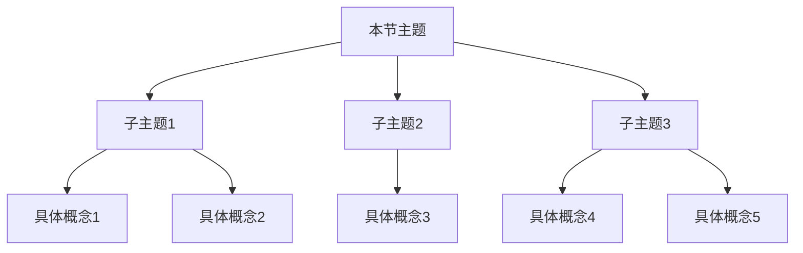

**相关笔记：** [[前节笔记]] | [[后节笔记]] | [[第{N}章 {章标题} — 章节汇总]]

> [!abstract] 概览
> 本节介绍 {一句话概括本节核心内容}。核心知识点包括：
> - **知识点1**：简要说明
> - **知识点2**：简要说明
> - **知识点3**：简要说明

---

## 一、知识结构总览

---

## 二、核心思想与证明技巧

> [!tip] 核心思想
> 本节的核心思想是...

### 关键证明技巧

1. **技巧名称**：描述
   - 适用场景：...
   - 典型应用：...

2. **技巧名称**：描述
   - 适用场景：...
   - 典型应用：...

---

## 三、补充理解与易混淆点

> [!warning] 变体说明
> - **变体 A**：本节包含需要额外补充理解的内容或易混淆概念 → 必须包含此模块
> - **变体 B**：本节内容清晰，无需额外补充 → ==完全省略此模块==，不要写"无"

### 补充理解

> [!info] 补充：{补充主题}
> **来源：** {教材页码/视频时间戳/个人思考}
>
> {补充内容...}

### 易混淆点

> [!warning] 误区：{误区描述}
> ❌ **错误理解：** {描述常见错误理解}
> ✅ **正确理解：** {描述正确理解}
> **辨析：** {解释为什么错误理解是错的，正确理解为什么是对的}

---

## 四、习题精选

> [!todo] 习题概览
> | 题号 | 来源 | 核心考点 | 难度 |
> |:-----|:-----|:---------|:-----|
> | 1 | {来源} | {考点} | ⭐ |
> | 2 | {来源} | {考点} | ⭐⭐ |
> | 3 | {来源} | {考点} | ⭐⭐⭐ |

### 题1：{题目标题}

> [!problem] 题目
> {完整题目内容}

> [!faq]- 解答
> **[步骤1]** {解题步骤...}
>
> **[步骤2]** {解题步骤...}
>
> $\blacksquare$

> [!tip] 解题思路提示
> {可选的解题思路提示，帮助读者独立思考}

---

## 五、视频学习指南

> [!info] 视频资源
> | 资源 | 链接 | 对应内容 | 备注 |
> |:-----|:-----|:---------|:-----|
> | {资源名} | [链接](url) | {对应内容} | {备注} |

---

## 六、教材原文

> [!quote] 教材原文
> **来源：** {书名} 第{N}版，第{P}章第{S}节，第{页码}页
>
> {摘录教材中的关键原文段落，保持原文表述}

#学习/{学科}/{分支}/{关键词}
