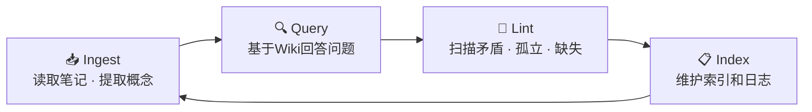

# CS Wiki

基于 Karpathy 知识编译模式 · Obsidian + Quartz 架构

> [!abstract] 概览
> 一个持续生长的「活体维基」。所有笔记遵循统一规范，通过 **Ingest → Query → Lint → Index** 流水线实现知识复利。

---

## 统计总览

  
📖

  
概念

  
368

  
📕

  
定理

  
55

  
⚖️

  
对比

  
44

  
📊

  
总页数

  
467

---

## 学习进度

  

    📐 离散数学
    进行中
  

  

    

  

  

    概念 150 · 定理 15 · 对比 10
    72%
  

  

    🧠 逻辑学
    已完成
  

  

    

  

  

    概念 70 · 定理 15 · 对比 22
    100%
  

  

    💻 算法导论
    新启动
  

  

    

  

  

    概念 148 · 定理 25 · 对比 12
    18%
  

---

## 学科导航

  <h3>📐 离散数学</h3>
  

    
教材Rosen《离散数学及其应用》第8版

    
状态🔵 进行中

    
笔记概念150个 / 定理15个 / 对比10个

  

  <a class="subject-link" href="/离散数学/index">进入学科 →</a>

  <h3>🧠 逻辑学</h3>
  

    
教材Copi《逻辑学导论》第15版

    
状态✅ 已完成

    
笔记概念70个 / 定理15个 / 对比22个

  

  <a class="subject-link" href="/逻辑学/index">进入学科 →</a>

  <h3>💻 算法导论</h3>
  

    
教材CLRS《算法导论》第4版

    
状态🆕 新启动

    
笔记概念148个 / 定理25个 / 对比12个

  

  <a class="subject-link" href="/算法导论/index">进入学科 →</a>

---

## 快速入口

- 🔍 **[Wiki 总目录](Wiki/index)** — 全站概念/定理/对比页索引
- 📋 **[操作日志](Wiki/log)** — 知识库变更记录与操作历史
- 📐 **[架构规范](Wiki/SCHEMA)** — 目录结构、命名规范、标签体系
- 📝 **[学习路线](学习路线 v0.1)** — 三阶段学习计划与执行进度
- 🎨 **[模板目录](_templates/)** — 笔记模板集合
- 📊 **[Wiki 统计](Wiki/index)** — 各学科 Wiki 页面数量汇总

---

## 知识编译流水线

| 操作 | 目的 | 频率 |
|:-----|:-----|:-----|
| **Ingest** | 读取新笔记，提取概念，更新 Wiki | 每学完一个章节 |
| **Query** | 基于已编译 Wiki 回答问题 | 日常学习 |
| **Lint** | 扫描矛盾、孤立、缺失 | 每周一次 |
| **Index** | 维护 Wiki Index 和日志 | 每次操作后 |

<!-- 
最后更新：2026-04-25
Total Wiki Pages: 467
-->

#学习/导航
