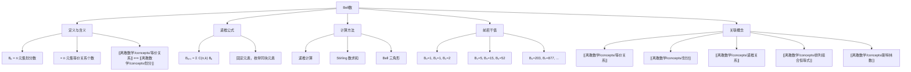

# Bell数

> [!abstract] 概述
> ==Bell 数== $B_n$ 表示 $n$ 元集合上的==划分数==（由等价关系与划分的一一对应，也等于 $n$ 元集合上的==等价关系个数==）。Bell 数满足递推公式 $B_{n+1} = \sum_{k=0}^{n}\binom{n}{k}B_k$，初始条件 $B_0 = 1$。前若干值为 $B_0=1, B_1=1, B_2=2, B_3=5, B_4=15, B_5=52, B_6=203, \ldots$。Bell 数的递推直觉是：固定一个元素，考虑它与多少个其他元素同块，对每种情况求和。

## 定义

> [!def] Bell 数（Bell Numbers）
>
> 设 $B_n$ 表示 $n$ 元集合上的==划分数==（即 $n$ 元集合上==等价关系==的个数），则 $B_n$ 称为第 $n$ 个==Bell 数==。
>
> 初始条件：$B_0 = 1$（空集有唯一划分：空划分）。
>
> 递推公式：
>
> $$B_{n+1} = \sum_{k=0}^{n}\binom{n}{k}B_k$$
>
> 等价形式（固定元素 $a_1$ 所在块的讨论）：
>
> $$B_n = \sum_{j=0}^{n-1}\binom{n-1}{j}B_{n-j-1}$$

> [!def] Bell 数与第二类 Stirling 数的关系
>
> Bell 数可以用第二类 Stirling 数 $S(n,k)$（将 $n$ 个元素划分为恰好 $k$ 个非空块的方式数）表示为：
>
> $$B_n = \sum_{k=0}^{n}S(n,k)$$
>
> 其中 $S(n,k)$ 满足递推 $S(n,k) = k \cdot S(n-1,k) + S(n-1,k-1)$，初始条件 $S(0,0)=1$，$S(n,0)=0$（$n>0$），$S(0,k)=0$（$k>0$）。

## 核心性质

| 性质 | 公式/规则 | 说明 |
|:-----|:----------|:-----|
| ==Bell 数定义== | $B_n$ = $n$ 元集的划分数 | 也等于 $n$ 元集上的等价关系个数 |
| ==初始条件== | $B_0 = 1$ | 空集有唯一划分 |
| ==递推公式== | $B_{n+1} = \sum_{k=0}^{n}\binom{n}{k}B_k$ | 固定一个元素，枚举其同块元素个数 |
| ==Stirling 数求和== | $B_n = \sum_{k=0}^{n}S(n,k)$ | 对所有可能的块数求和 |
| ==指数生成函数== | $e^{e^x - 1} = \sum_{n=0}^{\infty}\frac{B_n}{n!}x^n$ | Bell 数的指数生成函数 |
| ==Dobinski 公式== | $B_n = \frac{1}{e}\sum_{k=0}^{\infty}\frac{k^n}{k!}$ | 用无穷级数表示 Bell 数 |
| ==增长速度== | $B_n \sim \frac{1}{\sqrt{n}}\left(\frac{n}{W(n)}\right)^{n+\frac{1}{2}} e^{\frac{n}{W(n)}-n-1}$ | 超指数增长，比任何多项式都快 |

## 关系网络



- **前置知识**：[[离散数学/concepts/等价关系]]（Bell 数计数等价关系）、[[离散数学/concepts/划分]]（Bell 数计数划分）、[[离散数学/concepts/递推关系]]（Bell 数用递推定义）
- **核心关联**：Bell 数连接了等价关系理论与组合计数。由等价关系与划分的一一对应，$B_n$ 既是 $n$ 元集上的等价关系个数，也是划分数
- **后继概念**：[[离散数学/concepts/排列组合恒等式]]（Bell 数满足的组合恒等式）、[[离散数学/concepts/斯特林数]]（Bell 数的组成部分）

## 章节扩展

### 第09章：关系

Bell 数是 Rosen 第8版第9章第9.5节的补充内容，为等价关系与划分的理论提供了计数视角。

**递推公式的直观理解**：考虑 $n$ 元集合 $\{a_1, a_2, \ldots, a_n\}$ 的所有划分。固定元素 $a_1$，考虑 $a_1$ 所在的块中有多少个其他元素：

- 若 $a_1$ 所在的块有 $j+1$ 个元素（$j$ 个其他元素与 $a_1$ 同块），则从剩余 $n-1$ 个元素中选 $j$ 个与 $a_1$ 同块，有 $\binom{n-1}{j}$ 种选法
- 剩下的 $n-j-1$ 个元素需要独立划分，有 $B_{n-j-1}$ 种方式
- $j$ 的取值范围是 $0$ 到 $n-1$（$j=0$ 时 $a_1$ 独占一块）

对所有 $j$ 求和即得 $B_n = \sum_{j=0}^{n-1}\binom{n-1}{j}B_{n-j-1}$。

**Bell 三角形**：Bell 数可以通过构造 Bell 三角形来高效计算。三角形的构造规则为：
- 第一行：$B_0 = 1$
- 每行第一个数等于上一行最后一个数
- 其余每个数等于左边相邻的数加上左上方的数

```
1
1   2
2   3   5
5   7  10  15
15  20  27  37  52
```

每行最后一个数就是对应的 Bell 数。

**前若干 Bell 数的验证**：
- $B_0 = 1$：空集有唯一划分
- $B_1 = 1$：$\{a\}$ 的唯一划分 $\{\{a\}\}$
- $B_2 = 2$：$\{a,b\}$ 的划分 $\{\{a,b\}\}$ 和 $\{\{a\},\{b\}\}$
- $B_3 = 5$：$\{a,b,c\}$ 的划分 $\{\{a,b,c\}\}$、$\{\{a\},\{b,c\}\}$、$\{\{b\},\{a,c\}\}$、$\{\{c\},\{a,b\}\}$、$\{\{a\},\{b\},\{c\}\}$

## 补充

> [!info] Bell 数的历史与学术参考
>
> Bell 数以苏格兰数学家 Eric Temple Bell（1883--1960）命名，但这一数列的研究可追溯到更早。日本数学家 Tadashi Takatsuji 在 18 世纪就已经研究了这一数列。
>
> **学术来源**：
> - Bell, E. T. (1934). "Exponential Numbers." *American Mathematical Monthly*, 41(7), 411-419.
> - Rota, G.-C. (1964). "The Number of Partitions of a Set." *American Mathematical Monthly*, 71(5), 498-504.
> - Wikipedia: [Bell number](https://en.wikipedia.org/wiki/Bell_number)
> - OEIS: [A000110](https://oeis.org/A000110) -- Bell numbers: number of partitions of a set of n labeled elements.

> [!info] Bell 数的增长速度
>
> Bell 数的增长速度非常快，是超指数增长的。前 20 个 Bell 数为：
>
> $B_0=1, B_1=1, B_2=2, B_3=5, B_4=15, B_5=52, B_6=203, B_7=877, B_8=4140, B_9=21147,$
>
> $B_{10}=115975, B_{11}=678570, B_{12}=4213597, B_{13}=27644437, B_{14}=190899322,$
>
> $B_{15}=1382958545, \ldots$
>
> 可以看到，Bell 数的增长远快于指数函数 $2^n$，但慢于阶乘 $n!$。

## 参见

- [[离散数学/concepts/等价关系]] -- Bell 数计数等价关系
- [[离散数学/concepts/划分]] -- Bell 数计数划分
- [[离散数学/concepts/递推关系]] -- Bell 数的递推定义
- [[离散数学/concepts/排列组合恒等式]] -- Bell 数满足的组合恒等式
- [[离散数学/concepts/斯特林数]] -- $B_n = \sum_{k} S(n,k)$
