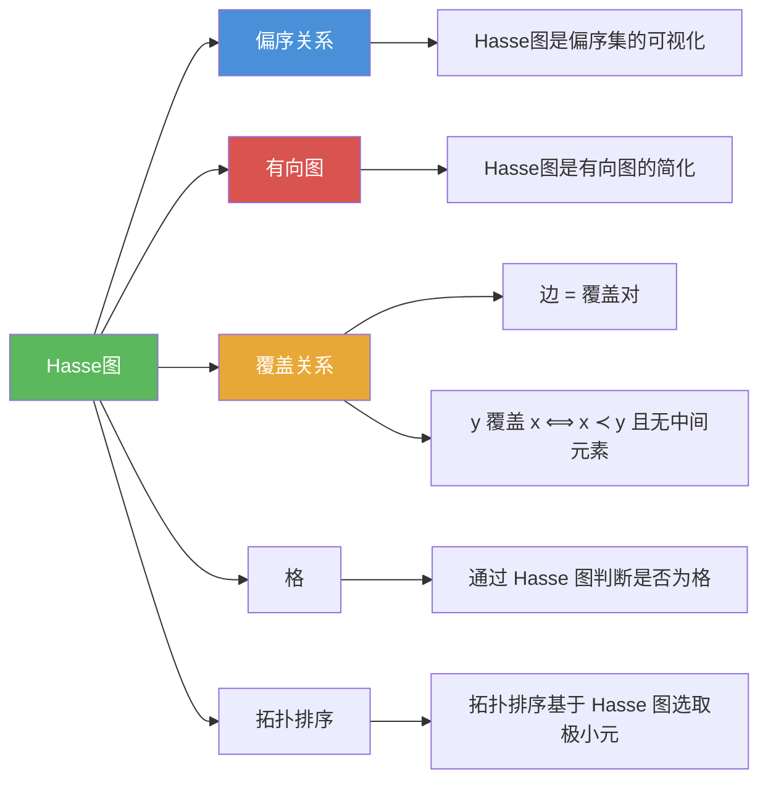

# Hasse图

> [!abstract] 概述
> ==Hasse 图==（Hasse Diagram）是有限==偏序集==的简洁图形表示方法。通过==省略所有自环==、==省略由传递性蕴含的边==、==按偏序方向从下到上排列==并==删除箭头==，Hasse 图将偏序集的有向图大幅简化，使层次结构一目了然。图中的每条边恰好对应一个==覆盖关系==（covering relation）。Hasse 图以 20 世纪德国数学家 Helmut Hasse 命名，是分析偏序集中极大/极小元、上界/下界等概念的重要可视化工具。

## 定义

> [!def] Hasse 图（Hasse Diagram）
>
> 有限偏序集 $(S, \preceq)$ 的==Hasse 图==是按以下四个步骤从有向图得到的简化图：
>
> 1. **删除所有自环**：因为偏序是自反的，每个顶点的自环必然存在，但不提供有用信息
> 2. **删除所有由传递性蕴含的边**：若存在 $z$ 使得 $x \prec z$ 且 $z \prec y$，则删除 $x$ 到 $y$ 的边（因为该关系可由传递性推导得出）
> 3. **使所有边指向"上方"**：将初始顶点（被覆盖的元素）放在下方，终端顶点（覆盖的元素）放在上方
> 4. **删除所有箭头**：因为方向由位置隐含（从下到上）
>
> Hasse 图中的边恰好对应==覆盖关系==中的有序对。

> [!def] 覆盖关系（Covering Relation）
>
> 在偏序集 $(S, \preceq)$ 中，若 $y \in S$ ==覆盖==（covers）$x \in S$，即满足以下两个条件：
> 1. $x \prec y$（$x$ 严格小于 $y$）
> 2. 不存在 $z \in S$ 使得 $x \prec z \prec y$（$x$ 和 $y$ 之间没有其他元素）
>
> 则称 $(x, y)$ 属于==覆盖关系==。覆盖关系中的有序对就是 Hasse 图中的边。
>
> 直觉：$y$ 覆盖 $x$ 意味着 $y$ 是 $x$ "上方最近的"元素。

> [!def] 从偏序集构造 Hasse 图的步骤
>
> 给定有限偏序集 $(S, \preceq)$，构造 Hasse 图的完整步骤：
>
> 1. 列出 $S$ 中所有元素
> 2. 确定所有覆盖关系 $(x, y)$，即找出所有 $x \prec y$ 且中间无其他元素的对
> 3. 将元素按偏序方向从下到上分层排列（极小元在最底层，极大元在最顶层）
> 4. 用线段连接每对覆盖关系中的元素（无需箭头）

## 核心性质

| 性质 | 描述 | 说明 |
|------|------|------|
| 省略自环 | 偏序的自反性保证每个元素都有自环 | 自环不提供有用信息，全部删除 |
| 省略传递边 | 若 $x \prec z \prec y$，则删除 $x$ 到 $y$ 的边 | 传递性保证该关系可推导得出 |
| 方向隐含 | 所有边从下到上 | 无需箭头，位置即方向 |
| 边 = 覆盖关系 | Hasse 图中的每条边对应一个覆盖对 | 覆盖关系是 Hasse 图的"骨架" |
| 极大元在顶层 | Hasse 图最上方的元素 | 上方没有其他元素 |
| 极小元在底层 | Hasse 图最下方的元素 | 下方没有其他元素 |
| 不唯一性 | 同一偏序集可能有不同的 Hasse 图布局 | 元素的水平位置不影响图的正确性 |

## 关系网络



- [[离散数学/concepts/偏序关系|偏序关系]] 是 Hasse 图的数学基础：Hasse 图是偏序集的图形表示
- [[离散数学/concepts/有向图|有向图]] 是 Hasse 图的前身：Hasse 图通过省略自环、传递边和箭头从有向图简化而来
- 覆盖关系是 Hasse 图的核心：图中的每条边恰好对应一个覆盖对 $(x, y)$，其中 $y$ 覆盖 $x$
- [[离散数学/concepts/格|格]] 的判定可通过 Hasse 图辅助：检查每对元素是否都有 lub 和 glb

## 章节扩展

### 第09章：关系

Hasse 图是第 9 章偏序关系（9.6 节）中的核心可视化工具：

- **9.6 偏序关系**：Hasse 图的绘制规则、覆盖关系定义、通过 Hasse 图分析极大/极小元、上界/下界、判定[[离散数学/concepts/格|格]]

### 第10章：图论

- **10.1~10.4 图的基本概念**：Hasse 图本质上是一种特殊的有向图（无自环、无传递边、无箭头），图论为理解 Hasse 图提供了理论支撑

## 补充

> [!info] Hasse 图的实例
>
> **例1：整除关系的 Hasse 图**
>
> 画 $\{1, 2, 3, 4, 6, 8, 12\}$ 上整除关系的 Hasse 图。
>
> 覆盖关系为：$(1,2), (1,3), (2,4), (2,6), (3,6), (4,8), (4,12), (6,12)$。
>
> Hasse 图结构（从下到上）：
> ```
>       12
>      /  \
>     8    6
>     |   / \
>     4  3   |
>     | /    |
>     2      |
>      \    /
>       1
> ```
>
> 注意：$1$ 到 $12$ 的边被删除（因为 $1 \prec 4 \prec 12$），$2$ 到 $12$ 的边被删除（因为 $2 \prec 6 \prec 12$），等等。
>
> **例2：幂集的 Hasse 图**
>
> 画 $(\mathcal{P}(\{a, b, c\}), \subseteq)$ 的 Hasse 图。
>
> ```
>        {a,b,c}
>       /   |   \
>   {a,b} {a,c} {b,c}
>     |  \  /   |
>    {a}  {b}  {c}
>      \   |   /
>         ∅
> ```
>
> 这恰好是一个 3 维立方体的投影，共有 $2^3 = 8$ 个顶点。一般地，$(\mathcal{P}(\{a_1, \ldots, a_n\}), \subseteq)$ 的 Hasse 图是 $n$ 维立方体。
>
> **学术来源**：Rosen, K. H. (2019). *Discrete Mathematics and Its Applications* (8th ed.). McGraw-Hill, Section 9.6.

## 参见

- [[离散数学/concepts/偏序关系]] -- Hasse 图是偏序集的图形表示，偏序关系是 Hasse 图的数学基础
- [[离散数学/concepts/有向图]] -- Hasse 图从有向图通过省略自环、传递边和箭头简化而来
