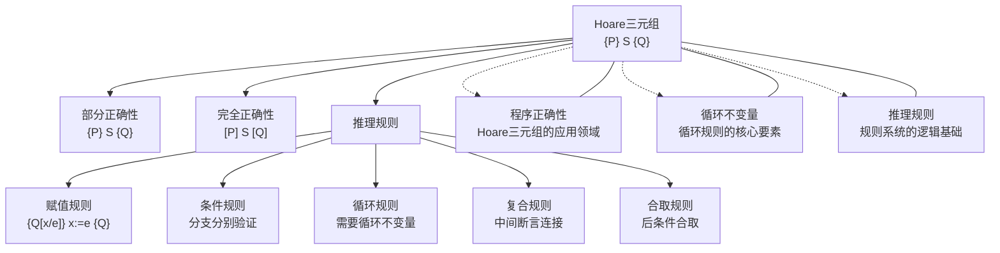

# Hoare三元组

> [!abstract] 概述
> ==Hoare三元组（Hoare Triple）==记为 $\{P\}\ S\ \{Q\}$，其中 $P$ 是==前条件（precondition）==，$S$ 是程序语句，$Q$ 是==后条件（postcondition）==。它断言：若执行 $S$ 前 $P$ 为真且 $S$ 终止，则执行后 $Q$ 为真。由 C. A. R. Hoare 于 1969 年提出，是==公理语义学==的基石。

## 定义

> [!def] Hoare三元组的语法和语义
>
> **语法**：Hoare 三元组写作 $\{P\}\ S\ \{Q\}$，其中：
> - $P$：==前条件（precondition）==，一个描述程序执行前状态逻辑公式
> - $S$：程序语句（可以是赋值、条件、循环或复合语句）
> - $Q$：==后条件（postcondition）==，一个描述程序执行后期望状态的逻辑公式
>
> **部分正确性语义**：$\{P\}\ S\ \{Q\}$ 表示：
>
> $$\text{若 } P \text{ 在 } S \text{ 执行前为真，且 } S \text{ 终止，则 } Q \text{ 在 } S \text{ 执行后为真}$$
>
> **完全正确性语义**：$[P]\ S\ [Q]$（方括号记法）表示：
>
> $$\text{若 } P \text{ 在 } S \text{ 执行前为真，则 } S \text{ 必定终止，且终止后 } Q \text{ 为真}$$

> [!def] 部分正确性与完全正确性的 Hoare 三元组表示
>
> - **部分正确性**使用花括号：$\{P\}\ S\ \{Q\}$
>   - 含义：$P$ 为真且 $S$ 终止 $\Rightarrow$ $Q$ 为真
>   - 不保证 $S$ 终止
>
> - **完全正确性**使用方括号：$[P]\ S\ [Q]$
>   - 含义：$P$ 为真 $\Rightarrow$ $S$ 终止且 $Q$ 为真
>   - 同时保证终止性和结果正确性
>
> 两者关系：$[P]\ S\ [Q]$ 成立当且仅当 $\{P\}\ S\ \{Q\}$ 成立 **且** $S$ 在 $P$ 下必定终止。

> [!def] 五条推理规则
>
> **1. 赋值规则（Assignment Rule）**
>
> $$\{Q[x/e]\}\ x := e\ \{Q\}$$
>
> 其中 $Q[x/e]$ 表示将 $Q$ 中所有自由出现的 $x$ 替换为表达式 $e$。
>
> 直觉：要使赋值后 $Q$ 成立，只需在赋值前 $Q$ 中 $x$ 的位置换成 $e$ 后成立。
>
> **2. 条件规则（Conditional Rule）**
>
> $$\frac{\{P \land B\}\ S_1\ \{Q\} \quad \{P \land \neg B\}\ S_2\ \{Q\}}{\{P\}\ \textbf{if } B \textbf{ then } S_1 \textbf{ else } S_2\ \{Q\}}$$
>
> 直觉：分别验证两个分支在各自条件下都能从 $P$ 达到 $Q$。
>
> **3. 循环规则（Loop Rule）**
>
> $$\frac{\{P \land B\}\ S\ \{P\}}{\{P\}\ \textbf{while } B \textbf{ do } S\ \{P \land \neg B\}}$$
>
> 其中 $P$ 是==循环不变量==（loop invariant），$B$ 是循环条件。
>
> 直觉：若 $P$ 在循环前为真，且每次迭代后 $P$ 仍为真（不变量保持），则循环终止时 $P \land \neg B$ 成立。
>
> **4. 复合规则（Composition Rule）**
>
> $$\frac{\{P\}\ S_1\ \{R\} \quad \{R\}\ S_2\ \{Q\}}{\{P\}\ S_1;\, S_2\ \{Q\}}$$
>
> 直觉：$S_1$ 的后条件恰好是 $S_2$ 的前条件，中间断言 $R$ 连接两段程序。
>
> **5. 合取规则（Conjunction Rule）**
>
> $$\frac{\{P\}\ S\ \{Q_1\} \quad \{P\}\ S\ \{Q_2\}}{\{P\}\ S\ \{Q_1 \land Q_2\}}$$
>
> 直觉：若程序 $S$ 在前条件 $P$ 下分别满足两个后条件，则同时满足两者的合取。

> [!def] 推理规则应用示例
>
> **示例**：验证程序 `x := 1; y := x + 1` 满足 $\{\text{true}\}\ S\ \{y = 2\}$。
>
> **证明**：
> 1. 对 `y := x + 1` 应用赋值规则：
>    - 后条件为 $y = 2$，将 $y$ 替换为 $x + 1$，得 $\{x + 1 = 2\}$，即 $\{x = 1\}$
>    - 所以 $\{x = 1\}\ y := x + 1\ \{y = 2\}$ ✓
> 2. 对 `x := 1` 应用赋值规则：
>    - 后条件为 $x = 1$，将 $x$ 替换为 $1$，得 $\{1 = 1\}$，即 $\{\text{true}\}$
>    - 所以 $\{\text{true}\}\ x := 1\ \{x = 1\}$ ✓
> 3. 应用复合规则，取中间断言 $R$ 为 $x = 1$：
>    - $\{\text{true}\}\ x := 1\ \{x = 1\}$ 和 $\{x = 1\}\ y := x + 1\ \{y = 2\}$
>    - 得 $\{\text{true}\}\ x := 1;\, y := x + 1\ \{y = 2\}$ ✓

## 核心性质

| 性质 | 描述 | 说明 |
|:----:|:-----|:-----|
| 后向推理 | 赋值规则从后条件反推前条件 | $Q[x/e]$ 是保证 $Q$ 成立的最弱前条件 |
| 规则可靠性 | 每条推理规则都是可靠的（sound） | 若前提成立则结论一定成立 |
| 不变量关键性 | 循环规则的核心是找到合适的循环不变量 | 不变量必须满足初始化、保持、终止三条件 |
| 复合可分解 | 复合语句的正确性可分解为子语句正确性 | 通过中间断言连接 |
| 条件分支独立 | if-else 的两个分支独立验证 | 各自在对应条件下保证后条件 |
| 部分正确性优先 | 通常先证部分正确性再证终止性 | 终止性需要单独处理 |

## 关系网络

- **应用领域**：[[程序正确性]] 使用 Hoare 三元组作为形式化验证的基本表示
- **核心要素**：[[循环不变量]] 是循环规则中必须找到的关键断言
- **逻辑基础**：[[推理规则]] 为 Hoare 三元组的推理系统提供逻辑支撑

## 章节扩展

### 第5章 — 5.5节内容

Hoare 三元组是 Rosen 第5章 5.5 节中程序验证的核心形式化工具：

- **三元组记法**：$\{P\}S\{Q\}$ 的语法和语义，部分正确性与完全正确性的区分
- **赋值公理**：后向替换方法 $Q[x/e]$，从后条件反推前条件
- **条件规则**：if-else 语句的分支独立验证方法
- **循环规则**：基于循环不变量的 while 循环验证，与数学归纳法的对应
- **复合规则**：顺序语句的中间断言连接方法
- **合取规则**：多个后条件的合并验证
- **程序验证实例**：使用 Hoare 三元组规则系统验证具体程序的正确性

Hoare 三元组将程序验证从直觉层面提升到了严格的逻辑推理层面，是形式方法的重要基础。

## 补充

> [!info] 学术背景
>
> Hoare 三元组由 **C. A. R. Hoare** 于 1969 年在其经典论文 "An Axiomatic Basis for Computer Programming" 中提出。这篇论文开创了==公理语义学==（Axiomatic Semantics）的研究方向，使程序语言有了精确的数学语义定义。
>
> Hoare 后来因其在程序逻辑和编程方法论方面的贡献于 1980 年获得 ==Turing 奖==。他的另一项重要贡献是提出了 **CSP**（Communicating Sequential Processes），这是一种描述并发程序的代数语言，对并发理论产生了深远影响。
>
> Hoare 三元组的思想后来被发展为更丰富的程序逻辑体系，包括：
> - **分离逻辑**（Separation Logic）：扩展 Hoare 逻辑以处理指针和堆操作
> - **并发 Hoare 逻辑**：处理并发程序的验证
> - **时序逻辑**：用模态逻辑描述程序的时序行为
>
> **来源**：
> - Rosen, K. H. *Discrete Mathematics and Its Applications*, 8th ed., Section 5.5
> - Hoare, C. A. R. (1969). "An axiomatic basis for computer programming." *Communications of the ACM*, 12(10), 576-580. https://doi.org/10.1145/363235.363259
> - Hoare, C. A. R. (1978). "Communicating sequential processes." *Communications of the ACM*, 21(8), 666-677.

## 参见

- [[程序正确性]] — Hoare 三元组的应用领域和理论背景
- [[循环不变量]] — 循环规则中必须找到的关键断言
- [[推理规则]] — Hoare 三元组推理系统的逻辑基础
