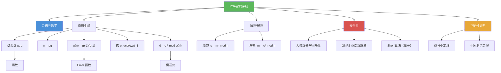

# RSA密码系统

> [!abstract] 概述
> ==RSA 密码系统==（RSA Cryptosystem）是由 Rivest、Shamir 和 Adleman 于 1976 年在 MIT 提出的==公钥密码系统==，是现代密码学最重要的里程碑之一。RSA 的密钥生成基于两个大素数 $p$ 和 $q$ 的乘积 $n = pq$，加密为 $c = m^e \bmod n$，解密为 $m = c^d \bmod n$，其中 $d = e^{-1} \bmod \varphi(n)$。其正确性由==费马小定理==和==中国剩余定理==严格保证。RSA 的安全性建立在==大整数分解==的计算困难性之上：已知 $n$ 和 $e$，在不分解 $n$ 的前提下无法有效计算 $d$。

## 定义

> [!def] RSA 密码系统（RSA Cryptosystem）
>
> RSA 由 Rivest、Shamir 和 Adleman 于 1976 年在 MIT 提出（Clifford Cocks 于 1973 年在英国 GCHQ 秘密发现）。
>
> **密钥生成**：
> 1. 选择两个大素数 $p$ 和 $q$（各约 300 位十进制数），计算 $n = pq$
> 2. 计算 Euler 函数 $\varphi(n) = (p-1)(q-1)$
> 3. 选择 $e$ 使得 $\gcd(e, \varphi(n)) = 1$（$e$ 为公钥指数，常用 $e = 65537$）
> 4. 求 $e$ 模 $\varphi(n)$ 的逆元 $d$（$d$ 为私钥指数），即 $de \equiv 1 \pmod{\varphi(n)}$
>
> **公钥**：$(n, e)$；**私钥**：$d$
>
> **加密**：给定明文 $m$（$0 \leq m < n$），计算密文
>
> $$c = m^e \bmod n$$
>
> **解密**：给定密文 $c$，恢复明文
>
> $$m = c^d \bmod n$$

> [!def] RSA 解密的正确性证明
>
> **定理**：设 $n = pq$（$p, q$ 为不同素数），$de \equiv 1 \pmod{(p-1)(q-1)}$，则对任意明文 $m$（$0 \leq m < n$），有 $c^d \equiv m \pmod{n}$。
>
> **证明**：
>
> 因为 $de \equiv 1 \pmod{(p-1)(q-1)}$，存在整数 $k$ 使得
>
> $$de = 1 + k(p-1)(q-1)$$
>
> 因此：
>
> $$c^d \equiv (m^e)^d = m^{de} = m^{1+k(p-1)(q-1)} \pmod{n}$$
>
> **情形 1**：$\gcd(m, p) = \gcd(m, q) = 1$（$m$ 与 $n$ 互素）
>
> 由 [[费马小定理]]：
>
> $$m^{p-1} \equiv 1 \pmod{p}, \quad m^{q-1} \equiv 1 \pmod{q}$$
>
> 因此：
>
> $$c^d \equiv m \cdot (m^{p-1})^{k(q-1)} \equiv m \cdot 1^{k(q-1)} = m \pmod{p}$$
> $$c^d \equiv m \cdot (m^{q-1})^{k(p-1)} \equiv m \cdot 1^{k(p-1)} = m \pmod{q}$$
>
> 因为 $\gcd(p, q) = 1$，由 [[中国剩余定理]]：
>
> $$c^d \equiv m \pmod{pq} = m \pmod{n} \quad \blacksquare$$
>
> **情形 2**：$\gcd(m, n) > 1$（$m$ 是 $p$ 或 $q$ 的倍数）
>
> 不妨设 $p \mid m$ 但 $q \nmid m$（$m$ 是 $p$ 的倍数但不是 $q$ 的倍数）。
>
> - 模 $p$：$c^d \equiv m^{de} \equiv 0 \equiv m \pmod{p}$（因为 $p \mid m$）
> - 模 $q$：由费马小定理，$m^{q-1} \equiv 1 \pmod{q}$，因此 $c^d \equiv m^{1+k(p-1)(q-1)} \equiv m \cdot (m^{q-1})^{k(p-1)} \equiv m \pmod{q}$
>
> 由中国剩余定理：$c^d \equiv m \pmod{n}$。$\blacksquare$

> [!def] RSA 安全性基础
>
> RSA 的安全性基于以下计算困难性假设：
> 1. ==大整数分解困难==：已知 $n = pq$（$p, q$ 各约 300 位），目前没有多项式时间算法能分解 $n$
> 2. 已知 $n$ 和 $e$，无法在不分解 $n$ 的情况下有效计算 $d$
> 3. 没有分解 $n$ 的方法也无法解密消息
>
> 目前最快的经典分解算法是==普通数域筛法==（GNFS），时间复杂度为亚指数级：
>
> $$O\left(\exp\left(\left(\frac{64}{9}\right)^{1/3}(\ln n)^{1/3}(\ln \ln n)^{2/3}\right)\right)$$
>
> 截至 2020 年，被分解的最大 RSA 数为 829 位（250 个十进制位）。
>
> **量子计算威胁**：Shor 算法（1994）可以在多项式时间内分解大整数，一旦大规模量子计算机实现，RSA 将不再安全。

## 核心性质

| 性质 | 描述 | 说明 |
|------|------|------|
| 公钥 | $(n, e)$ | 公开，任何人可用于加密 |
| 私钥 | $d$ | 保密，仅接收者持有 |
| 加密运算 | $c = m^e \bmod n$ | 模幂运算，可用快速模幂算法高效计算 |
| 解密运算 | $m = c^d \bmod n$ | 模幂运算，正确性由费马小定理 + CRT 保证 |
| 密钥生成条件 | $\gcd(e, \varphi(n)) = 1$ | 确保 $e$ 模 $\varphi(n)$ 的逆元 $d$ 存在 |
| 安全性基础 | 大整数分解困难性 | 分解 $n = pq$ 是计算上不可行的 |
| 乘法同态性 | $E(m_1) \cdot E(m_2) = E(m_1 \cdot m_2) \bmod n$ | 密文相乘等于明文乘积的加密 |
| 正确性保证 | 费马小定理 + 中国剩余定理 | 对所有 $m \in [0, n)$ 均成立 |
| 实际密钥长度 | $n$ 至少 2048 位（约 617 位十进制） | NIST 推荐的安全密钥长度 |
| 速度劣势 | 比 AES 慢约 1000 倍 | 实际中 RSA 用于密钥交换，AES 用于数据加密 |

## 关系网络

- [[公钥密码学]] 是 RSA 的上位概念：RSA 是最广泛使用的公钥密码系统
- [[模逆元]] 是 RSA 密钥生成的核心操作：计算 $d = e^{-1} \bmod \varphi(n)$ 需要扩展欧几里得算法
- [[素数]] 是 RSA 安全性的根基：$n = pq$ 的安全性依赖于大素数分解的困难性
- [[费马小定理]] 是 RSA 正确性证明的关键步骤：$m^{p-1} \equiv 1 \pmod{p}$
- [[中国剩余定理]] 将模 $p$ 和模 $q$ 的同余合并为模 $n$ 的同余
- [[模运算]] 是 RSA 所有运算的数学基础

## 章节扩展

### 第4章：数论与密码学

RSA 密码系统是第 4 章 4.6 节的核心内容，综合运用了本章的多个数论工具：

- **4.6 密码学**：RSA 的完整推导（密钥生成、加密、解密）、正确性证明（费马小定理 + CRT）、安全性分析（大整数分解困难性）、数字签名应用
- **4.4 解同余方程**：[[模逆元]]的计算（扩展欧几里得算法）是求 $d = e^{-1} \bmod \varphi(n)$ 的关键
- **4.3 素数与最大公因数**：素数的性质、Euler 函数 $\varphi(n) = (p-1)(q-1)$ 的计算
- **4.5 同余的应用**：费马小定理和中国剩余定理是正确性证明的数学基础

## 补充

> [!info] RSA 的历史与学术背景
>
> RSA 公钥密码系统通常归功于 MIT 的 Ron Rivest、Adi Shamir 和 Leonard Adleman（1977 年公开发表，1976 年完成内部报告）。然而，英国 GCHQ 的 Clifford Cocks 在 1973 年就独立发现了相同的方案，但由于保密原因直到 1997 年才解密公开。RSA 的安全性依赖于大整数分解问题的计算困难性，目前最快的经典算法是普通数域筛法（GNFS），其时间复杂度为亚指数级。RSA 广泛应用于 HTTPS/SSL 协议、电子邮件加密（PGP/S/MIME）、数字签名等领域。NIST 推荐的最小 RSA 密钥长度为 2048 位（约 617 位十进制数），3072 位可提供约 128 位安全强度。随着量子计算的发展，RSA 的长期安全性面临 Shor 算法的威胁，NIST 已于 2024 年发布后量子密码标准（如 ML-KEM、ML-DSA）作为替代方案。
>
> **学术来源**：Rosen, K. H. (2019). *Discrete Mathematics and Its Applications* (8th ed.). McGraw-Hill, Section 4.6.
>
> **参考链接**：Rivest, R. L., Shamir, A., & Adleman, L. (1978). A Method for Obtaining Digital Signatures and Public-Key Cryptosystems. *Communications of the ACM*, 21(2), 120-126.

## 参见

- [[公钥密码学]] -- 公钥密码学的基本思想、Diffie-Hellman 密钥交换、数字签名
- [[模逆元]] -- RSA 密钥生成中 $d = e^{-1} \bmod \varphi(n)$ 的计算方法
- [[素数]] -- RSA 安全性的数学根基，大素数的选择与性质
- [[费马小定理]] -- RSA 正确性证明的核心定理
- [[中国剩余定理]] -- 将模 $p$ 和模 $q$ 的同余结果合并为模 $n$ 的同余
- [[模运算]] -- RSA 所有运算（加密、解密、密钥生成）的数学基础
