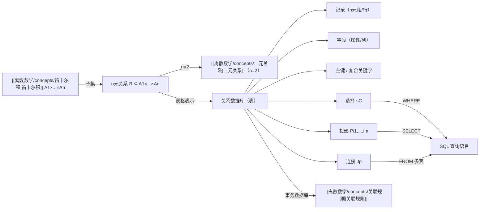

# n元关系

> [!abstract]
> **n元关系**（n-ary relation）是[[离散数学/concepts/二元关系|二元关系]]的自然推广，定义为笛卡尔积 $A_1 \times A_2 \times \cdots \times A_n$ 的子集。n元关系是**关系数据库**的理论基础——数据库中的每一张表就是一个 n 元关系。本概念涵盖 n 元关系的定义（度与域）、关系数据库模型（记录、字段、主键、复合关键字）、三种基本操作（选择 $s_C$、投影 $P_{i_1,\ldots,i_m}$、连接 $J_p$），以及数据库查询语言 SQL 的基本用法。
>
> - n元关系：$A_1 \times \cdots \times A_n$ 的子集，$n$ 为度，$A_i$ 为域
> - 关系数据库：表 = 关系，行 = 记录（n元组），列 = 属性（字段）
> - 三种操作：选择（筛选行）、投影（选取列）、连接（合并表）
> - SQL：SELECT（投影）、FROM（关系）、WHERE（选择）

## 定义

> [!def] n元关系（n-ary Relation）
> 设 $A_1, A_2, \ldots, A_n$ 是集合。在这些集合上的**n元关系** $R$ 是笛卡尔积 $A_1 \times A_2 \times \cdots \times A_n$ 的一个子集。
>
> - 集合 $A_1, A_2, \ldots, A_n$ 称为该关系的**域**（domains）
> - 整数 $n$ 称为该关系的**度**（degree）
> - $R$ 中的元素 $(a_1, a_2, \ldots, a_n)$ 称为 **n元组**（n-tuples）
>
> 当 $n = 2$ 时，n元关系退化为[[离散数学/concepts/二元关系|二元关系]]。

> [!def] 关系数据库模型（Relational Database Model）
> **关系数据模型**用 n 元关系来表示数据库。核心术语：
>
> - **记录**（record）：n 元组，即关系中的一个元素（表的一行）
> - **字段**（field）/ **属性**（attribute）：n 元组的各个分量（表的一列）
> - **表**（table）：关系的表格表示
> - **主键**（primary key）：某个域，其值能唯一确定一条记录
> - **复合关键字**（composite key）：多个域的值的组合能唯一确定一条记录
> - **外延**（extension）：数据库当前的记录集合（即关系本身）
> - **内涵**（intension）：数据库的结构信息（名称、属性等永久部分）

> [!def] 选择操作（Selection）
> 设 $R$ 是一个 n 元关系，$C$ 是条件。**选择操作** $s_C$ 返回满足条件 $C$ 的所有 n 元组：
>
> $$s_C(R) = \{(a_1, a_2, \ldots, a_n) \in R \mid C(a_1, a_2, \ldots, a_n) \text{ 为真}\}$$
>
> 直觉：**按条件筛选行**（记录），不改变列的结构。条件 $C$ 可以用 $\wedge$、$\vee$、$\neg$ 组合。

> [!def] 投影操作（Projection）
> **投影** $P_{i_1, i_2, \ldots, i_m}$（其中 $i_1 < i_2 < \cdots < i_m$）将 n 元组 $(a_1, \ldots, a_n)$ 映射到 m 元组 $(a_{i_1}, a_{i_2}, \ldots, a_{i_m})$：
>
> $$P_{i_1, i_2, \ldots, i_m}(R) = \{(a_{i_1}, a_{i_2}, \ldots, a_{i_m}) \mid (a_1, \ldots, a_n) \in R\}$$
>
> 直觉：**保留指定列，删除其余列**。投影后可能产生重复行，需要去重（因为关系是集合）。

> [!def] 连接操作（Join）
> 设 $R$ 是度为 $m$ 的关系，$S$ 是度为 $n$ 的关系。**连接** $J_p(R, S)$（$p \leq \min(m, n)$）是度为 $m + n - p$ 的关系：
>
> $$J_p(R, S) = \{(a_1, \ldots, a_{m-p}, c_1, \ldots, c_p, b_1, \ldots, b_{n-p}) \mid (a_1, \ldots, a_{m-p}, c_1, \ldots, c_p) \in R \wedge (c_1, \ldots, c_p, b_1, \ldots, b_{n-p}) \in S\}$$
>
> 直觉：将两个表中**最后 $p$ 列与最前 $p$ 列匹配**的行拼接。不匹配的行不出现在结果中。

> [!def] SQL（Structured Query Language）
> SQL 是关系数据库的标准查询语言，基本语句结构：
>
> ```sql
> SELECT 列名1, 列名2, ...     -- 投影（选取列）
> FROM 表名1, 表名2, ...       -- 关系（多表时隐含连接）
> WHERE 条件                   -- 选择（筛选行）
> ```
>
> **注意术语冲突**：SQL 的 SELECT 对应数学中的**投影**，SQL 的 WHERE 对应数学中的**选择**。

## 核心性质

| 操作 | 符号 | 功能 | SQL 对应 | 直觉 |
|:-----|:-----|:-----|:---------|:-----|
| **选择** | $s_C(R)$ | 筛选满足条件 $C$ 的行 | WHERE 子句 | 按条件过滤记录 |
| **投影** | $P_{i_1,\ldots,i_m}(R)$ | 保留指定列，删除其余列 | SELECT 子句 | 选取感兴趣的属性 |
| **连接** | $J_p(R, S)$ | 基于 $p$ 个公共字段合并两个表 | FROM 多表 | 拼接匹配的记录 |
| **并** | $R \cup S$ | 合并两个关系 | UNION | 合并查询结果 |
| **差** | $R - S$ | 属于 $R$ 但不属于 $S$ 的元组 | EXCEPT | 差集 |
| **笛卡尔积** | $R \times S$ | 所有可能的元组组合 | CROSS JOIN | 无条件拼接 |

> [!info] 选择与投影的代数性质
> - $s_C(s_D(R)) = s_{C \wedge D}(R)$：连续选择等价于合取条件的选择
> - $P_{i_1,\ldots,i_m}(P_{j_1,\ldots,j_k}(R)) = P_{i_1,\ldots,i_m}(R)$（当 $\{j_1,\ldots,j_k\} \supseteq \{i_1,\ldots,i_m\}$）：多余投影可消除
> - $P_{i_1,\ldots,i_m}(s_C(R)) = s_C(P_{i_1,\ldots,i_m}(R))$：选择与投影可交换（当条件 $C$ 只涉及投影列时）

## 关系网络



## 章节扩展

本概念出自 **第09章 关系**，相关章节内容包括：

- **9.1 关系及其性质**：二元关系的定义与性质（n元关系的特例）
- **9.2 n元关系及其应用**：本概念的直接来源，涵盖 n元关系、数据库操作与关联规则
- **9.3 关系的表示**：用零一矩阵和有向图表示关系
- **9.4 关系的闭包**：传递闭包、自反闭包、对称闭包
- **9.5 等价关系**：等价类与划分
- **9.6 偏序关系**：哈斯图与偏序集

## 补充

> [!info] SQL 术语冲突详解
> SQL 中的术语与关系代数中的术语存在不幸的冲突：
> - SQL 的 **SELECT** $\neq$ 数学中的选择（selection），而是对应**投影**（projection）
> - SQL 的 **WHERE** = 数学中的选择（selection）
> - SQL 的 **FROM** 指定关系，多表 FROM 隐含连接操作
>
> 记忆口诀：SQL 的 SELECT 是"**选列**"（投影），WHERE 是"**在哪**"（筛选行）。

> [!info] 主键的选择原则
> - 主键应选择在**所有可能的扩展**中都保持唯一的属性
> - 学号、身份证号等系统保证唯一性的属性是好的主键
> - 姓名通常不是好的主键（可能存在同名同姓）
> - 当单个属性无法保证唯一时，使用**复合关键字**
> - 复合关键字的唯一性依赖于当前数据，添加新记录后可能失效

> [!info] 投影操作的去重
> 投影后可能产生重复行，因为关系是集合，不能有重复元素。例如选课表中多个学生选了同一门课，投影到 (Student, Major) 后行数会减少。这与 SQL 中 `SELECT DISTINCT` 的行为一致。

## 参见

- [[离散数学/concepts/二元关系]] -- n元关系在 $n = 2$ 时的特例
- [[离散数学/concepts/笛卡尔积]] -- n元关系定义为笛卡尔积的子集
- [[离散数学/concepts/关联规则]] -- 基于事务数据库（n元关系）的数据挖掘技术
- [[离散数学/concepts/集合]] -- n元关系是集合（n元组的集合）
