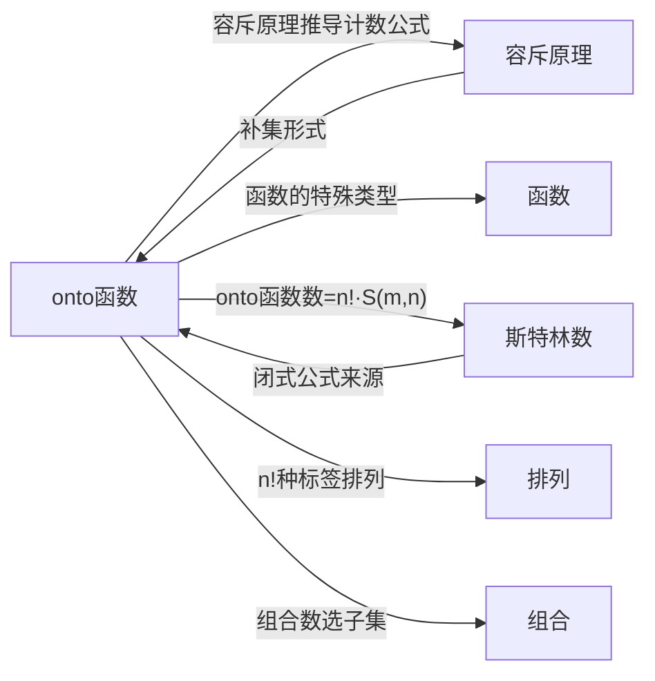

# onto函数

> [!abstract]
> ==onto 函数（满射函数，Surjection）==是从定义域到到达域的[[离散数学/concepts/函数|函数]]，其值域恰好覆盖整个到达域（即到达域中每个元素都有至少一个原像）。利用[[离散数学/concepts/容斥原理|容斥原理]]的补集形式，可以精确计算从 $m$ 元集到 $n$ 元集的 onto 函数个数，该结果与[[离散数学/concepts/斯特林数|第二类 Stirling 数]]密切相关。

## 定义

> [!def] onto 函数（满射函数）
> 设 $f: A \to B$ 为一个函数。若 $f$ 的值域等于 $B$，即对每个 $b \in B$，都存在 $a \in A$ 使得 $f(a) = b$，则称 $f$ 为 **onto 函数**（满射函数，surjection）。
>
> 等价表述：$f$ 是 onto 的当且仅当 $B$ 中没有任何元素被"遗漏"在值域之外。

> [!def] onto 函数计数定理（Theorem 1）
> 设 $m$ 和 $n$ 为正整数且 $m \geq n$。则从 $m$ 元集到 $n$ 元集的 onto 函数共有
> $$\sum_{k=1}^{n}(-1)^{k+1}\binom{n}{k}(n-k)^m = n^m - \binom{n}{1}(n-1)^m + \binom{n}{2}(n-2)^m - \cdots + (-1)^{n-1}\binom{n}{n-1} \cdot 1^m$$
> 个。

> [!def] 与第二类 Stirling 数的关系
> 从 $m$ 元集到 $n$ 元集的 onto 函数数等于 $n! \cdot S(m,n)$，其中 $S(m,n)$ 是[[离散数学/concepts/斯特林数|第二类 Stirling 数]]。由此可反推 Stirling 数的闭式公式：
> $$S(m,n) = \frac{1}{n!}\sum_{k=0}^{n}(-1)^k \binom{n}{k}(n-k)^m$$

## 核心性质

| 编号 | 性质 | 公式 / 说明 |
|:---:|------|------|
| P1 | **计数公式** | $\displaystyle\sum_{k=1}^{n}(-1)^{k+1}\binom{n}{k}(n-k)^m$ |
| P2 | **存在条件** | 当 $m < n$ 时，onto 函数数为 0（鸽巢原理） |
| P3 | **与 Stirling 数的关系** | onto 函数数 $= n! \cdot S(m,n)$ |
| P4 | **非 onto 函数数** | $n^m - \displaystyle\sum_{k=1}^{n}(-1)^{k+1}\binom{n}{k}(n-k)^m$ |
| P5 | **等价表述** | $f$ 是 onto 的 $\Leftrightarrow$ 到达域中每个元素至少有一个原像 |
| P6 | **容斥原理思路** | 性质 $P_i$ 为"$b_i$ 不在值域中"，onto 即不具有任何 $P_i$ |

## 关系网络

## 章节扩展

- **容斥原理**：onto 函数的计数公式是[[离散数学/concepts/容斥原理|容斥原理]]补集形式的直接应用，性质 $P_i$ 定义为"到达域元素 $b_i$ 不在值域中"
- **函数**：onto 函数是[[离散数学/concepts/函数|函数]]按映射覆盖性分类的重要类型
- **第二类 Stirling 数**：onto 函数数 $= n! \cdot S(m,n)$，给出了[[离散数学/concepts/斯特林数|Stirling 数]]的闭式公式
- **排列**：对 $n$ 个不可区分盒子赋予标签的 $n!$ 种方式涉及[[离散数学/concepts/排列|排列]]
- **组合**：公式中的 $\binom{n}{k}$ 涉及[[离散数学/concepts/组合|组合]]数——从 $n$ 个到达域元素中选 $k$ 个排除

## 补充

> [!info] 容斥原理证明思路
> 设到达域为 $\{b_1, b_2, \ldots, b_n\}$。定义性质 $P_i$ 为"$b_i$ 不在函数的值域中"。一个函数是 onto 的当且仅当它不具有任何性质 $P_i$。
>
> - 总函数数 $N = n^m$（每个自变量有 $n$ 个选择）
> - $N(P_i) = (n-1)^m$（值域中不含 $b_i$），共 $\binom{n}{1}$ 项
> - $N(P_i P_j) = (n-2)^m$（值域中不含 $b_i$ 和 $b_j$），共 $\binom{n}{2}$ 项
> - 一般地，$N(P_{i_1} \cdots P_{i_k}) = (n-k)^m$，共 $\binom{n}{k}$ 项
>
> 代入容斥原理的补集形式即得 onto 函数计数公式。

> [!info] 直觉解释与 Stirling 数的关系
> 将 $m$ 个可区分的球放入 $n$ 个不可区分的非空盒子有 $S(m,n)$ 种方式（第二类 Stirling 数），再对 $n$ 个盒子赋予标签（排列）有 $n!$ 种方式，因此 onto 函数数 $= n! \cdot S(m,n)$。
>
> 由此可以反推 Stirling 数的闭式公式：
> $$S(m,n) = \frac{1}{n!}\sum_{k=0}^{n}(-1)^k \binom{n}{k}(n-k)^m$$
> 这一公式在组合数学中极其重要，它将"将 $m$ 个可区分的球放入 $n$ 个不可区分的非空盒子"这个看似困难的计数问题，转化为一个可以直接计算的代数表达式。

> [!info] 计算示例
> **例1**：从 6 元集到 3 元集的 onto 函数数
> $$3^6 - \binom{3}{1} \cdot 2^6 + \binom{3}{2} \cdot 1^6 = 729 - 192 + 3 = 540$$
>
> **例2**：工作分配问题——将 5 个不同的工作分配给 4 个不同的员工，要求每个员工至少分到一个工作
> $$4^5 - \binom{4}{1} \cdot 3^5 + \binom{4}{2} \cdot 2^5 - \binom{4}{3} \cdot 1^5 = 1024 - 972 + 192 - 4 = 240$$

## 参见

- [[离散数学/concepts/容斥原理]]：onto 函数计数公式的推导基础
- [[离散数学/concepts/函数]]：onto 函数是函数按映射覆盖性分类的类型
- [[离散数学/concepts/斯特林数]]：onto 函数数与第二类 Stirling 数的关系 $n! \cdot S(m,n)$
- [[离散数学/concepts/排列]]：对盒子赋予标签的 $n!$ 种排列方式
- [[离散数学/concepts/组合]]：公式中 $\binom{n}{k}$ 的组合含义
