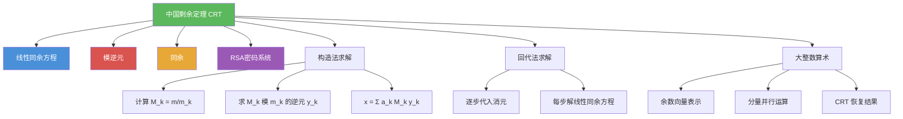

# 中国剩余定理

> [!abstract] 概述
> ==中国剩余定理==（Chinese Remainder Theorem, CRT）是数论中关于联立同余方程组的核心定理：当模数 $m_1, m_2, \ldots, m_n$ 两两互素时，同余方程组 $x \equiv a_i \pmod{m_i}$ 在模 $m = m_1 m_2 \cdots m_n$ 下有==唯一解==。CRT 提供了两种求解方法——==构造法==（利用模逆元将各方程的贡献叠加）和==回代法==（逐步代入消元）。该定理在==大整数算术==加速、RSA 解密优化、秘密共享方案等领域有广泛应用，其历史可追溯至中国南北朝时期的《孙子算经》。

## 定义

> [!def] 中国剩余定理（Chinese Remainder Theorem, CRT）
>
> 设 $m_1, m_2, \ldots, m_n$ 为两两互素的正整数（$>1$），$a_1, a_2, \ldots, a_n$ 为任意整数。则同余方程组
>
> $$\begin{cases} x \equiv a_1 \pmod{m_1} \\ x \equiv a_2 \pmod{m_2} \\ \quad \vdots \\ x \equiv a_n \pmod{m_n} \end{cases}$$
>
> 在模 $m = m_1 m_2 \cdots m_n$ 下有==唯一解==。
>
> **构造法证明**：令 $M_k = m / m_k$（即除 $m_k$ 外所有模数的乘积）。因为 $\gcd(m_k, M_k) = 1$，存在 $M_k$ 模 $m_k$ 的逆元 $y_k$，使得 $M_k y_k \equiv 1 \pmod{m_k}$。构造解：
>
> $$x = a_1 M_1 y_1 + a_2 M_2 y_2 + \cdots + a_n M_n y_n$$
>
> 验证：对每个 $k$，当 $j \neq k$ 时 $M_j \equiv 0 \pmod{m_k}$，因此 $x \equiv a_k M_k y_k \equiv a_k \cdot 1 \equiv a_k \pmod{m_k}$。
>
> $\blacksquare$

> [!def] 回代法求解
>
> 回代法（back substitution）通过逐步代入消元来求解同余方程组：
>
> 1. 由第一个方程 $x \equiv a_1 \pmod{m_1}$，令 $x = m_1 t + a_1$
> 2. 代入第二个方程，解关于 $t$ 的同余方程，得到 $t \equiv t_0 \pmod{m_2}$
> 3. 令 $t = m_2 u + t_0$，代入第三个方程，以此类推
> 4. 最终得到 $x$ 关于最后一个参数的表达式，即为通解

## 核心性质

| 性质 | 描述 | 说明 |
|------|------|------|
| 前提条件 | 模数 $m_1, \ldots, m_n$ 两两互素 | 不满足此条件时不能直接使用 CRT |
| 解的存在性 | 方程组必有解 | 在两两互素条件下 |
| 解的唯一性 | 模 $m = m_1 \cdots m_n$ 下唯一 | 最小非负解在 $[0, m)$ 中 |
| 构造法 | $x = \sum a_k M_k y_k$ | 需要计算 $n$ 个模逆元 |
| 回代法 | 逐步代入消元 | 每步解一个线性同余方程 |
| 大整数表示 | 余数向量唯一表示 | $(a \bmod m_1, \ldots, a \bmod m_n)$ |
| 并行运算 | 分量独立运算后 CRT 恢复 | 可加速大整数算术 |

## 关系网络

- [[线性同余方程]] 是 CRT 的基础构件：CRT 求解联立的多个线性同余方程
- [[模逆元]] 是 CRT 构造法的核心工具：需要计算 $M_k$ 模 $m_k$ 的逆元 $y_k$
- [[同余]] 提供了 CRT 的理论基础：模运算的基本性质保证构造法的正确性
- [[RSA密码系统]] 利用 CRT 加速解密：将模 $n = pq$ 的运算分解为模 $p$ 和模 $q$ 的运算

## 章节扩展

### 第4章：数论与密码学

中国剩余定理是第 4.4 节的重要内容，连接了同余方程求解与实际应用：

- **4.4 解同余方程**：CRT 是线性同余方程组求解的系统化方法，构造法与回代法两种途径
- **4.4 大整数算术**：利用 CRT 将大整数运算分解为小模数的并行运算，最后恢复结果
- **4.4 费马小定理**：与 CRT 联合应用可简化复杂的大幂计算
- **4.6 密码学**：RSA 解密利用 CRT 将模 $n$ 的运算分解为模 $p$ 和模 $q$，加速约 4 倍

## 补充

> [!info] 中国剩余定理的历史与推广
>
> 中国剩余定理的最早形式可追溯至中国南北朝时期的《孙子算经》（约公元 3--5 世纪），其中记载了著名的"物不知数"问题："有物不知其数，三三数之剩二，五五数之剩三，七七数之剩二。问物几何？"该问题在 1247 年由南宋数学家秦九韶在《数书九章》中给出了系统化解法，称为"大衍求一术"。在西方，该定理由欧拉（Euler）于 18 世纪重新发现并严格证明。在抽象代数中，CRT 有深刻的环论推广：当理想 $I_1, \ldots, I_n$ 两两互素时，$R/(I_1 \cap \cdots \cap I_n) \cong R/I_1 \times \cdots \times R/I_n$。在现代计算机科学中，CRT 被广泛应用于大整数运算加速、秘密共享方案（Shamir's Secret Sharing）以及 RSA 解密优化等领域。
>
> **学术来源**：Rosen, K. H. (2019). *Discrete Mathematics and Its Applications* (8th ed.). McGraw-Hill, Section 4.4, Theorem 2.
>
> **参考链接**：[Chinese Remainder Theorem - Wikipedia](https://en.wikipedia.org/wiki/Chinese_remainder_theorem)

## 参见

- [[线性同余方程]] -- CRT 求解的基础构件
- [[模逆元]] -- CRT 构造法中计算 $M_k$ 模 $m_k$ 的逆元
- [[同余]] -- CRT 的理论基础
- [[RSA密码系统]] -- 利用 CRT 加速 RSA 解密运算
