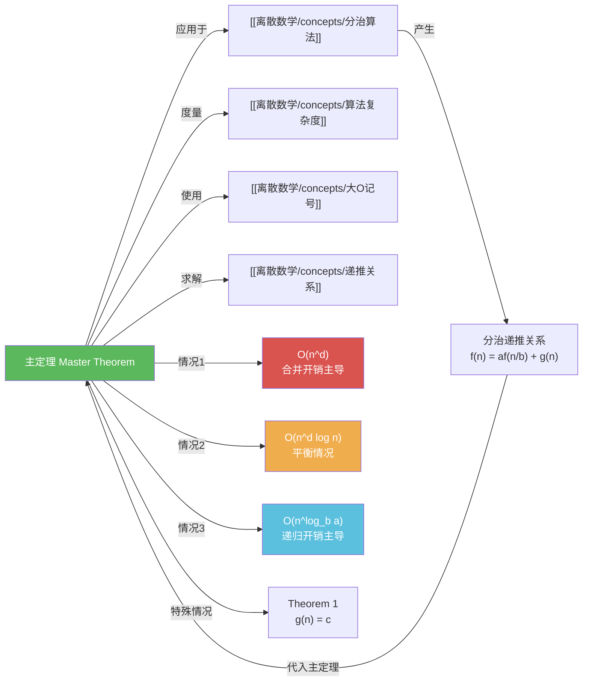

# 主定理

> [!abstract]
> ==主定理（Master Theorem）==提供了形如 $f(n) = af(n/b) + cn^d$ 的分治递推关系复杂度的直接判定方法，根据 $a$ 与 $b^d$ 的大小关系分为三种情况：$a < b^d$ 时 $O(n^d)$（合并开销主导），$a = b^d$ 时 $O(n^d \log n)$（平衡情况），$a > b^d$ 时 $O(n^{\log_b a})$（递归开销主导）。主定理是分析[[离散数学/concepts/分治算法]]复杂度的核心工具。

## 定义

> [!def] 主定理（Master Theorem / Theorem 2）
> 设 $f$ 是递增函数，满足递推关系
>
> $$f(n) = af(n/b) + cn^d$$
>
> 其中 $n = b^k$（$k$ 为正整数），$a \geq 1$，$b$ 是大于 $1$ 的整数，$c > 0$，$d \geq 0$。则
>
> $$f(n) = \begin{cases} O(n^d), & \text{若 } a < b^d \quad \text{（情况1：合并开销主导）} \\ O(n^d \log n), & \text{若 } a = b^d \quad \text{（情况2：平衡情况）} \\ O(n^{\log_b a}), & \text{若 } a > b^d \quad \text{（情况3：递归开销主导）} \end{cases}$$
>
> **应用条件**：
> - $f$ 必须是递增函数
> - $g(n)$ 必须能写成 $cn^d$ 的形式（$c > 0$，$d \geq 0$）
> - $n$ 为 $b$ 的幂（当 $n$ 不是 $b$ 的幂时，结论仍然成立，但需额外论证）

> [!def] Theorem 1（$g(n) = c$ 的特殊情况）
> 主定理在 $d = 0$（即 $g(n) = c$）时的特例。设 $f$ 是递增函数，满足
>
> $$f(n) = af(n/b) + c$$
>
> 其中 $n$ 是 $b$ 的倍数，$a \geq 1$，$b > 1$，$c$ 为正常数。则
>
> $$f(n) = \begin{cases} O(n^{\log_b a}), & \text{若 } a > 1 \\ O(\log n), & \text{若 } a = 1 \end{cases}$$
>
> 当 $a = 1$ 时，精确解为 $f(n) = f(1) + c\log_b n$。当 $a > 1$ 时，精确解为 $f(n) = C_1 n^{\log_b a} + C_2$，其中 $C_1 = f(1) + c/(a-1)$，$C_2 = -c/(a-1)$。

## 核心性质

| 编号 | 情况 | 条件 | 复杂度 | 直觉 | 经典案例 |
|:---:|:---:|:---:|:---:|------|---------|
| 1 | 合并开销主导 | $a < b^d$ | $O(n^d)$ | 每层工作量递减，根节点主导 | $f(n) = 2f(n/2) + n^2$ $\to$ $O(n^2)$ |
| 2 | 平衡情况 | $a = b^d$ | $O(n^d \log n)$ | 每层工作量相同，共 $\log_b n$ 层 | 归并排序 $f(n) = 2f(n/2) + n$ $\to$ $O(n\log n)$ |
| 3 | 递归开销主导 | $a > b^d$ | $O(n^{\log_b a})$ | 每层工作量递增，叶子节点主导 | $f(n) = 3f(n/2) + n$ $\to$ $O(n^{\log_2 3})$ |

| 编号 | 判定步骤 | 说明 |
|:---:|---------|------|
| 1 | 识别参数 | 从递推关系中确定 $a$（子问题个数）、$b$（缩小因子）、$c$ 和 $d$（使 $g(n) = cn^d$） |
| 2 | 计算 $b^d$ | 将 $b$ 的 $d$ 次幂与 $a$ 比较 |
| 3 | 判断情况 | $a < b^d$、$a = b^d$、$a > b^d$ 分别对应三种情况 |
| 4 | 得出结论 | 套用对应情况的复杂度公式 |

## 关系网络

## 章节扩展

### 第08章 高级计数技术 -- 8.3 分治算法与递推关系

主定理是 8.3 节的核心定理（Theorem 2），与分治递推关系紧密关联：

- **递推展开法**：主定理的证明基础。将 $f(n) = af(n/b) + cn^d$ 展开为 $f(n) = a^k f(1) + \sum_{j=0}^{k-1} a^j \cdot c(n/b^j)^d$
- **Theorem 1**：$g(n) = c$（即 $d = 0$）时的特例，可通过等比数列求和精确求解
- **证明思路概述**：
  - **情况1**（$a < b^d$）：每层递归总合并开销为 $cn^d(a/b^d)^j$，由于 $a/b^d < 1$，是递减等比数列，总开销以首项 $cn^d$ 为上界
  - **情况2**（$a = b^d$）：每层递归总合并开销为常数 $cn^d$，共 $\log_b n$ 层，总开销 $cn^d \log_b n$
  - **情况3**（$a > b^d$）：底层叶子节点有 $a^{\log_b n} = n^{\log_b a}$ 个，底层总开销主导

### 经典判定案例

| 递推关系 | 参数 | $b^d$ | 判断 | 结果 |
|---------|:---:|:---:|:---:|:---:|
| $f(n) = 2f(n/2) + n$ | $a=2, b=2, d=1$ | $2$ | $a = b^d$ | $O(n\log n)$ |
| $f(n) = 2f(n/2) + n^2$ | $a=2, b=2, d=2$ | $4$ | $a < b^d$ | $O(n^2)$ |
| $f(n) = 3f(n/2) + n$ | $a=3, b=2, d=1$ | $2$ | $a > b^d$ | $O(n^{\log_2 3})$ |
| $f(n) = 7f(n/2) + 15n^2/4$ | $a=7, b=2, d=2$ | $4$ | $a > b^d$ | $O(n^{\log_2 7})$ |
| $f(n) = 5f(n/4) + 6n$ | $a=5, b=4, d=1$ | $4$ | $a > b^d$ | $O(n^{\log_4 5})$ |
| $f(n) = f(n/2) + 2$ | $a=1, b=2, d=0$ | $1$ | $a = b^d$ | $O(\log n)$ |
| $f(n) = 2f(n/2) + 2$ | $a=2, b=2, d=0$ | $1$ | $a > b^d$ | $O(n)$ |

## 补充

> [!info] 主定理使用注意事项
> - 判断的关键是比较 $a$ 与 $b^d$ 的大小关系，而非 $a$ 与 $b$ 的大小关系
> - 当 $a = b^d$ 时，复杂度多了一个 $\log n$ 因子，这是最容易出错的地方
> - 主定理要求 $g(n) = cn^d$ 的形式，对于 $g(n) = n\log n$ 等非标准形式，需使用递归树法或其他方法
> - Theorem 1 是主定理在 $d = 0$ 时的特殊情况，两者结论完全一致

> [!info] 递归树视角的直觉理解
> 将分治递推展开为一棵递归树，可以直观理解主定理的三种情况：
> - **情况1**（$a < b^d$）：每层工作量按 $(a/b^d)^j$ 递减，总工作量以根节点的工作量 $O(n^d)$ 为上界——合并开销主导
> - **情况2**（$a = b^d$）：每层工作量相同，都是 $O(n^d)$，共 $\log_b n$ 层——总工作量 $O(n^d \log n)$
> - **情况3**（$a > b^d$）：工作量随层数递增，总工作量以叶子节点的工作量 $O(n^{\log_b a})$ 为上界——递归开销主导
>
> 这种递归树分析法是理解主定理的最佳方式，也是《算法导论》（CLRS）第4章推荐的分析方法。

## 参见

- [[离散数学/concepts/分治算法]] -- 主定理的主要应用场景，分治算法的复杂度分析
- [[离散数学/concepts/算法复杂度]] -- 主定理输出的复杂度度量结果
- [[离散数学/concepts/大O记号]] -- 主定理结论中使用的渐近记号
- [[离散数学/concepts/递推关系]] -- 主定理所求解的递推关系类型
