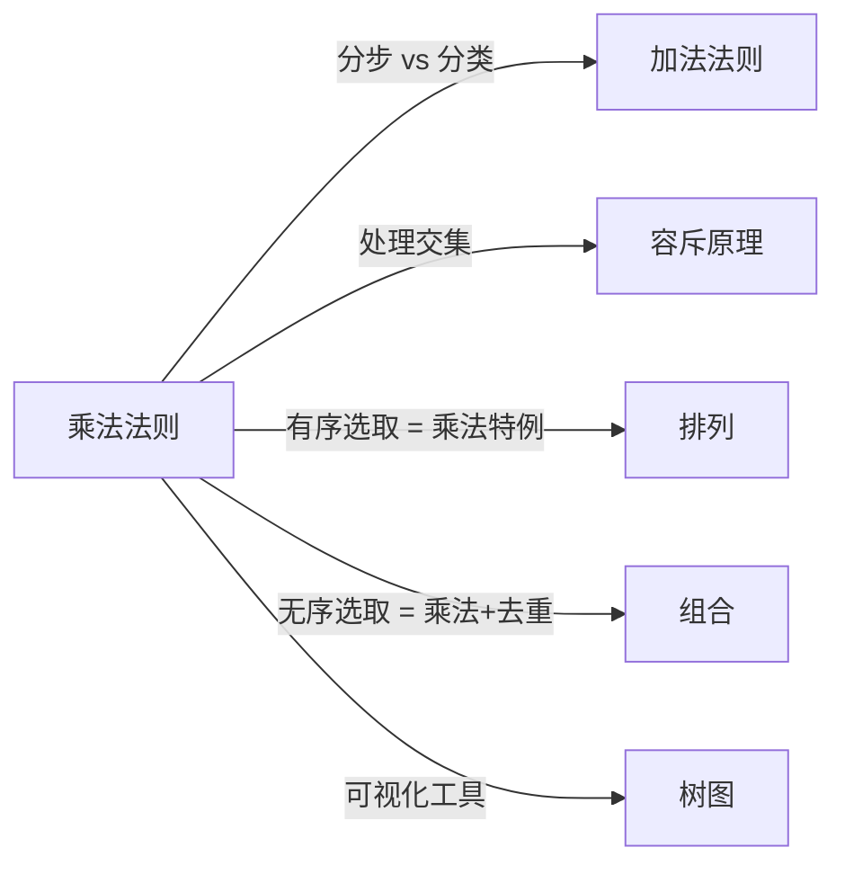

# 乘法法则

> [!abstract]
> ==乘法法则（Product Rule）==是组合计数中最基本的方法之一。如果一个任务可以分解为 $k$ 个**有序步骤**，第 $i$ 步有 $n_i$ 种不同的完成方式，且每步的选择**相互独立**，则完成整个任务的总方法数为各步方法数的**乘积**：
> $$N = n_1 \times n_2 \times \cdots \times n_k = \prod_{i=1}^{k} n_i$$

## 定义

> [!def] 乘法法则（基本形式）
> 若一个过程可以分解为两个连续的步骤：
> - 第一步有 $n_1$ 种完成方式
> - 第二步有 $n_2$ 种完成方式
>
> 则完成整个过程共有 $n_1 \times n_2$ 种方式。
>
> **关键条件**：每一步的选择不受其他步骤选择的影响（步骤间相互独立）。

> [!def] 乘法法则（推广形式）
> 若一个任务可分为 $k$ 个连续步骤，第 $i$ 步有 $n_i$ 种完成方式（$i = 1, 2, \ldots, k$），且各步选择相互独立，则完成该任务的总方法数为：
> $$N = \prod_{i=1}^{k} n_i$$

> [!def] 典型应用场景
> 1. **位串计数**：长度为 $n$ 的位串共有 $2^n$ 个（每位有 2 种选择，共 $n$ 位）
> 2. **函数计数**：从 $m$ 元集到 $n$ 元集的函数共有 $n^m$ 个（每个元素有 $n$ 种映射选择）
> 3. **密码计数**：长度为 $L$ 的密码，若每位可从 $s$ 个符号中选取，则共有 $s^L$ 个可能密码
> 4. **子集计数**：$n$ 元集的子集共有 $2^n$ 个（每个元素有"取"或"不取"两种选择）

## 核心性质

| 编号 | 性质 | 说明 |
|:---:|------|------|
| P1 | **有序性** | 步骤之间存在顺序关系，交换步骤顺序不改变总方法数（但步骤含义随之改变） |
| P2 | **独立性** | 各步的选择范围不依赖于其他步骤的选择结果 |
| P3 | **完备性** | 每一步的每种选择都必须能与其他步骤的每种选择组合，形成完整方案 |
| P4 | **幂律结构** | 当每步方法数相同（$n_i = n$）时，总方法数为 $n^k$，这是乘法法则最常见的特例 |
| P5 | **与加法法则互补** | 乘法法则处理"分步"（AND 关系），[[加法法则]]处理"分类"（OR 关系） |
| P6 | **可递归嵌套** | 某一步的方法数本身可以由乘法法则或加法法则递归计算得出 |

## 关系网络

## 章节扩展

- **排列与组合**：[[排列]]和[[组合]]的本质都是乘法法则的反复应用——逐步选取元素并累乘方法数
- **容斥原理**：当分类之间存在重叠时，[[容斥原理]]对[[加法法则]]进行修正，而乘法法则常用于计算交集大小
- **树图**：[[树图]]是乘法法则的可视化表示，树的每层对应一个步骤，分支数对应方法数

## 补充

> [!info] 生活类比
> 想象你每天早上有三个决策：上衣（5件）、裤子（3条）、鞋子（2双）。每天穿搭的总方案数 = $5 \times 3 \times 2 = 30$ 种。每个决策独立于其他决策——选了哪件上衣不影响裤子和鞋子的选择范围。

> [!info] 常见陷阱
> - **忽略独立性**：如果第二步的选择依赖于第一步的结果，不能直接使用乘法法则，需要分情况讨论
> - **混淆与加法法则**：乘法法则对应"同时满足多个条件"（AND），加法法则对应"满足至少一个条件"（OR）
> - **重复计数**：当不同步骤路径可能产生相同结果时，需要去重

## 参见

- [[加法法则]]：处理互斥分类的计数法则
- [[容斥原理]]：处理集合重叠的推广加法法则
- [[排列]]：基于乘法法则的有序选取
- [[组合]]：基于乘法法则的无序选取
- [[树图]]：乘法法则的树形可视化工具
