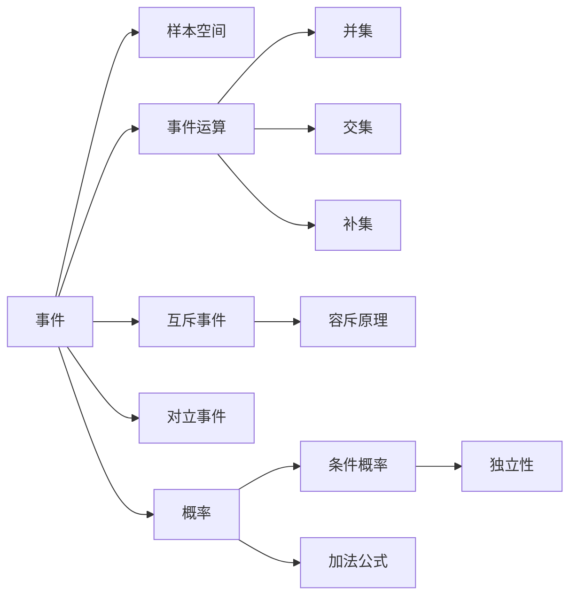

# 事件

> [!abstract]
> ==事件（Event）==是[[样本空间]]的子集，即若干样本点的集合。事件是概率论的核心研究对象——我们关心的不是单个样本点，而是"某些结果是否发生"。事件运算与集合运算完全对应，这使集合论成为概率论的天然语言。

## 定义

> [!def] 事件
> 设 $S$ 为[[样本空间]]，$S$ 的任意子集 $E \subseteq S$ 称为一个**事件**（event）。
> - **基本事件**：仅含一个样本点的事件 $\{s_i\}$
> - **复合事件**：含两个或以上样本点的事件
> - **必然事件**：$S$ 本身（一定发生），$P(S) = 1$
> - **不可能事件**：空集 $\emptyset$（一定不发生），$P(\emptyset) = 0$

> [!def] 互斥事件（Mutually Exclusive Events）
> 若两个事件 $E$ 和 $F$ 不能同时发生，即
> $$E \cap F = \emptyset$$
> 则称 $E$ 和 $F$ 为**互斥事件**（或不相容事件）。
>
> 互斥事件的概率满足：
> $$P(E \cup F) = P(E) + P(F)$$
>
> **推广**：若 $E_1, E_2, \ldots, E_n$ 两两互斥，则
> $$P\left(\bigcup_{i=1}^{n} E_i\right) = \sum_{i=1}^{n} P(E_i)$$

> [!def] 对立事件（Complementary Event）
> 事件 $E$ 的**对立事件**（补事件）记为 $\bar{E}$，定义为：
> $$\bar{E} = S - E = \{s \in S \mid s \notin E\}$$
>
> 对立事件的概率满足**互补律**：
> $$P(\bar{E}) = 1 - P(E)$$
>
> 注意：$E$ 与 $\bar{E}$ 一定互斥，且 $E \cup \bar{E} = S$。

> [!def] 事件运算与集合运算的对应关系
> 事件运算与集合运算存在完全的对应关系：
>
> | 事件语言 | 集合语言 | 符号 |
> |:---:|:---:|:---:|
> | 事件 $E$ 发生 | $s \in E$ | — |
> | $E$ 和 $F$ 同时发生 | 交集 | $E \cap F$ |
> | $E$ 或 $F$ 至少一个发生 | 并集 | $E \cup F$ |
> | $E$ 不发生 | 补集 | $\bar{E}$ |
> | $E$ 发生但 $F$ 不发生 | 差集 | $E - F = E \cap \bar{F}$ |
> | $E$ 蕴含 $F$（$E$ 发生则 $F$ 必发生） | 子集 | $E \subseteq F$ |

## 核心性质

| 编号 | 性质名称 | 数学表达 | 说明 |
|:---:|:---:|:---:|:---|
| 1 | De Morgan 律（事件版） | $\overline{E \cup F} = \bar{E} \cap \bar{F}$，$\overline{E \cap F} = \bar{E} \cup \bar{F}$ | 并的补等于补的交，交的补等于补的并 |
| 2 | 交换律 | $E \cup F = F \cup E$，$E \cap F = F \cap E$ | 并运算与交运算满足交换律 |
| 3 | 结合律 | $(E \cup F) \cup G = E \cup (F \cup G)$ | 多个事件的并运算可任意结合 |
| 4 | 分配律 | $E \cap (F \cup G) = (E \cap F) \cup (E \cap G)$ | 交对并的分配律（并的分配律类似） |
| 5 | 互斥判定 | $E \cap F = \emptyset \Leftrightarrow P(E \cap F) = 0$ | 互斥等价于交集概率为零 |
| 6 | 包含关系 | $E \subseteq F \Rightarrow P(E) \leq P(F)$ | 子事件的概率不超过父事件 |
| 7 | 差事件概率 | $P(E - F) = P(E) - P(E \cap F)$ | 差事件的概率等于原事件减去交集部分 |

## 关系网络

## 章节扩展

- **第7.1节**：事件的基本定义、互斥事件、对立事件、事件运算
- **第7.2节**：[[离散数学/concepts/条件概率]] 将事件关系进一步扩展为信息依赖关系
- **第6章**：[[容斥原理]] 是计算事件并集概率的直接应用

## 补充

> [!info] 事件域（$\sigma$-代数）
> 在严格的概率论中，并非样本空间的所有子集都能作为事件。需要满足以下条件的子集族 $\mathcal{F}$ 称为**事件域**（或 $\sigma$-代数）：
> 1. $S \in \mathcal{F}$
> 2. 若 $E \in \mathcal{F}$，则 $\bar{E} \in \mathcal{F}$（对补封闭）
> 3. 若 $E_1, E_2, \ldots \in \mathcal{F}$，则 $\bigcup_{i=1}^{\infty} E_i \in \mathcal{F}$（对可数并封闭）
>
> 在有限样本空间中，所有子集均可作为事件，因此离散数学中通常不需要考虑这一限制。

> [!info] 事件与命题逻辑的类比
> 事件运算与命题逻辑存在深刻的类比关系：
> - 事件的**并** $\cup$ 对应逻辑**或** $\vee$
> - 事件的**交** $\cap$ 对应逻辑**与** $\wedge$
> - 事件的**补** $\bar{E}$ 对应逻辑**非** $\neg$
> - **互斥**对应逻辑中的**矛盾**（不可同真）
> - **对立**对应逻辑中的**矛盾律**（必有一真一假）
>
> 这一类比有助于从集合论和逻辑学两个角度理解概率。

## 参见

- [[离散数学/concepts/概率]] — 赋予事件数值度量的函数
- [[样本空间]] — 事件的母集，所有可能结果的集合
- [[容斥原理]] — 利用事件互斥性计算并集概率的核心工具
