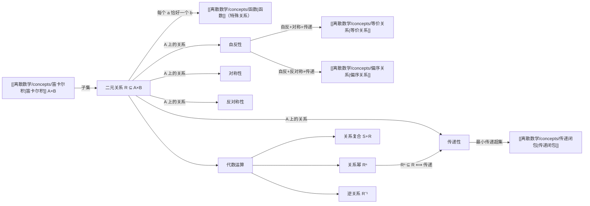

# 二元关系

> [!abstract]
> **二元关系**（binary relation）是从集合 $A$ 到集合 $B$ 的[[离散数学/concepts/笛卡尔积|笛卡尔积]] $A \times B$ 的一个子集，用于描述两个集合元素之间的关联。本概念涵盖关系的定义、记号 $aRb$、集合 $A$ 上关系的四大核心性质（自反性、对称性、反对称性、传递性）、关系的复合运算 $S \circ R$、关系幂 $R^n$、逆关系 $R^{-1}$，以及关系的集合运算（并、交、差）。
>
> - 关系 $R \subseteq A \times B$：用 $aRb$ 表示 $(a,b) \in R$
> - 四大性质：自反、对称、反对称、传递——是研究[[离散数学/concepts/等价关系|等价关系]]和[[离散数学/concepts/偏序关系|偏序关系]]的基础
> - 复合运算 $S \circ R$ 与逆关系 $R^{-1}$ 提供了关系的代数操作工具

## 定义

> [!def] 二元关系（Binary Relation）
> 设 $A$ 和 $B$ 是集合。从 $A$ 到 $B$ 的**二元关系** $R$ 是 $A \times B$ 的一个子集，即 $R \subseteq A \times B$。
>
> - 若 $(a, b) \in R$，记作 $aRb$，读作"$a$ 通过 $R$ 关联到 $b$"
> - 若 $(a, b) \notin R$，记作 $a \not{R} b$
> - $a$ 称为该有序对的**第一元素**，$b$ 称为**第二元素**
> - 当 $A = B$ 时，$R$ 称为**集合 $A$ 上的关系**，即 $R \subseteq A \times A$
>
> **函数与关系的关系**：[[离散数学/concepts/函数|函数]]的图是 $A \times B$ 的子集，因此函数的图是一个关系。函数要求 $A$ 中每个元素恰好对应一个 $B$ 中的元素，而关系允许一对多、一对零。因此**关系是函数的推广**。

> [!def] 自反性（Reflexive）
> 集合 $A$ 上的关系 $R$ 是**自反的**，如果：
>
> $$\forall a \in A, \, (a, a) \in R$$
>
> 即每个元素都与自身相关联。在[[离散数学/concepts/零一矩阵|零一矩阵]]表示中，主对角线全为 1；在[[离散数学/concepts/有向图|有向图]]表示中，每个顶点都有自环。

> [!def] 对称性（Symmetric）
> 集合 $A$ 上的关系 $R$ 是**对称的**，如果：
>
> $$\forall a \forall b \in A, \, ((a, b) \in R \rightarrow (b, a) \in R)$$
>
> 即关系是"双向的"。在零一矩阵中，矩阵关于主对角线对称；在有向图中，若存在 $a$ 到 $b$ 的边，则必存在 $b$ 到 $a$ 的边。

> [!def] 反对称性（Antisymmetric）
> 集合 $A$ 上的关系 $R$ 是**反对称的**，如果：
>
> $$\forall a \forall b \in A, \, ((a, b) \in R \wedge (b, a) \in R \rightarrow a = b)$$
>
> 即不同元素之间不会"双向关联"。等价表述：不存在 $a \neq b$ 使得 $(a, b) \in R$ 且 $(b, a) \in R$。

> [!def] 传递性（Transitive）
> 集合 $A$ 上的关系 $R$ 是**传递的**，如果：
>
> $$\forall a \forall b \forall c \in A, \, ((a, b) \in R \wedge (b, c) \in R \rightarrow (a, c) \in R)$$
>
> 即关系可以"链式传导"。若不存在满足 $(a,b) \in R$ 且 $(b,c) \in R$ 的三元组，则关系平凡地满足传递性。

> [!def] 关系复合（Composition of Relations）
> 设 $R$ 是从 $A$ 到 $B$ 的关系，$S$ 是从 $B$ 到 $C$ 的关系。$R$ 与 $S$ 的**复合** $S \circ R$ 是从 $A$ 到 $C$ 的关系：
>
> $$S \circ R = \{(a, c) \mid \exists b \in B, \, (a, b) \in R \wedge (b, c) \in S\}$$
>
> 注意记号顺序：$S \circ R$ **先应用 $R$，再应用 $S$**（与函数复合 $g \circ f$ 一致）。

> [!def] 关系幂（Powers of Relations）
> 设 $R$ 是集合 $A$ 上的关系。$R$ 的幂递归定义为：
>
> $$R^1 = R, \quad R^{n+1} = R^n \circ R$$
>
> $R^n$ 表示通过 $n-1$ 个中间元素的 $n$ 步关联。在有限集合上，关系幂最终会稳定。

> [!def] 逆关系（Inverse Relation）
> 设 $R$ 是从 $A$ 到 $B$ 的关系。$R$ 的**逆关系** $R^{-1}$ 是从 $B$ 到 $A$ 的关系：
>
> $$R^{-1} = \{(b, a) \mid (a, b) \in R\}$$
>
> 将 $R$ 中所有有序对的两个元素交换位置。$R$ 是对称的当且仅当 $R = R^{-1}$。

> [!def] 关系的集合运算
> 设 $R_1$ 和 $R_2$ 都是从 $A$ 到 $B$ 的关系，则：
> - $R_1 \cup R_2$（并）：$(a,b) \in R_1$ 或 $(a,b) \in R_2$
> - $R_1 \cap R_2$（交）：$(a,b) \in R_1$ 且 $(a,b) \in R_2$
> - $R_1 - R_2$（差）：$(a,b) \in R_1$ 且 $(a,b) \notin R_2$
> - $R_1 \oplus R_2$（对称差）：$(a,b) \in R_1$ 或 $(a,b) \in R_2$ 但不同时属于两者

## 核心性质

| 性质 | 量词定义 | 直觉 | 矩阵特征 | 典型例子 |
|:-----|:---------|:-----|:---------|:---------|
| **自反性** | $\forall a \in A, (a,a) \in R$ | 照镜子——每个元素都能看到自己 | 主对角线全为 1 | $\leq$, $=$, 整除 |
| **对称性** | $\forall a,b \in A, (a,b) \in R \Rightarrow (b,a) \in R$ | 双向车道 | 矩阵关于主对角线对称 | $=$, 同余 $\pmod m$ |
| **反对称性** | $\forall a,b \in A, (a,b) \in R \wedge (b,a) \in R \Rightarrow a = b$ | 单行道——不同元素间最多单向 | 若 $i \neq j$，则 $m_{ij}$ 和 $m_{ji}$ 不同时为 1 | $\leq$, $<$, 整除 |
| **传递性** | $\forall a,b,c \in A, (a,b) \in R \wedge (b,c) \in R \Rightarrow (a,c) \in R$ | 接力赛——可以链式传导 | $M_R^2$ 中为 1 的位置在 $M_R$ 中也为 1 | $\leq$, $<$, $=$, 整除 |

> [!info] 对称性与反对称性的关系
> - 两者**不是对立面**：一个关系可以**既对称又反对称**（如 $R = \{(a,a) \mid a \in A\}$）
> - 一个关系可以**既不对称也不反对称**（如 $R = \{(1,2), (2,1), (2,3)\}$）
> - "不对称"（asymmetric）是更强条件：$(a,b) \in R \Rightarrow (b,a) \notin R$，蕴含反对称和反自反

> [!info] 各性质关系的计数（$n$ 元素集合）
> - 自反关系：$2^{n(n-1)}$ 个
> - 对称关系：$2^{n(n+1)/2}$ 个
> - 反对称关系：$2^n \cdot 3^{n(n-1)/2}$ 个
> - 传递关系：无一般公式（$T(4) = 3994$, $T(5) = 154303$）

## 关系网络

## 章节扩展

本概念出自 **第09章 关系**，相关章节内容包括：

- **9.1 关系及其性质**：本概念的直接来源，涵盖二元关系的完整定义与性质
- **9.2 n元关系及其应用**：将二元关系推广到 $n$ 元，应用于关系数据库与数据挖掘
- **9.3 关系的表示**：用零一矩阵和有向图表示关系
- **9.4 关系的闭包**：传递闭包、自反闭包、对称闭包（Warshall 算法）
- **9.5 等价关系**：自反 + 对称 + 传递 = 等价关系，等价类与划分
- **9.6 偏序关系**：自反 + 反对称 + 传递 = 偏序关系，哈斯图

### 第13章：计算建模

- **13.2 带输出的有限状态机**：有限状态机的状态转移函数 $\delta: S \times I \to S$ 本质上是一种二元关系——输入状态-输入符号对与输出状态的对应。Mealy 机的输出函数 $g: S \times I \to O$ 同样是笛卡尔积上的关系。
- **13.3 不带输出的有限状态机**：DFA 和 NFA 的状态转移可以理解为状态集上的二元关系。NFA 的转移关系 $\Delta \subseteq S \times (\Sigma \cup \{\epsilon\}) \times S$ 是三元关系，而 DFA 的转移函数 $\delta: S \times \Sigma \to S$ 是二元关系（函数是特殊的关系）。此外，==等价关系==在自动机理论中有重要应用：Myhill-Nerode 定理利用状态集上的等价关系来刻画正则语言，自动机最小化算法通过构造等价类来合并不可区分状态。

## 补充

> [!info] 传递性的等价刻画
> 集合 $A$ 上的关系 $R$ 是传递的，当且仅当对一切 $n = 1, 2, 3, \ldots$，都有 $R^n \subseteq R$。
>
> **证明要点**：
> - 必要性（$\Rightarrow$）：对 $n$ 用数学归纳法。$R^1 = R \subseteq R$ 平凡成立；归纳步中，$(a,b) \in R^{n+1} = R^n \circ R$ 意味着存在 $x$ 使得 $(a,x) \in R$ 且 $(x,b) \in R^n \subseteq R$，由传递性得 $(a,b) \in R$
> - 充分性（$\Leftarrow$）：$R^2 \subseteq R$。若 $(a,b) \in R$ 且 $(b,c) \in R$，则 $(a,c) \in R^2 \subseteq R$

> [!info] 关系复合与函数复合的类比
> 关系的复合 $S \circ R$ 与函数的复合 $g \circ f$ 完全类似：先应用 $R$（或 $f$），再应用 $S$（或 $g$）。区别在于函数复合每个输入恰好有一个输出，而关系复合每个输入可以有零个、一个或多个输出。关系幂 $R^n$ 对应 $f^n(x) = f(f(\cdots f(x)\cdots))$。

> [!info] 关系性质的直觉记忆法
> - **自反性**：照镜子——每个元素都能"看到自己"
> - **对称性**：双向车道——$a$ 到 $b$ 通，$b$ 到 $a$ 也通
> - **反对称性**：单行道——不同元素之间最多只能单向通行
> - **传递性**：接力赛——$a$ 传给 $b$，$b$ 传给 $c$，则 $a$ 可以直接传给 $c$

## 参见

- [[离散数学/concepts/笛卡尔积]] -- 二元关系的定义基础，$R \subseteq A \times B$
- [[离散数学/concepts/函数]] -- 函数是特殊的二元关系（一对一映射）
- [[离散数学/concepts/集合]] -- 关系是集合（有序对的集合）
- [[离散数学/concepts/集合运算]] -- 关系支持并、交、差等集合运算
- [[离散数学/concepts/零一矩阵]] -- 用矩阵表示关系，判定关系性质
- [[离散数学/concepts/有向图]] -- 用有向图表示关系，直观展示关联
- [[离散数学/concepts/传递闭包]] -- 包含 $R$ 的最小传递关系
- [[离散数学/concepts/等价关系]] -- 自反 + 对称 + 传递
- [[离散数学/concepts/偏序关系]] -- 自反 + 反对称 + 传递
