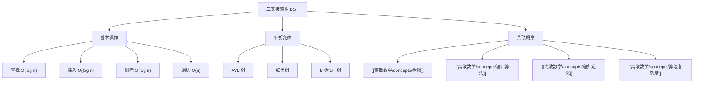

# 二叉搜索树

> [!abstract] 概述
> ==二叉搜索树==（Binary Search Tree, BST）是一种特殊的==二叉树==，其中每个节点的左子树中所有节点的值都小于该节点的值，右子树中所有节点的值都大于该节点的值。这一性质使得 BST 支持==高效的查找、插入和删除==操作。在平衡条件下（如==AVL 树==或==红黑树==），这些操作的时间复杂度为 $O(\log n)$。BST 是==递归定义==的典型应用——整棵 BST 的性质由其根节点和左右子树的递归性质共同决定。BST 的三种遍历（前序、中序、后序）分别对应不同的应用场景，其中==中序遍历==可以得到有序的键值序列。

## 定义

> [!def] 二叉搜索树（BST）
>
> 一棵==二叉搜索树==是一棵二叉树，其中每个节点存储一个键值 $k$，满足==BST 性质==：
>
> - 对于节点 $x$，其左子树中所有节点的键值 $\leq k$
> - 对于节点 $x$，其右子树中所有节点的键值 $\geq k$
>
> 形式化地，设 $L(x)$ 和 $R(x)$ 分别为 $x$ 的左子树和右子树中的键值集合：
>
> $$\forall k_L \in L(x):\ k_L \leq \text{key}(x), \quad \forall k_R \in R(x):\ k_R \geq \text{key}(x)$$

> [!def] AVL 树
>
> ==AVL 树==是一种==自平衡二叉搜索树==，由 Adelson-Velsky 和 Landis 于1962年提出。对于 AVL 树中的每个节点，其左右子树的高度差（==平衡因子==）的绝对值不超过 1：
>
> $$|\text{height}(L(x)) - \text{height}(R(x))| \leq 1$$
>
> AVL 树通过==旋转==（rotation）操作在插入和删除后恢复平衡，保证查找、插入、删除操作均为 $O(\log n)$。

> [!def] 红黑树
>
> ==红黑树==是另一种自平衡二叉搜索树，每个节点额外存储一个颜色属性（红或黑），满足以下性质：
> 1. 每个节点是红色或黑色
> 2. 根节点是黑色
> 3. 叶节点（NIL）是黑色
> 4. 红色节点的两个子节点都是黑色（不能有连续红节点）
> 5. 从任一节点到其所有叶节点的路径上，黑色节点数相同（黑高度相同）
>
> 红黑树保证树的高度为 $O(\log n)$，因此查找、插入、删除操作均为 $O(\log n)$。

## 核心性质

| 性质 | 描述 | 备注 |
|:-----|:-----|:-----|
| ==BST 性质== | 左子树 ≤ 节点 ≤ 右子树 | 支持高效查找 |
| ==中序遍历有序== | BST 的中序遍历产生升序序列 | BST = "排序" + "树" |
| ==查找复杂度== | 平均 $O(\log n)$，最坏 $O(n)$ | 最坏情况退化为链表 |
| ==AVL 严格平衡== | 左右子树高度差 ≤ 1 | 查找 $O(\log n)$，旋转 $O(1)$ |
| ==红黑树近似平衡== | 树高 ≤ $2\log_2(n+1)$ | 插入最多2次旋转，删除最多3次 |
| ==递归结构== | 子树仍然是 BST | 递归算法天然适配 |

## 关系网络

- **前置知识**：二叉树的基本概念、递归
- **核心关联**：BST 是递归定义的典型实例，也是递归算法（查找、遍历）的经典应用场景
- **后继概念**：[[离散数学/concepts/递归算法]]（BST 操作的递归实现）、[[离散数学/concepts/算法复杂度]]（BST 操作的复杂度分析）

## 章节扩展

### 第11章：树

二叉搜索树是第11章中树的应用（Section 11.2）和树的遍历（Section 11.3）的核心实例。

**BST 与树的遍历**：

- **前序遍历**（根-左-右）：用于复制树结构
- **中序遍历**（左-根-右）：产生有序序列（BST 特有性质）
- **后序遍历**（左-右-根）：用于计算目录大小、释放内存

**BST 的递归本质**：

BST 的查找、插入、删除操作都可以自然地用递归描述：
- 查找 key：与根比较 → 递归搜索左/右子树 → 基准情况为空树
- 插入 key：递归找到插入位置 → 创建新节点
- 删除 key：三种情况（叶节点/单子树/双子树 → 用后继替换）

## 补充

> [!info] BST 在实际系统中的应用
>
> - **标准库实现**：C++ `std::map`/`std::set`（红黑树）、Java `TreeMap`/`TreeSet`（红黑树）
> - **数据库索引**：B 树和 B+ 树是 BST 的多路推广，广泛用于数据库和文件系统
> - **符号表**：编译器中的符号表常用 BST 实现
> - **优先队列**：某些优先队列实现基于 BST

> [!tip] 何时选择 BST vs 哈希表
>
> | 比较维度 | BST | 哈希表 |
> |:---------|:----|:-------|
> | 查找 | $O(\log n)$ | $O(1)$ 平均 |
> | 有序遍历 | ✅ 支持 | ❌ 不支持 |
> | 范围查询 | ✅ 高效 | ❌ 需全扫描 |
> | 最小/最大值 | $O(\log n)$ | $O(n)$ |
> | 空间开销 | 指针开销 | 可能冲突 |

## 参见

- [[离散数学/concepts/树图]] -- BST 是特殊的二叉树
- [[离散数学/concepts/递归算法]] -- BST 操作的递归实现
- [[离散数学/concepts/递归定义]] -- BST 的递归定义
- [[离散数学/concepts/算法复杂度]] -- BST 操作的复杂度分析
