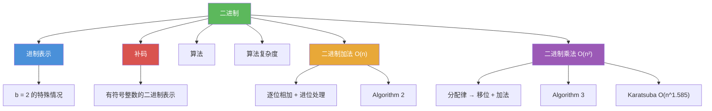

# 二进制

> [!abstract] 概述
> ==二进制（binary）==是以 2 为基数的进制表示，是计算机内部数据的基础编码方式。本概念页聚焦于基于二进制表示的两个核心运算算法：==二进制加法算法==（Algorithm 2）通过逐位相加并处理进位，以 $O(n)$ 次位运算完成两个 $n$ 位二进制数的加法；==二进制乘法算法==（Algorithm 3）利用分配律将乘法分解为移位与加法的组合，以 $O(n^2)$ 次位运算完成两个 $n$ 位二进制数的乘法。这两个算法是理解计算机算术运算复杂度的基石。

## 定义

> [!def] 二进制加法算法（Algorithm 2）
>
> 给定两个 $n$ 位二进制数 $a = (a_{n-1} \ldots a_0)_2$ 和 $b = (b_{n-1} \ldots b_0)_2$：
> 1. 从最低位开始，逐位相加：$a_j + b_j + c_j = 2c_{j+1} + s_j$，其中 $c_j$ 为进位，$s_j$ 为结果位
> 2. 初始进位 $c_0 = 0$
> 3. 最终进位 $s_n = c_{n-1}$ 作为最高位
>
> - 每次位加法需要 2 次位运算，共 $n$ 位，总计 $O(n)$ 次位运算

> [!def] 二进制乘法算法（Algorithm 3）
>
> 给定两个 $n$ 位二进制数 $a$ 和 $b$：
> 1. 利用分配律：$ab = a(b_0 \cdot 2^0) + a(b_1 \cdot 2^1) + \cdots + a(b_{n-1} \cdot 2^{n-1})$
> 2. 若 $b_j = 1$，则部分积 $c_j = a$ 左移 $j$ 位；若 $b_j = 0$，则 $c_j = 0$
> 3. 将所有部分积相加得到最终结果
>
> - 移位次数：$\sum_{j=0}^{n-1} j = O(n^2)$
> - 加法次数：$n$ 次加法，每次 $O(n)$ 位运算，总计 $O(n^2)$
> - 总复杂度：$O(n^2)$ 位运算

## 核心性质

| 性质 | 描述 | 说明 |
|------|------|------|
| 二进制加法复杂度 | $O(n)$ 次位运算 | 逐位相加，每次常数次位运算 |
| 二进制乘法复杂度 | $O(n^2)$ 次位运算 | 分配律分解为移位与加法 |
| 加法进位传播 | 进位可能逐位传递 | 最坏情况下进位传播 $n$ 位 |
| 乘法部分积 | $b_j = 1$ 时产生一个左移 $j$ 位的部分积 | 最多 $n$ 个部分积 |
| 更高效的乘法 | Karatsuba $O(n^{1.585})$，Schonhage-Strassen $O(n \log n \log \log n)$ | 传统 $O(n^2)$ 并非最优 |
| 位运算模型 | 以单个二进制位的运算为基本单位 | 算法复杂度的标准度量方式 |

## 关系网络

- [[进制表示]] 是二进制的理论基础：基数展开定理保证了二进制表示的唯一性
- [[补码]] 建立在二进制表示之上，是计算机中表示有符号整数的标准方法
- [[算法]] 提供了二进制加法和乘法的精确描述框架（伪代码、有限性、确定性）
- [[算法复杂度]] 提供了分析二进制运算效率的工具：加法 $O(n)$，乘法 $O(n^2)$

## 章节扩展

### 第4章：数论与密码学

二进制运算是第 4 章 4.2 节的核心算法内容：

- **4.2 整数表示与算法**：二进制加法算法（Algorithm 2，$O(n)$）、二进制乘法算法（Algorithm 3，$O(n^2)$）、div 和 mod 的计算（Algorithm 4）
- **4.2 模幂算法**：快速幂利用指数的二进制展开，将 $O(n)$ 次乘法降至 $O(\log n)$ 次
- **4.5 密码学应用**：RSA 中的大整数运算依赖高效的二进制乘法和模幂算法

## 补充

> [!info] 二进制运算算法的历史与学术背景
>
> "algorithm"一词源自波斯数学家 ==花拉子密==（al-Khwarizmi, 约 780--850）的名字，他系统描述了印度-阿拉伯数字的算术运算步骤，这些步骤正是最早的"算法"。本节讨论的二进制加法和乘法算法，正是历史上最早被称为"算法"的计算过程。传统的 $O(n^2)$ 乘法算法并非最优：1960 年 Karatsuba 发现了 $O(n^{1.585})$ 的乘法算法，1971 年 Schonhage-Strassen 算法达到了 $O(n \log n \log \log n)$。2024 年，新的算法进一步将乘法复杂度推进到接近 $O(n \log n)$。这些算法展示了算法设计对计算效率的巨大影响。
>
> **学术来源**：Rosen, K. H. (2019). *Discrete Mathematics and Its Applications* (8th ed.). McGraw-Hill, Section 4.2.
>
> **参考链接**：Knuth, D. E. (1997). *The Art of Computer Programming* (Vol. 2, 3rd ed.). Addison-Wesley, Section 4.3.3.

## 参见

- [[进制表示]] -- 基数展开定理与进制转换，二进制的理论基础
- [[补码]] -- 建立在二进制之上的有符号整数表示方法
- [[算法]] -- 算法的定义与五大特性，二进制运算的描述框架
- [[算法复杂度]] -- 时间复杂度与空间复杂度的分析方法
