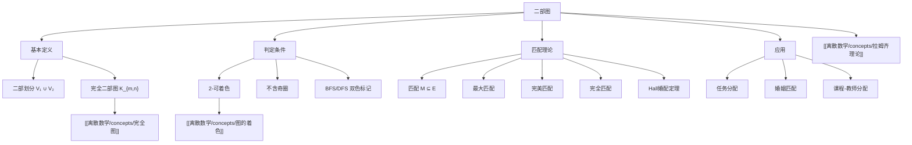

# 二部图

> [!abstract] 概述
> ==二部图==（bipartite graph）是顶点集可以被划分为两个不相交子集、且所有边都跨越两个子集的图。二部图与==图的着色==密切相关：一个图是二部图当且仅当它是 2-可着色的，也等价于图中不含奇数长度的圈。二部图的核心应用之一是==匹配==问题：在二部图的两个顶点子集之间寻找尽可能多的不相交边。==Hall 婚配定理==给出了完全匹配存在的充要条件，是组合数学中最优美的定理之一。匹配理论在任务分配、资源调度、婚姻匹配等场景中有广泛应用。

## 定义

> [!def] 二部图（Bipartite Graph）
>
> 一个图 $G = (V, E)$ 是==二部图==，如果存在 $V$ 的一个划分 $V = V_1 \cup V_2$（$V_1 \cap V_2 = \emptyset$），使得 $G$ 中的每条边都连接 $V_1$ 中的一个顶点和 $V_2$ 中的一个顶点。
>
> - $(V_1, V_2)$ 称为 $G$ 的一个==二部划分==（bipartition）
> - 若 $V_1$ 中的每个顶点都与 $V_2$ 中的每个顶点相邻，则称 $G$ 为==完全二部图==，记为 $K_{m,n}$（其中 $m = |V_1|$，$n = |V_2|$）
> - $K_{m,n}$ 有 $m + n$ 个顶点和 $m \cdot n$ 条边

> [!def] 二部图的判定定理
>
> 以下三个条件等价：
>
> 1. $G$ 是二部图
> 2. $G$ 是 2-可着色的（即 $\chi(G) \leq 2$）
> 3. $G$ 不含奇数长度的圈（奇圈）
>
> **证明思路**（$1 \Rightarrow 3$）：设 $G$ 有二部划分 $(V_1, V_2)$，考虑 $G$ 中任意圈 $v_1, v_2, \ldots, v_k, v_1$。由于边跨越 $V_1$ 和 $V_2$，圈上的顶点交替属于 $V_1$ 和 $V_2$。若 $k$ 为奇数，则 $v_1$ 和 $v_k$ 属于同一集合，但边 $\{v_k, v_1\}$ 需要跨越两个集合，矛盾。因此 $k$ 必为偶数。

> [!def] 匹配（Matching）
>
> 在二部图 $G = (V_1 \cup V_2, E)$ 中，一个==匹配== $M \subseteq E$ 是边的子集，使得 $M$ 中的任意两条边不共享端点。
>
> - 匹配 $M$ 中的每条边称为一个==匹配边==，其端点称为==被匹配的==（matched）
> - 未被匹配的顶点称为==自由的==（free）或==暴露的==（exposed）
> - ==最大匹配==（maximum matching）：边数最多的匹配
> - ==完美匹配==（perfect matching）：所有顶点都被匹配的匹配（要求 $|V_1| = |V_2|$）
> - ==完全匹配==（complete matching from $V_1$ to $V_2$）：$V_1$ 的每个顶点都被匹配（不要求 $V_2$ 的每个顶点都被匹配）

> [!def] Hall 婚配定理（Hall's Marriage Theorem）
>
> 设 $G = (V_1 \cup V_2, E)$ 是二部图，$|V_1| \leq |V_2|$。则 $G$ 中存在从 $V_1$ 到 $V_2$ 的==完全匹配==，当且仅当：
>
> $$\forall S \subseteq V_1, \quad |N(S)| \geq |S|$$
>
> 其中 $N(S) = \{v \in V_2 \mid \exists u \in S, \{u, v\} \in E\}$ 是 $S$ 的==邻域==（neighborhood）。
>
> - 上述条件称为==Hall 条件==（Hall's condition）
> - 直觉理解：$V_1$ 的任何子集 $S$ 的"候选对象"集合 $N(S)$ 的大小都不小于 $S$ 本身的大小
> - Hall 定理是二部图匹配理论的核心定理，将存在性问题转化为邻域条件验证

## 核心性质

| 性质 | 描述 | 备注 |
|:-----|:-----|:-----|
| ==2-可着色== | 二部图等价于 2-可着色图 | $\chi(G) \leq 2$ |
| ==无奇圈== | 二部图不含奇数长度的圈 | 等价判定条件 |
| ==完全二部图== | $K_{m,n}$ 有 $m+n$ 顶点、$mn$ 条边 | 最稠密的二部图 |
| ==边数上界== | $e \leq \lfloor n^2/4 \rfloor$（$n$ 阶二部图） | Turan 定理特例 |
| ==最大匹配== | 可用匈牙利算法在 $O(VE)$ 内求解 | 增广路方法 |
| ==Hall 条件== | 完全匹配的充要条件 | 邻域条件 |
| ==Konig 定理== | 最大匹配数 = 最小顶点覆盖数 | 仅适用于二部图 |

## 关系网络

- **前置知识**：[[离散数学/concepts/完全图]]（完全二部图 $K_{m,n}$ 是二部图的重要特例）
- **核心关联**：二部图是着色数为 2 的图，匹配理论是二部图最核心的应用方向
- **后继概念**：[[离散数学/concepts/图的着色]]（二部图是 2-可着色图）、[[离散数学/concepts/拉姆齐理论]]（二部图在极值图论中的角色）

## 章节扩展

### 第10章：图论

**二部图的判定算法**：利用 BFS 或 DFS 可以在线性时间 $O(V + E)$ 内判定一个图是否为二部图。算法思路：从一个顶点出发进行 BFS，交替标记颜色（如红色和蓝色）。若在遍历过程中发现一条边连接了两个同色顶点，则图中存在奇圈，图不是二部图；否则图是二部图，颜色标记给出一个二部划分。

**匈牙利算法**：求解二部图最大匹配的经典算法，由 Edmonds 于 1965 年提出（基于 Kuhn 1955 年和 Munkres 1957 年的工作）。算法核心思想是==增广路==（augmenting path）：

- 一条==增广路==是从一个自由顶点出发、交替经过非匹配边和匹配边、到达另一个自由顶点的路径
- 翻转增广路上的匹配边和非匹配边，可以使匹配数增加 1
- **Berge 定理**：一个匹配 $M$ 是最大匹配，当且仅当不存在关于 $M$ 的增广路
- 匈牙利算法的时间复杂度为 $O(VE)$；使用 Hopcroft-Karp 算法可优化到 $O(\sqrt{V} \cdot E)$

**Konig 定理**：在二部图中，==最大匹配的边数==等于==最小顶点覆盖的顶点数==。这是二部图特有的优美性质，在一般图中不成立（一般图中最大匹配数 $\leq$ 最小顶点覆盖数）。Konig 定理将匹配问题与覆盖问题联系起来，在组合优化中有重要意义。

**Hall 定理的应用举例**：假设有 $n$ 名学生和 $m$ 门课程，每名学生选修了若干门课程。将学生和课程分别作为 $V_1$ 和 $V_2$，学生与其选修的课程之间连边。若要为每名学生分配一门不同的课程，需要满足 Hall 条件：对于任意 $k$ 名学生的集合，他们共同选修的课程数不少于 $k$。

## 补充

> [!info] 二部图的实际应用
>
> 二部图和匹配理论在现实中有丰富的应用场景：
>
> - **任务分配**：工人与任务的匹配，最大化完成任务数
> - **婚姻匹配**：稳定婚姻问题（Gale-Shapley 算法）的图论基础
> - **课程安排**：课程与时间段的匹配，避免时间冲突
> - **求职匹配**：求职者与职位的匹配，双向选择优化
> - **网络流**：二部图最大匹配可以转化为最大流问题求解

> [!tip] 二部图匹配的实用技巧
>
> - **判定二部图**：使用 BFS 双色标记法，时间复杂度 $O(V + E)$
> - **求最大匹配**：使用匈牙利算法 $O(VE)$ 或 Hopcroft-Karp 算法 $O(\sqrt{V} \cdot E)$
> - **验证完全匹配**：检查 Hall 条件（实际中通常直接运行匹配算法）
> - **加权匹配**：若边有权重，可使用 Kuhn-Munkres 算法（匈牙利算法的加权版本），时间复杂度 $O(n^3)$

> [!warning] 常见误区
>
> - 二部图的定义要求所有边的端点分别属于两个不同的顶点子集，但二部划分 $(V_1, V_2)$ 不一定唯一
> - 完全匹配要求 $|V_1| \leq |V_2|$，而完美匹配要求 $|V_1| = |V_2|$ 且所有顶点都被匹配
> - Hall 条件是"对所有子集 $S$"都成立，不能只检查个别子集
> - 树一定是二部图（因为树不含圈，自然不含奇圈），但二部图不一定是树
> - $K_{1,1}$ 就是 $K_2$（一条边），$K_{1,n-1}$ 是星图

## 参见

- [[离散数学/concepts/图的着色]] -- 二部图等价于 2-可着色图
- [[离散数学/concepts/完全图]] -- 完全二部图 $K_{m,n}$ 是二部图的重要特例
- [[离散数学/concepts/拉姆齐理论]] -- 二部图在极值图论和 Ramsey 理论中的角色
