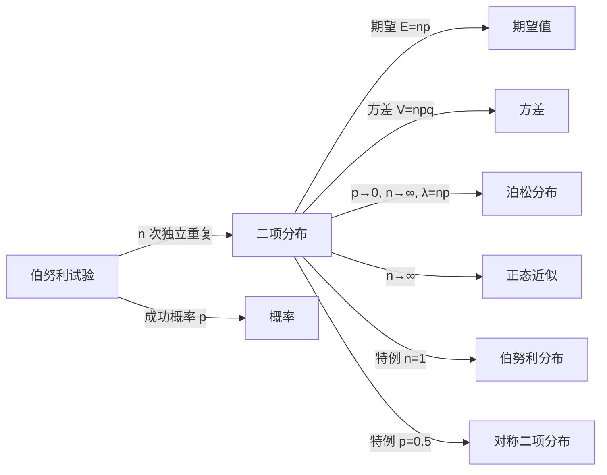

# 二项分布

> [!abstract]
> ==二项分布（Binomial Distribution）==描述 $n$ 次独立重复[[离散数学/concepts/伯努利试验]]中恰好成功 $k$ 次的概率。其概率质量函数为 $b(k; n, p) = \binom{n}{k} p^k (1-p)^{n-k}$。二项分布是离散概率论中最重要的分布之一，广泛应用于质量检测、民意调查、可靠性分析等领域。

## 定义

> [!def] 二项分布
> 设进行 $n$ 次**独立重复**的[[离散数学/concepts/伯努利试验]]，每次成功的概率为 $p$（$0 < p < 1$），
> 失败的概率为 $q = 1 - p$。
> 令 $X$ 表示 $n$ 次试验中成功的总次数，则 $X$ 服从参数为 $(n, p)$ 的**二项分布**，
> 记为 $X \sim B(n, p)$。
>
> > [!def] 二项分布的概率质量函数
> > $$
> > b(k; n, p) = P(X = k) = \binom{n}{k} p^k q^{n-k}, \quad k = 0, 1, 2, \ldots, n
> > $$
> > 其中 $\binom{n}{k} = \frac{n!}{k!(n-k)!}$ 是二项式系数，
> > 表示从 $n$ 次试验中选出 $k$ 次成功位置的组合数。
> >
> > **推导思路**：要恰好成功 $k$ 次，需要：
> > 1. 从 $n$ 次试验中选出 $k$ 次成功的位置（$\binom{n}{k}$ 种方式）；
> > 2. 选定的 $k$ 次试验均成功（概率 $p^k$）；
> > 3. 剩余 $n - k$ 次试验均失败（概率 $q^{n-k}$）。
> > 由独立性，三者相乘即得。

## 核心性质

| 编号 | 性质 | 数学表达 / 说明 |
|:---:|------|----------------|
| 1 | **取值范围** | $X$ 的可能取值为 $\{0, 1, 2, \ldots, n\}$ |
| 2 | **概率质量函数** | $b(k; n, p) = \binom{n}{k} p^k q^{n-k}$ |
| 3 | **归一性** | $\sum_{k=0}^{n} \binom{n}{k} p^k q^{n-k} = (p + q)^n = 1$（二项式定理） |
| 4 | **期望值** | $E(X) = np$ |
| 5 | **方差** | $V(X) = npq = np(1-p)$ |
| 6 | **最可能值** | 使 $b(k; n, p)$ 最大的 $k$ 为 $\lfloor (n+1)p \rfloor$ 或 $\lceil (n+1)p \rceil - 1$ |
| 7 | **可加性** | 若 $X \sim B(n_1, p)$，$Y \sim B(n_2, p)$ 且 $X, Y$ 独立，则 $X + Y \sim B(n_1 + n_2, p)$ |

## 关系网络

## 章节扩展

- **泊松近似**：当 $n$ 很大、$p$ 很小、$\lambda = np$ 适中时，二项分布可用泊松分布近似：
  $b(k; n, p) \approx \frac{\lambda^k e^{-\lambda}}{k!}$。
- **正态近似（De Moivre-Laplace 定理）**：当 $n$ 较大时，$X$ 近似服从 $N(np, npq)$。
- **二项式定理的联系**：二项分布的归一性直接来源于二项式定理 $(p+q)^n = \sum_{k=0}^{n}\binom{n}{k}p^k q^{n-k}$。

## 补充

> [!info] 计算示例
> 某工厂产品合格率为 $p = 0.95$，随机抽取 $n = 10$ 件产品。
> 恰好有 $k = 8$ 件合格的概率为：
> $$
> b(8; 10, 0.95) = \binom{10}{8} (0.95)^8 (0.05)^2 = 45 \times 0.6634 \times 0.0025 \approx 0.0746
> $$
> 期望合格件数 $E(X) = 10 \times 0.95 = 9.5$ 件。
>
> [!info] 二项分布的命名由来
> 二项分布的名称来源于**二项式定理**（Binomial Theorem）。
> 概率质量函数中的系数 $\binom{n}{k}$ 正是二项展开式 $(p+q)^n$ 的系数，
> 因此该分布被称为"二项"分布。

## 参见

- [[离散数学/concepts/伯努利试验]]：二项分布的产生来源
- [[离散数学/concepts/概率分布]]：二项分布是一种离散概率分布
- [[离散数学/concepts/期望值]]：二项分布的期望为 $np$
- [[离散数学/concepts/方差]]：二项分布的方差为 $np(1-p)$
- [[离散数学/concepts/独立性]]：二项分布要求各次试验相互独立
