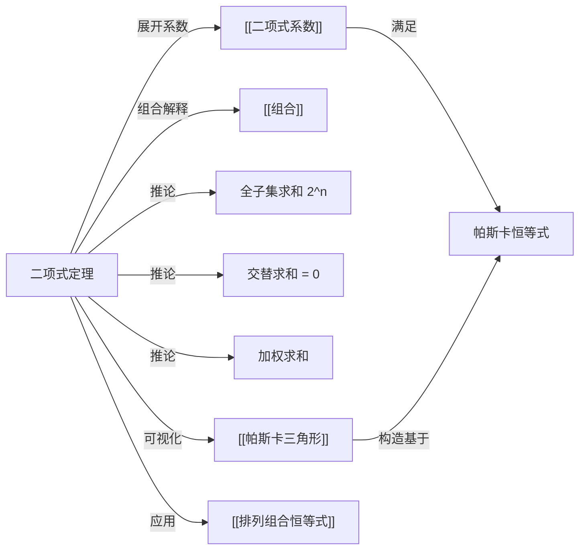

# 二项式定理

> [!abstract]
> ==二项式定理（Binomial Theorem）==给出了二项式 $(x+y)^n$ 展开后的系数公式：
>
> $$(x+y)^n = \sum_{k=0}^{n} \binom{n}{k} x^{n-k} y^k$$
>
> 其中 $\binom{n}{k}$ 是[[二项式系数]]（即[[组合]]数 $C(n,k)$）。该定理建立了代数与组合之间的桥梁：展开式中 $x^{n-k}y^k$ 的系数恰好等于从 $n$ 个因子中选 $k$ 个取 $y$ 的方式数。通过给变量赋特殊值，可以推导出一系列重要的[[排列组合恒等式]]。

## 定义

> [!def] 二项式定理（Binomial Theorem）
> 对于任意正整数 $n$ 和实数（或复数）$x, y$：
>
> $$(x+y)^n = \sum_{k=0}^{n} \binom{n}{k} x^{n-k} y^k$$
>
> 展开式共 $n+1$ 项，第 $k+1$ 项（$k$ 从 $0$ 开始）为 $\binom{n}{k} x^{n-k} y^k$。
>
> **组合解释**：$(x+y)^n$ 是 $n$ 个 $(x+y)$ 因子的乘积。展开时，每个因子贡献一个 $x$ 或一个 $y$。$x^{n-k}y^k$ 项对应"从 $n$ 个因子中选 $k$ 个取 $y$（其余取 $x$)"，方式数为 $\binom{n}{k}$。

> [!def] 二项式定理的等价形式
> 令 $k' = n-k$，定理也可写为：
>
> $$(x+y)^n = \sum_{k=0}^{n} \binom{n}{k} x^k y^{n-k}$$
>
> 两种形式等价，由[[二项式系数]]的对称性 $\binom{n}{k} = \binom{n}{n-k}$ 保证。

## 核心性质

| 编号 | 性质 | 公式 | 说明 |
|:---:|------|------|------|
| 1 | 基本展开 | $(x+y)^n = \displaystyle\sum_{k=0}^{n} \dbinom{n}{k} x^{n-k} y^k$ | 二项式定理的标准形式 |
| 2 | 全子集求和推论 | $\displaystyle\sum_{k=0}^{n} \dbinom{n}{k} = 2^n$ | 令 $x = y = 1$ |
| 3 | 交替求和推论 | $\displaystyle\sum_{k=0}^{n} (-1)^k \dbinom{n}{k} = 0 \quad (n \geq 1)$ | 令 $x = 1, y = -1$ |
| 4 | 加权求和推论 | $\displaystyle\sum_{k=0}^{n} \dbinom{n}{k} 2^k = 3^n$ | 令 $x = 1, y = 2$ |
| 5 | 二次幂求和 | $\displaystyle\sum_{k=0}^{n} \dbinom{n}{k}^2 = \dbinom{2n}{n}$ | $(1+x)^n(1+x)^n = (1+x)^{2n}$ 中 $x^n$ 的系数 |
| 6 | 项数 | 展开式共 $n+1$ 项 | 从 $k=0$ 到 $k=n$ |

## 关系网络

## 章节扩展

### 重要推论的推导

**推论 1：全子集求和**

> [!def] 推导过程
> 在二项式定理中令 $x = y = 1$：
>
> $$(1+1)^n = \sum_{k=0}^{n} \binom{n}{k} \cdot 1^{n-k} \cdot 1^k = \sum_{k=0}^{n} \binom{n}{k}$$
>
> 因此 $\sum_{k=0}^{n} \binom{n}{k} = 2^n$。
>
> **组合意义**：$n$ 元素集合的所有子集总数为 $2^n$（每个元素有"在/不在"两种选择）。

**推论 2：交替求和**

> [!def] 推导过程
> 在二项式定理中令 $x = 1, y = -1$：
>
> $$(1-1)^n = \sum_{k=0}^{n} \binom{n}{k} \cdot 1^{n-k} \cdot (-1)^k = \sum_{k=0}^{n} (-1)^k \binom{n}{k}$$
>
> 当 $n \geq 1$ 时，$(1-1)^n = 0$，因此 $\sum_{k=0}^{n} (-1)^k \binom{n}{k} = 0$。
>
> **组合意义**：偶数大小子集数等于奇数大小子集数。

**推论 3：$\sum_{k=0}^{n} \binom{n}{k}^2 = \binom{2n}{n}$**

> [!def] 推导过程
> 考虑 $(1+x)^n \cdot (1+x)^n = (1+x)^{2n}$：
>
> - 左边展开式中 $x^n$ 的系数为 $\sum_{k=0}^{n} \binom{n}{k} \binom{n}{n-k} = \sum_{k=0}^{n} \binom{n}{k}^2$
> - 右边展开式中 $x^n$ 的系数为 $\binom{2n}{n}$
>
> 两者相等，恒等式得证。这也是[[二项式系数]]中范德蒙德恒等式当 $m = n = r$ 时的特例。

## 补充

> [!info] 二项式定理的数学归纳法证明
> **基础步**：$n = 1$ 时，$(x+y)^1 = \binom{1}{0}x + \binom{1}{1}y = x + y$，成立。
>
> **归纳步**：假设 $(x+y)^n = \sum_{k=0}^{n} \binom{n}{k} x^{n-k}y^k$ 成立，则：
>
> $$(x+y)^{n+1} = (x+y) \sum_{k=0}^{n} \binom{n}{k} x^{n-k}y^k$$
>
> $$= \sum_{k=0}^{n} \binom{n}{k} x^{n+1-k}y^k + \sum_{k=0}^{n} \binom{n}{k} x^{n-k}y^{k+1}$$
>
> 对第二个求和令 $j = k+1$，合并后利用帕斯卡恒等式 $\binom{n}{k} + \binom{n}{k-1} = \binom{n+1}{k}$，即可得到 $(x+y)^{n+1}$ 的展开式。

> [!info] 二项式定理的应用举例
> - **计算近似值**：$(1 + 0.01)^{10} \approx 1 + \binom{10}{1}(0.01) = 1.1$（一阶近似）
> - **证明整除性**：$2^n = \sum_{k=0}^{n} \binom{n}{k}$，因此 $2^n - 2 = \sum_{k=1}^{n-1} \binom{n}{k}$ 是偶数（$n \geq 2$ 时）
> - **概率论**：二项分布 $P(X=k) = \binom{n}{k} p^k (1-p)^{n-k}$ 正是 $(p + (1-p))^n = 1$ 展开式的各项

## 参见

- [[二项式系数]] —— 展开式中各项的系数
- [[帕斯卡三角形]] —— 二项式系数的三角形排列
- [[组合]] —— 二项式系数的组合意义
- [[排列组合恒等式]] —— 由二项式定理推导的恒等式
- [[排列]] —— 与组合数的关系
