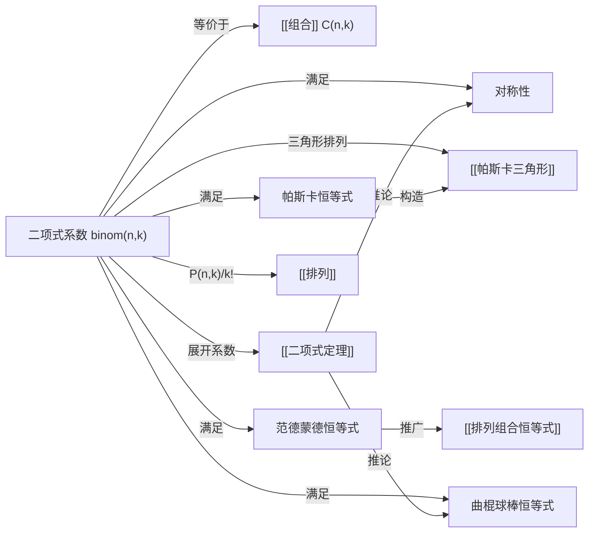

# 二项式系数

> [!abstract]
> ==二项式系数（Binomial Coefficient）== $\binom{n}{k}$ 计数的是从 $n$ 个元素的集合中选取 $k$ 个元素的子集数，即[[组合]]数 $C(n,k)$。它是[[二项式定理]]展开式中的系数，也是[[帕斯卡三角形]]中的基本元素。二项式系数具有丰富的代数性质和组合意义，包括对称性、帕斯卡恒等式、范德蒙德恒等式、曲棍球棒恒等式等。

## 定义

> [!def] 二项式系数（Binomial Coefficient）
> 对于非负整数 $n$ 和 $k$（$0 \leq k \leq n$），二项式系数定义为：
>
> $$\binom{n}{k} = \frac{n!}{k!(n-k)!}$$
>
> 当 $k < 0$ 或 $k > n$ 时，约定 $\binom{n}{k} = 0$。
>
> 二项式系数等价于[[组合]]数 $C(n,k)$，表示从 $n$ 个不同元素中选取 $k$ 个的无序方式数。

> [!def] 广义二项式系数
> 对于任意实数 $\alpha$ 和非负整数 $k$，广义二项式系数定义为：
>
> $$\binom{\alpha}{k} = \frac{\alpha(\alpha-1)(\alpha-2)\cdots(\alpha-k+1)}{k!}$$
>
> 当 $\alpha$ 为正整数 $n$ 时，退化为标准二项式系数。

## 核心性质

| 编号 | 性质 | 公式 | 说明 |
|:---:|------|------|------|
| 1 | 对称性 | $\dbinom{n}{k} = \dbinom{n}{n-k}$ | 选 $k$ 个等价于排除 $n-k$ 个 |
| 2 | 帕斯卡恒等式 | $\dbinom{n}{k} = \dbinom{n-1}{k-1} + \dbinom{n-1}{k}$ | [[帕斯卡三角形]]的构造基础 |
| 3 | 范德蒙德恒等式 | $\displaystyle\sum_{k=0}^{r} \dbinom{m}{k}\dbinom{n}{r-k} = \dbinom{m+n}{r}$ | 两组元素合并后选 $r$ 个 |
| 4 | 上指标求和（曲棍球棒恒等式） | $\displaystyle\sum_{i=r}^{n} \dbinom{i}{r} = \dbinom{n+1}{r+1}$ | 沿对角线求和等于右下方的数 |
| 5 | 全子集求和 | $\displaystyle\sum_{k=0}^{n} \dbinom{n}{k} = 2^n$ | $n$ 元素集合的所有子集总数 |
| 6 | 交替求和 | $\displaystyle\sum_{k=0}^{n} (-1)^k \dbinom{n}{k} = 0 \quad (n \geq 1)$ | [[二项式定理]]中令 $x=1, y=-1$ 的推论 |
| 7 | 单峰性 | $\dbinom{n}{0} < \dbinom{n}{1} < \cdots < \dbinom{n}{\lfloor n/2 \rfloor}$ | 二项式系数先增后减，关于中间对称 |
| 8 | 吸收恒等式 | $\dbinom{n}{k} = \dfrac{n}{k}\dbinom{n-1}{k-1}$ | 将 $n$ 提取到分子前的降阶表示 |

## 关系网络

## 章节扩展

- **帕斯卡恒等式**是[[帕斯卡三角形]]中每个数等于其上方两数之和的数学表达，也是递推计算二项式系数的基础。
- **范德蒙德恒等式**可以理解为：从 $m+n$ 个元素（分为 $m$ 个和 $n$ 个两组）中选 $r$ 个，等价于从第一组选 $k$ 个、从第二组选 $r-k$ 个的所有可能之和。
- **曲棍球棒恒等式**得名于其在[[帕斯卡三角形]]中的几何形状——沿对角线求和的路径形似曲棍球棒。
- **单峰性**说明二项式系数在第 $\lfloor n/2 \rfloor$ 处达到最大值，这一性质在概率论（二项分布）中有重要应用。

## 补充

> [!info] 范德蒙德恒等式的组合证明
> 考虑从 $m+n$ 个学生（$m$ 个男生，$n$ 个女生）中选 $r$ 个人组成委员会：
>
> - **左边**：按男生人数 $k$ 分类，从男生中选 $k$ 个（$\binom{m}{k}$ 种方式），从女生中选 $r-k$ 个（$\binom{n}{r-k}$ 种方式），对 $k$ 从 $0$ 到 $r$ 求和
> - **右边**：直接从 $m+n$ 个人中选 $r$ 个，有 $\binom{m+n}{r}$ 种方式
>
> 两种计数方式结果相同，恒等式得证。

> [!info] 曲棍球棒恒等式的直观理解
> 在[[帕斯卡三角形]]中，从第 $r$ 行第 $r$ 列开始，沿对角线向下走到第 $n$ 行，将路径上的所有数相加，恰好等于第 $n+1$ 行第 $r+1$ 列的那个数。
>
> 例如：$\binom{2}{1} + \binom{3}{1} + \binom{4}{1} + \binom{5}{1} = \binom{6}{2}$，即 $2 + 3 + 4 + 5 = 15$。

## 参见

- [[组合]] —— 二项式系数的组合意义
- [[排列]] —— 与组合数的关系
- [[二项式定理]] —— 二项式系数的代数应用
- [[帕斯卡三角形]] —— 二项式系数的几何表示
- [[排列组合恒等式]] —— 更多经典恒等式与证明方法
