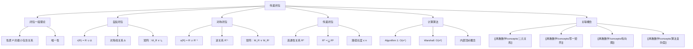

# 传递闭包

> [!abstract] 概述
> ==闭包==（closure）是为不具有某种性质的关系"补全"该性质的最小关系。==自反闭包== $r(R)=R\cup\Delta$（$\Delta$ 为对角线关系），==对称闭包== $s(R)=R\cup R^{-1}$，二者均可一步构造。==传递闭包== $t(R)=R^*=\bigcup_{k=1}^{n} R^k$ 则需要迭代计算，对应有向图中所有可达顶点对。计算传递闭包有两种经典算法：==布尔矩阵乘法算法==（$O(n^4)$）和 ==Warshall 算法==（$O(n^3)$），后者通过逐步扩展允许的内部顶点集合实现高效计算。

## 定义

> [!def] 闭包（Closure）
>
> 设 $R$ 是集合 $A$ 上的关系，$P$ 是关系的某个性质。如果存在集合 $A$ 上的关系 $S$ 满足：
> 1. $S$ 具有性质 $P$
> 2. $R \subseteq S$
> 3. $S$ 是所有满足条件 1 和 2 的关系中最小的（即 $S \subseteq T$ 对所有满足条件的 $T$ 成立）
>
> 则称 $S$ 是 $R$ 关于性质 $P$ 的==闭包==。闭包如果存在，则一定是==唯一的==。

> [!def] 自反闭包（Reflexive Closure）
>
> 设 $R$ 是集合 $A$ 上的关系，$R$ 的==自反闭包==为
>
> $$r(R) = R \cup \Delta$$
>
> 其中 $\Delta = \{(a, a) \mid a \in A\}$ 是 $A$ 上的==对角线关系==（diagonal relation）。在矩阵表示中，$M_{r(R)} = M_R \vee I_n$。

> [!def] 对称闭包（Symmetric Closure）
>
> 设 $R$ 是集合 $A$ 上的关系，$R$ 的==对称闭包==为
>
> $$s(R) = R \cup R^{-1}$$
>
> 其中 $R^{-1} = \{(b, a) \mid (a, b) \in R\}$ 是 $R$ 的==逆关系==。在矩阵表示中，$M_{s(R)} = M_R \vee M_R^t$。

> [!def] 传递闭包（Transitive Closure）
>
> 设 $R$ 是集合 $A$ 上的关系，$R$ 的==传递闭包==为==连通性关系==
>
> $$t(R) = R^* = \bigcup_{k=1}^{\infty} R^k$$
>
> 对于 $|A| = n$ 的有限集，可简化为
>
> $$R^* = R \cup R^2 \cup R^3 \cup \cdots \cup R^n$$
>
> 用零一矩阵表示为
>
> $$M_{R^*} = M_R \vee M_R^{[2]} \vee M_R^{[3]} \vee \cdots \vee M_R^{[n]}$$

> [!def] Warshall 算法
>
> 设 $R$ 是 $n$ 个元素集合 $\{v_1, v_2, \ldots, v_n\}$ 上的关系。定义零一矩阵序列 $W_0, W_1, \ldots, W_n$：
> - $W_0 = M_R$
> - $W_k$ 中 $w_{ij}^{(k)} = 1$ 当且仅当存在从 $v_i$ 到 $v_j$ 的路径，且所有内部顶点都在 $\{v_1, \ldots, v_k\}$ 中
>
> 递推公式：
>
> $$w_{ij}^{(k)} = w_{ij}^{(k-1)} \vee (w_{ik}^{(k-1)} \wedge w_{kj}^{(k-1)})$$
>
> 最终 $W_n = M_{R^*}$。
>
> **伪代码**：
> ```
> procedure Warshall (M_R: n × n zero-one matrix)
>     W := M_R
>     for k := 1 to n
>         for i := 1 to n
>             for j := 1 to n
>                 w_ij := w_ij ∨ (w_ik ∧ w_kj)
>     return W
> ```

## 核心性质

| 性质 | 公式/规则 | 说明 |
|:-----|:----------|:-----|
| ==自反闭包== | $r(R) = R \cup \Delta$ | 添加所有缺失的 $(a,a)$ |
| ==对称闭包== | $s(R) = R \cup R^{-1}$ | 添加所有缺失的反向有序对 |
| ==传递闭包== | $t(R) = \bigcup_{k=1}^{n} R^k$ | 需要迭代计算，不能一步完成 |
| ==自反闭包矩阵== | $M_{r(R)} = M_R \vee I_n$ | 布尔 join 单位矩阵 |
| ==对称闭包矩阵== | $M_{s(R)} = M_R \vee M_R^t$ | 布尔 join 转置矩阵 |
| ==传递闭包矩阵== | $M_{R^*} = \bigvee_{k=1}^{n} M_R^{[k]}$ | 布尔幂的布尔 join |
| ==路径长度上界== | 有限集上路径长度 $\leq n$ | 鸽巢原理保证 |
| ==Warshall 复杂度== | $O(n^3)$，$2n^3$ 次位运算 | 三重循环 $k \to i \to j$ |
| ==Algorithm 1 复杂度== | $O(n^4)$，$2n^3(n-1)$ 次位运算 | 布尔幂累加 |
| ==闭包唯一性== | 若存在则唯一 | 最小性保证 |

## 关系网络



- **前置知识**：[[离散数学/concepts/二元关系]]（闭包运算的对象）、[[离散数学/concepts/零一矩阵]]（布尔运算与布尔幂是算法基础）、[[离散数学/concepts/有向图]]（路径概念是传递闭包的理论基础）
- **核心关联**：传递闭包的本质是有向图中的可达性问题——$R^*$ 包含所有通过一步或多步可以到达的顶点对
- **后继概念**：[[离散数学/concepts/等价关系]]（等价关系的传递闭包是其自身）

## 章节扩展

### 第09章：关系

闭包是 Rosen 第8版第9章第9.4节的核心内容，是关系理论从"表示"走向"计算"的关键一步。

**自反闭包与对称闭包的简单性**：这两种闭包都可以一步构造完成。自反闭包只需添加所有缺失的 $(a,a)$，对称闭包只需添加所有缺失的反向有序对。但传递闭包不能一步完成——添加新的有序对后可能产生更多需要添加的有序对，这就是为什么传递闭包需要借助路径概念和迭代算法来计算。

**路径长度的鸽巢原理上界**：对于 $n$ 个元素的有限集，若从 $a$ 到 $b$ 存在路径，则存在长度不超过 $n$ 的路径（$a \neq b$ 时不超过 $n-1$）。这一结论（Lemma 1）将无限并 $\bigcup_{k=1}^{\infty} R^k$ 简化为有限并 $\bigcup_{k=1}^{n} R^k$，是传递闭包可计算性的理论保证。

**Warshall 算法与 Floyd-Warshall 算法**：Warshall 算法（1960）计算布尔矩阵的传递闭包（判定可达性：0 或 1），而 Floyd-Warshall 算法（1962）计算加权图中的最短路径（数值距离）。两者的核心思想完全相同——逐步扩展允许经过的中间顶点——但 Warshall 用布尔运算（$\vee, \wedge$），Floyd-Warshall 用算术运算（$+$, $\min$）。

### 第10章：图论

> [!info] 传递闭包与图论连通性
> 在第10章图论中，传递闭包与有向图的连通性直接相关：
>
> - 关系 $R$ 的传递闭包 $R^*$ 对应有向图的==可达性矩阵==
> - Warshall 算法计算的传递闭包矩阵中，$(i,j)=1$ 表示从 $v_i$ 到 $v_j$ 存在路径
> - ==强连通分量==可通过传递闭包矩阵的对称性分析得到

## 补充

> [!info] 传递闭包在计算机科学中的应用
>
> 传递闭包的概念在计算机科学中有极其重要的应用：
>
> - **数据库查询**：SQL 中的递归公共表表达式（Recursive CTE）本质上就是在计算传递闭包。例如，在组织架构表中查询"某员工的所有下属（包括间接下属）"就是计算管理层级关系的传递闭包
> - **程序分析**：编译器中的可达性分析（reachability analysis）需要计算控制流图的传递闭包
> - **网络路由**：互联网路由协议（如 BGP）需要计算网络拓扑的传递闭包，以确定数据包的可达性
> - **社交网络**：推荐系统中的"朋友的朋友"推荐就是计算社交关系图的传递闭包

> [!warning] 常见误区
>
> - 传递闭包不能简单通过"添加缺失的三元组"一步完成，添加新有序对后可能产生更多需要添加的有序对
> - $R^*$ 中不包含长度为 0 的路径，即不自动包含对角线关系 $\Delta$。自反传递闭包 $= R^* \cup \Delta$
> - Warshall 算法中 $k$ 循环必须是最外层循环，否则某些 $w_{ik}^{(k)}$ 或 $w_{kj}^{(k)}$ 可能已被更新为 $W_k$ 的值而非 $W_{k-1}$ 的值，导致结果错误

## 参见

- [[离散数学/concepts/二元关系]] -- 闭包运算的对象
- [[离散数学/concepts/零一矩阵]] -- 布尔运算与布尔幂是闭包算法的基础
- [[离散数学/concepts/有向图]] -- 路径概念是传递闭包的理论基础
- [[离散数学/concepts/算法复杂度]] -- $O(n^3)$ 与 $O(n^4)$ 的复杂度分析
