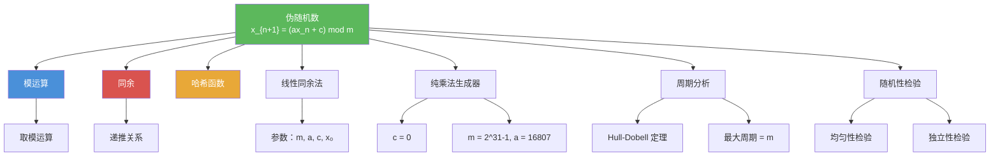

# 伪随机数

> [!abstract] 概述
> ==伪随机数==（pseudorandom numbers）是通过确定性算法生成的、具有统计随机性质的数列。最常用的方法是==线性同余法==（linear congruential method）：$x_{n+1} = (ax_n + c) \bmod m$，由四个参数——模 $m$、乘数 $a$、增量 $c$、种子 $x_0$——完全确定。伪随机数序列具有==有限周期==，参数选择直接影响序列的质量和周期长度。纯乘法生成器（$c = 0$）是重要特例，如 $m = 2^{31}-1$、$a = 16807$ 可生成极长周期。伪随机数广泛应用于模拟、随机化算法和测试，但==不适用于密码学==等安全敏感场景。

## 定义

> [!def] 线性同余法（Linear Congruential Method）
>
> 选择四个整数参数：
> - ==模== $m$（modulus）：$m > 0$
> - ==乘数== $a$（multiplier）：$0 \leq a < m$
> - ==增量== $c$（increment）：$0 \leq c < m$
> - ==种子== $x_0$（seed）：$0 \leq x_0 < m$
>
> 递推生成伪随机数列 $\{x_n\}$：
>
> $$x_{n+1} = (ax_n + c) \bmod m$$
>
> 所有 $x_n$ 满足 $0 \leq x_n < m$。若需要 $[0, 1)$ 区间的伪随机数，使用 $x_n / m$。

> [!def] 纯乘法生成器（Pure Multiplicative Generator）
>
> 当 $c = 0$ 时，线性同余法退化为==纯乘法生成器==：
>
> $$x_{n+1} = (ax_n) \bmod m$$
>
> 广泛使用的参数：$m = 2^{31} - 1$（Mersenne 素数），$a = 7^5 = 16807$。
>
> 在此参数下，可以生成 $2^{31} - 2$ 个数后才重复，周期极长。

> [!def] 周期（Period）
>
> 伪随机数序列的==周期==是指序列开始重复之前生成的不同值的个数。
>
> - 最大可能周期为 $m$（当 $\gcd(m, a-c) = 1$ 且 $m$ 为素数时可达）
> - 周期取决于参数 $m, a, c$ 的选择
> - Hull-Dobell 定理给出了满周期（周期为 $m$）的充要条件

## 核心性质

| 性质 | 描述 | 说明 |
|------|------|------|
| 确定性 | 给定种子，序列唯一确定 | 伪随机数不是真正的随机数 |
| 有限周期 | 序列最终一定重复 | 周期最大为 $m$ |
| 可预测性 | 知道参数和足够输出可预测后续值 | 不适合密码学 |
| 参数敏感性 | 种子微变导致完全不同的序列 | 同一参数不同种子产生不同序列 |
| 满周期条件 | $\gcd(m, c) = 1$，$a-1$ 被 $p$ 整除等 | Hull-Dobell 定理 |
| 统计性质 | 应接近均匀分布 | 需要通过统计检验 |
| 计算效率 | 每步仅需一次乘法和一次加法 | 非常高效 |

## 关系网络

- [[模运算]] 是线性同余法的核心运算：每一步都通过取模将结果限制在 $[0, m)$ 中
- [[同余]] 提供了递推关系的数学框架：$x_{n+1} \equiv ax_n + c \pmod{m}$
- [[哈希函数]] 与伪随机数生成器共享模运算的数学基础，但设计目标不同

## 章节扩展

### 第4章：数论与密码学

伪随机数生成是第 4.5 节"同余的应用"中的第二个应用实例：

- **4.5 同余的应用**：线性同余法是模运算在随机数生成中的典型应用
- **4.5 纯乘法生成器**：$c = 0$ 的特例，广泛使用的参数配置
- **4.6 密码学**：密码学安全的伪随机数生成器（CSPRNG）需要更强的安全性质，线性同余法不满足

## 补充

> [!info] 伪随机数的学术背景与局限性
>
> 线性同余法由 **D. H. Lehmer** 于 1949 年提出，是最早且最广泛使用的伪随机数生成方法之一。Hull 和 Dobell (1962) 给出了满周期的充要条件（Hull-Dobell 定理）：线性同余生成器具有满周期（周期为 $m$）当且仅当：(1) $\gcd(c, m) = 1$；(2) 对 $m$ 的每个素因子 $p$，$a - 1$ 是 $p$ 的倍数；(3) 若 $4 \mid m$，则 $4 \mid (a - 1)$。线性同余法的著名局限包括：生成的点落在低维超平面上（Marsaglia, 1968 的"格子结构"问题）、低位比特随机性较差等。对于需要高质量随机数的应用（如大规模 Monte Carlo 模拟），通常使用更高级的生成器，如 Mersenne Twister（周期 $2^{19937}-1$）或 PCG 系列。对于密码学应用，必须使用密码学安全的伪随机数生成器（CSPRNG），如 Fortuna 或基于哈希函数的生成器。
>
> **学术来源**：Rosen, K. H. (2019). *Discrete Mathematics and Its Applications* (8th ed.). McGraw-Hill, Section 4.5.
>
> **参考链接**：Knuth, D. E. (1997). *The Art of Computer Programming, Vol. 2: Seminumerical Algorithms* (3rd ed.). Addison-Wesley, Section 3.2.1.

## 参见

- [[模运算]] -- 线性同余法的核心运算
- [[同余]] -- 递推关系的数学框架
- [[哈希函数]] -- 与伪随机数生成器共享模运算基础
