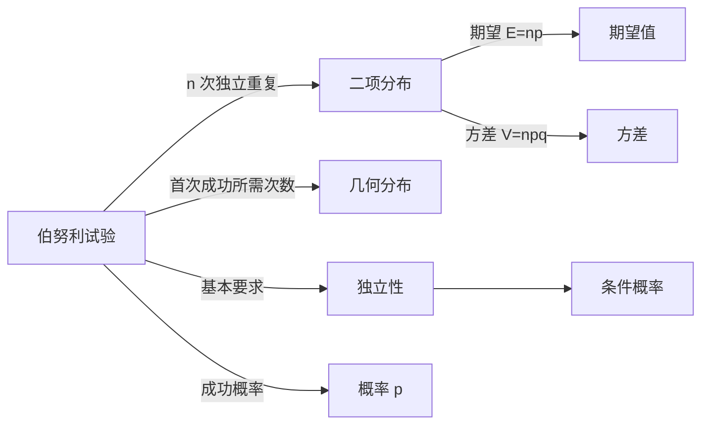

# 伯努利试验

> [!abstract]
> ==伯努利试验（Bernoulli Trial）==是只有两种可能结果（成功或失败）的随机试验。每次试验成功的概率为 $p$，失败的概率为 $1-p$（通常记为 $q$）。$n$ 次独立重复的伯努利试验是二项分布的产生基础，也是概率论中最基本、最重要的随机试验模型之一。

## 定义

> [!def] 伯努利试验
> 设一个随机试验只有两种可能的结果，分别称为**成功**（Success）和**失败**（Failure）。
> 若成功的概率为 $p$（$0 < p < 1$），则失败的概率为 $q = 1 - p$。
> 这样的试验称为一次**伯努利试验**。
>
> > [!def] 独立重复伯努利试验
> 若将伯努利试验**独立地重复**进行 $n$ 次（各次试验的结果互不影响），
> 则称这 $n$ 次试验为 **$n$ 重伯努利试验**（Bernoulli Trials）。
> >
> > **独立性**的含义：第 $i$ 次试验的结果不受之前任何试验结果的影响，
> > 即对于任意 $i \neq j$，事件 $A_i$（第 $i$ 次成功）与事件 $A_j$（第 $j$ 次成功）相互独立。

## 核心性质

| 编号 | 性质 | 数学表达 / 说明 |
|:---:|------|----------------|
| 1 | **结果只有两种** | 每次试验的结果集合为 $\{S, F\}$（成功 / 失败） |
| 2 | **概率恒定** | 每次成功的概率 $p$ 保持不变，$P(S) = p$，$P(F) = q = 1 - p$ |
| 3 | **独立性** | 各次试验的结果相互独立，$P(A_i \cap A_j) = P(A_i) \cdot P(A_j)$ |
| 4 | **二值指示变量** | 每次试验可用指示变量 $X_i$ 表示：成功时 $X_i = 1$，失败时 $X_i = 0$，则 $E[X_i] = p$ |
| 5 | **与二项分布的关系** | $n$ 重伯努利试验中成功次数 $X = \sum_{i=1}^{n} X_i$ 服从参数为 $(n, p)$ 的[[二项分布]] |

## 关系网络

## 章节扩展

- **二项分布**：$n$ 重伯努利试验中恰好成功 $k$ 次的概率为 $b(k; n, p) = \binom{n}{k} p^k q^{n-k}$，详见 [[二项分布]]。
- **几何分布**：在独立重复伯努利试验中，首次成功所需的试验次数服从几何分布。
- **大数定律**：当 $n \to \infty$ 时，成功频率 $\frac{k}{n}$ 依概率收敛于 $p$，即 $\lim_{n \to \infty} P\left(\left|\frac{k}{n} - p\right| < \varepsilon\right) = 1$。

## 补充

> [!info] 生活类比
> 抛一枚硬币是最典型的伯努利试验：正面朝上为"成功"，反面朝上为"失败"。
> 若硬币是均匀的，则 $p = 0.5$。
> 更一般的例子包括：产品质检（合格/不合格）、医疗检测（阳性/阴性）、
> 通信传输（正确/错误）等。
>
> [!info] 伯努利试验的命名
> 该试验以瑞士数学家 **雅各布·伯努利（Jacob Bernoulli, 1654–1705）** 命名。
> 他在著作 *Ars Conjectandi*（猜度术，1713年出版）中首次系统研究了
> 独立重复试验中成功次数的规律，为二项分布和大数定律奠定了基础。

## 参见

- [[二项分布]]：$n$ 重伯努利试验中成功次数的概率分布
- [[独立性]]：伯努利试验的核心前提条件
- [[概率]]：伯努利试验中成功与失败概率的基本定义
- [[条件概率]]：当试验不独立时，需要用条件概率描述依赖关系
