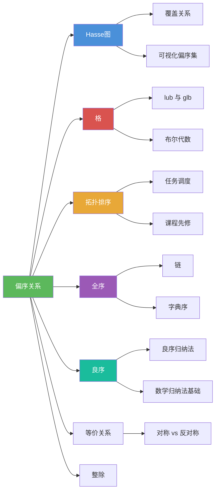

# 偏序关系

> [!abstract] 概述
> ==偏序关系==（partial ordering）是满足==自反性==、==反对称性==和==传递性==的二元关系，用于对集合中的元素建立"大小"或"先后"的层次结构。集合 $S$ 连同其上的偏序 $\preceq$ 构成==偏序集== $(S, \preceq)$。与[[离散数学/concepts/等价关系|等价关系]]（将元素"分类"）不同，偏序关系将元素"排列"——但并非所有元素对都可比，因此称为"偏"序。核心衍生概念包括==极大/极小/最大/最小元==、==上界/下界/上确界/下确界==、[[离散数学/concepts/Hasse图|Hasse 图]]、[[离散数学/concepts/格|格]]、[[离散数学/concepts/拓扑排序|拓扑排序]]、全序与良序。

## 定义

> [!def] 偏序关系（Partial Ordering）
>
> 集合 $S$ 上的关系 $R$ 如果同时满足以下三个性质，则称为 $S$ 上的==偏序==（partial ordering）或==偏序关系==：
>
> 1. **自反性**：对任意 $a \in S$，有 $(a, a) \in R$
> 2. **反对称性**：若 $(a, b) \in R$ 且 $(b, a) \in R$，则 $a = b$
> 3. **传递性**：若 $(a, b) \in R$ 且 $(b, c) \in R$，则 $(a, c) \in R$
>
> 集合 $S$ 连同其上的偏序 $R$ 称为==偏序集==（partially ordered set, poset），记作 $(S, R)$ 或 $(S, \preceq)$。
>
> 习惯上用 $\preceq$ 表示偏序关系：$a \preceq b$ 表示 $(a, b) \in R$。用 $a \prec b$ 表示 $a \preceq b$ 且 $a \neq b$。

> [!def] 可比与不可比（Comparable / Incomparable）
>
> 在偏序集 $(S, \preceq)$ 中：
> - 若 $a \preceq b$ 或 $b \preceq a$，则称 $a$ 和 $b$ 是==可比的==（comparable）
> - 若 $a$ 和 $b$ 既不满足 $a \preceq b$ 也不满足 $b \preceq a$，则称 $a$ 和 $b$ 是==不可比的==（incomparable）
>
> "偏"序的含义正是：并非所有元素对都是可比的。

> [!def] 极大元与极小元（Maximal / Minimal Element）
>
> 在偏序集 $(S, \preceq)$ 中：
> - $a$ 是==极大元==（maximal）当且仅当**不存在** $b \in S$ 使得 $a \prec b$
> - $a$ 是==极小元==（minimal）当且仅当**不存在** $b \in S$ 使得 $b \prec a$
>
> 极大/极小元可以有==多个==。在 [[离散数学/concepts/Hasse图|Hasse 图]] 中，极大元是"顶层"元素，极小元是"底层"元素。

> [!def] 最大元与最小元（Greatest / Least Element）
>
> 在偏序集 $(S, \preceq)$ 中：
> - $a$ 是==最大元==（greatest）当且仅当对**所有** $b \in S$，$b \preceq a$
> - $a$ 是==最小元==（least）当且仅当对**所有** $b \in S$，$a \preceq b$
>
> 最大/最小元如果存在，则是==唯一的==。最大元一定是极大元，但极大元不一定是最大元。

> [!def] 上界与下界（Upper Bound / Lower Bound）
>
> 设 $A$ 是偏序集 $(S, \preceq)$ 的子集。
> - $u \in S$ 是 $A$ 的==上界==（upper bound），若对**所有** $a \in A$，$a \preceq u$
> - $l \in S$ 是 $A$ 的==下界==（lower bound），若对**所有** $a \in A$，$l \preceq a$

> [!def] 上确界与下确界（Least Upper Bound / Greatest Lower Bound）
>
> - $x$ 是 $A$ 的==最小上界==（least upper bound, lub）或==上确界==（supremum, sup），若：
>   1. $x$ 是 $A$ 的上界
>   2. 对 $A$ 的任意上界 $z$，$x \preceq z$
> - $y$ 是 $A$ 的==最大下界==（greatest lower bound, glb）或==下确界==（infimum, inf），若：
>   1. $y$ 是 $A$ 的下界
>   2. 对 $A$ 的任意下界 $z$，$z \preceq y$
>
> 上确界和下确界如果存在，则是==唯一的==。记 $\operatorname{lub}(A) = \sup(A)$，$\operatorname{glb}(A) = \inf(A)$。

> [!def] 全序（Total Order / Linear Order）
>
> 若偏序集 $(S, \preceq)$ 中==每对元素都是可比的==，则 $\preceq$ 称为==全序==（total order）或==线性序==（linear order），$(S, \preceq)$ 称为==全序集==（totally ordered set）或==链==（chain）。

> [!def] 良序（Well Order）
>
> 若偏序集 $(S, \preceq)$ 满足：
> 1. $\preceq$ 是全序
> 2. $S$ 的每个非空子集都有==最小元==
>
> 则称 $(S, \preceq)$ 为==良序集==（well-ordered set）。

> [!def] 字典序（Lexicographic Order）
>
> 设 $(A_1, \preceq_1)$ 和 $(A_2, \preceq_2)$ 是两个偏序集。$A_1 \times A_2$ 上的==字典序==定义为：
>
> $$(a_1, a_2) \prec (b_1, b_2)$$
>
> 当且仅当以下条件之一成立：
> 1. $a_1 \prec_1 b_1$
> 2. $a_1 = b_1$ 且 $a_2 \prec_2 b_2$
>
> 可推广到 $n$ 元组和字符串。$(\mathbb{Z}^+ \times \mathbb{Z}^+, \preceq)$（字典序）是良序集。

## 核心性质

| 性质 | 描述 | 说明 |
|------|------|------|
| 自反性 | 对所有 $a \in S$，$a \preceq a$ | 每个元素与自身有关系 |
| 反对称性 | $a \preceq b$ 且 $b \preceq a$ $\Rightarrow$ $a = b$ | 不同于[[离散数学/concepts/等价关系|等价关系]]的对称性 |
| 传递性 | $a \preceq b$ 且 $b \preceq c$ $\Rightarrow$ $a \preceq c$ | 与等价关系共享 |
| 极大元不唯一 | 极大元可以有多个 | 只要求上方无更大元素，不要求与所有元素可比 |
| 最大元唯一 | 最大元若存在则唯一 | 必须比所有元素都大（或相等） |
| lub/glb 唯一 | 上确界和下确界若存在则唯一 | lub 是上界中最小者，glb 是下界中最大者 |
| 全序蕴含可比 | 全序集中每对元素都可比 | 全序是偏序的特例 |
| 良序蕴含最小元 | 良序集的每个非空子集都有最小元 | 良序 = 全序 + 每个非空子集有最小元 |
| 整除格对应 | $(\mathbb{Z}^+, \mid)$ 中 $\operatorname{lub} = \operatorname{lcm}$，$\operatorname{glb} = \gcd$ | 整除关系与[[离散数学/concepts/整除|整除]]理论紧密联系 |

## 关系网络

- [[离散数学/concepts/Hasse图|Hasse 图]] 是偏序集的可视化工具，通过省略自环、传递边和箭头来简化有向图表示
- [[离散数学/concepts/格|格]] 是偏序集的特例，要求每对元素都有 lub 和 glb
- [[离散数学/concepts/拓扑排序|拓扑排序]] 将偏序"线性化"为全序，用于任务调度等场景
- [[离散数学/concepts/等价关系|等价关系]] 与偏序关系都要求自反性和传递性，但前者要求对称性，后者要求反对称性
- [[离散数学/concepts/整除|整除]] 关系 $(\mathbb{Z}^+, \mid)$ 是偏序关系的经典实例，其中 lub = lcm，glb = gcd

## 章节扩展

### 第09章：关系

偏序关系是第 9 章的核心主题（9.6 节），是关系理论从"分类"（等价关系）到"排序"的延伸：

- **9.5 等价关系**：等价关系与偏序关系都要求自反性和传递性，但第三个性质不同（对称 vs 反对称），二者形成对比
- **9.6 偏序关系**：偏序的定义、Hasse 图、极值与界、格、拓扑排序、全序与良序、良序归纳法

### 第10章：图论

- **10.1~10.4 图的基本概念**：Hasse 图本质上是一种特殊的有向图（省略自环和传递边），图论为偏序集的可视化提供了工具

### 第04章：数论与密码学

- **4.1 整除与模运算**：[[离散数学/concepts/整除|整除]]关系 $(\mathbb{Z}^+, \mid)$ 是偏序关系的经典实例，其 lub 和 glb 分别对应 lcm 和 gcd

## 补充

> [!info] 偏序关系与等价关系的对比
>
> 偏序关系和[[离散数学/concepts/等价关系|等价关系]]都要求自反性和传递性，但关键区别在于第三个性质：
>
> | 性质 | 等价关系 | 偏序关系 |
> |------|:---:|:---:|
> | 自反性 | 要求 | 要求 |
> | 对称性 | 要求 | **不要求** |
> | 反对称性 | **不要求** | 要求 |
> | 传递性 | 要求 | 要求 |
>
> 等价关系将元素"分类"（同一类中的元素等价），偏序关系将元素"排列"（建立层次结构）。一个关系不可能同时是等价关系和偏序关系（除非是相等关系）。
>
> **学术来源**：Rosen, K. H. (2019). *Discrete Mathematics and Its Applications* (8th ed.). McGraw-Hill, Section 9.6.

## 参见

- [[离散数学/concepts/二元关系]] -- 偏序关系是二元关系的特殊类型
- [[离散数学/concepts/等价关系]] -- 与偏序关系对比：对称性 vs 反对称性
- [[离散数学/concepts/Hasse图]] -- 偏序集的简洁图形表示
- [[离散数学/concepts/格]] -- 每对元素都有 lub 和 glb 的偏序集
- [[离散数学/concepts/拓扑排序]] -- 将偏序扩展为全序的算法
- [[离散数学/concepts/整除]] -- 整除关系是偏序关系的经典实例
- [[离散数学/concepts/集合]] -- 偏序关系建立在集合之上
