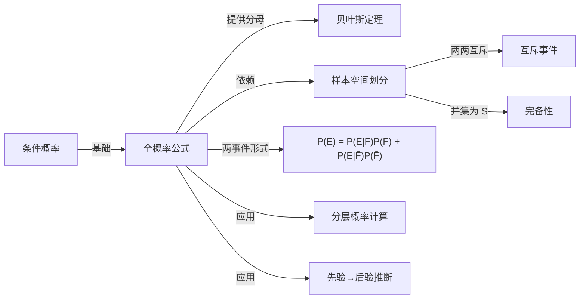

# 全概率公式

> [!abstract]
> ==全概率公式（Law of Total Probability）==提供了一种将复杂事件的概率分解为若干简单条件概率之加权求和的方法。其核心思想是：若 $F_1, F_2, \ldots, F_n$ 构成样本空间的一个**划分**，则事件 $E$ 的概率可以通过在各划分条件下的条件概率加权求和得到。全概率公式是[[离散数学/concepts/贝叶斯定理]]的直接基础，也是概率论中"分情况讨论"思想的形式化表达。

## 定义

> [!def] 样本空间的划分
> 设 $F_1, F_2, \ldots, F_n$ 是样本空间 $S$ 中的一组事件，若满足：
> 1. **两两互斥**：对所有 $i \neq j$，$F_i \cap F_j = \emptyset$
> 2. **完备性**：$\bigcup_{i=1}^{n} F_i = S$
> 3. **非零概率**：$P(F_i) > 0$ 对所有 $i$ 成立
>
> 则称 $F_1, F_2, \ldots, F_n$ 是 $S$ 的一个**划分**（Partition）。
>
> > [!def] 全概率公式
> > 若 $F_1, F_2, \ldots, F_n$ 是样本空间 $S$ 的一个划分，$E$ 是任意事件，则：
> > $$
> > P(E) = \sum_{i=1}^{n} P(E \mid F_i) \cdot P(F_i)
> > $$
> >
> > **推导过程**：
> > 1. 因为 $F_1, \ldots, F_n$ 是 $S$ 的划分，所以 $E = E \cap S = E \cap \left(\bigcup_{i=1}^{n} F_i\right) = \bigcup_{i=1}^{n} (E \cap F_i)$
> > 2. 由于 $F_i$ 两两互斥，$E \cap F_i$ 也两两互斥，由概率的可加性：
> >    $P(E) = \sum_{i=1}^{n} P(E \cap F_i)$
> > 3. 由[[离散数学/concepts/条件概率]]的定义 $P(E \cap F_i) = P(E \mid F_i) \cdot P(F_i)$，代入得：
> >    $P(E) = \sum_{i=1}^{n} P(E \mid F_i) \cdot P(F_i)$

## 核心性质

| 编号 | 性质 | 数学表达 / 说明 |
|:---:|------|----------------|
| 1 | **分情况讨论** | 将事件 $E$ 的概率按划分 $F_1, \ldots, F_n$ 分解为条件概率的加权和 |
| 2 | **权值为先验概率** | 每个条件概率 $P(E \mid F_i)$ 的权重为 $P(F_i)$（划分事件的概率） |
| 3 | **与贝叶斯定理的关系** | 全概率公式的结果 $P(E)$ 正是[[离散数学/concepts/贝叶斯定理]]中的分母 |
| 4 | **两事件特例** | 当划分只有 $\{F, \overline{F}\}$ 时，$P(E) = P(E \mid F)P(F) + P(E \mid \overline{F})P(\overline{F})$ |
| 5 | **化繁为简** | 当直接计算 $P(E)$ 困难时，可通过各条件下的 $P(E \mid F_i)$ 间接求得 |

## 关系网络

## 章节扩展

- **[[离散数学/concepts/贝叶斯定理]]**：全概率公式是贝叶斯定理分母的计算工具。贝叶斯定理可视为全概率公式的"逆用"——已知 $P(E)$ 反推 $P(F_j \mid E)$。
- **[[离散数学/concepts/条件概率]]**：全概率公式中的每一项 $P(E \mid F_i) \cdot P(F_i)$ 都是条件概率与边缘概率的乘积。
- **全期望公式（Law of Total Expectation）**：将全概率公式的思想推广到期望值：$E(X) = \sum_i E(X \mid F_i) \cdot P(F_i)$。
- **全方差公式（Law of Total Variance）**：$V(X) = E[V(X \mid Y)] + V[E(X \mid Y)]$。

## 补充

> [!info] 计算示例
> 某工厂有三条生产线，产量分别占总产量的 50%、30%、20%。
> 各线次品率分别为 2%、3%、5%。随机取一件产品，求其为次品的概率。
>
> 设 $F_i$ = "产品来自第 $i$ 条线"，$E$ = "产品为次品"。
> $F_1, F_2, F_3$ 构成划分，由全概率公式：
> $$
> \begin{aligned}
> P(E) &= P(E \mid F_1)P(F_1) + P(E \mid F_2)P(F_2) + P(E \mid F_3)P(F_3) \\
> &= 0.02 \times 0.50 + 0.03 \times 0.30 + 0.05 \times 0.20 \\
> &= 0.010 + 0.009 + 0.010 = 0.029
> \end{aligned}
> $$
> 即次品率为 2.9%。
>
> [!info] 直觉理解
> 全概率公式的本质是**加权平均**：在每种"情况"（划分）下，
> 事件 $E$ 发生的概率不同，而每种情况的"权重"就是该情况发生的概率 $P(F_i)$。
> 这就像计算加权平均分：不同科目的成绩（条件概率）按学分权重（先验概率）加权求和。

## 参见

- [[离散数学/concepts/条件概率]]：全概率公式的基本构件
- [[离散数学/concepts/贝叶斯定理]]：以全概率公式为分母的核心定理
- [[离散数学/concepts/概率]]：全概率公式中所有概率值的基本定义
- [[离散数学/concepts/独立性]]：当划分事件与 $E$ 独立时，$P(E \mid F_i) = P(E)$，公式退化为平凡等式
- [[离散数学/concepts/概率分布]]：全概率公式可用于求解边缘分布
