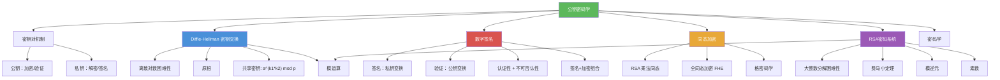

# 公钥密码学

> [!abstract] 概述
> ==公钥密码学==（Public Key Cryptography）于 1976 年由 Diffie 和 Hellman 首次提出，其核心思想是使用==密钥对==（公钥 + 私钥）替代对称密钥密码学中的单一共享密钥。公钥公开用于加密和验证，私钥保密用于解密和签名。这一范式解决了对称密码学中==密钥分发==的根本难题。基于==离散对数困难性==的 ==Diffie-Hellman 密钥交换==协议允许双方在不安全信道上协商共享密钥。==数字签名==利用私钥签名、公钥验证实现消息认证与不可否认性。==同态加密==允许在密文上直接执行计算，其中 RSA 具有==乘法同态性==，而==全同态加密==（FHE）支持任意计算，是密码学的前沿方向。

## 定义

> [!def] 公钥密码学（Public Key Cryptography）
>
> ==公钥密码学==的核心思想是：
> - 每个用户拥有一对密钥：==公钥==（public key）和==私钥==（private key）
> - ==公钥==公开，任何人都可以用于加密消息或验证签名
> - ==私钥==保密，仅所有者可以用于解密消息或生成签名
> - 知道公钥（加密方法）==不等于==知道私钥（解密方法）
>
> 与对称密钥密码学的本质区别：
>
> | 特性 | 对称密钥密码学 | 公钥密码学 |
> |:-----|:---------|:---------|
> | 密钥 | 加密/解密使用相同密钥 | 密钥对：公钥 + 私钥 |
> | 密钥分发 | 需要安全信道 | 无需安全信道 |
> | 速度 | 快 | 慢（约慢 1000 倍） |
> | 代表 | AES, DES | RSA, ECC |
> | 典型用途 | 大量数据加密 | 密钥交换、数字签名 |
> | 密钥管理 | $n$ 用户需 $n(n-1)/2$ 个密钥 | $n$ 用户仅需 $2n$ 个密钥 |

> [!def] Diffie-Hellman 密钥交换协议（Diffie-Hellman Key Exchange）
>
> 由 Whitfield Diffie 和 Martin Hellman 于 1976 年提出（Malcolm Williamson 于 1974 年在英国 GCHQ 秘密发明）。
>
> **协议步骤**（在 $\mathbb{Z}_p$ 中计算）：
> 1. Alice 和 Bob 公开约定素数 $p$ 和 $p$ 的==原根== $a$
> 2. Alice 选择秘密整数 $k_1$，发送 $a^{k_1} \bmod p$ 给 Bob
> 3. Bob 选择秘密整数 $k_2$，发送 $a^{k_2} \bmod p$ 给 Alice
> 4. Alice 计算 $(a^{k_2})^{k_1} \bmod p$
> 5. Bob 计算 $(a^{k_1})^{k_2} \bmod p$
>
> **共享密钥**：$(a^{k_2})^{k_1} \bmod p = (a^{k_1})^{k_2} \bmod p = a^{k_1 k_2} \bmod p$
>
> **安全性**：窃听者知道 $p, a, a^{k_1} \bmod p, a^{k_2} \bmod p$，但要求出 $k_1$ 或 $k_2$ 需要解决==离散对数问题==（给定 $a^k \bmod p$ 求 $k$），这在计算上是不可行的（当 $p$ 超过 300 位时）。

> [!def] 数字签名（Digital Signatures）
>
> ==数字签名==利用公钥密码学实现消息认证：接收者可以确认消息确实来自声称的发送者，且发送者无法否认。
>
> **签名协议**（以 RSA 为例，Alice 发送签名消息）：
> 1. Alice 的公钥为 $(n, e)$，私钥为 $d$
> 2. Alice 将消息分为块 $m_1, m_2, \ldots, m_k$
> 3. Alice 对每块应用==私钥变换==（签名）：$s_i = m_i^d \bmod n$
> 4. Alice 将签名后的块 $s_1, s_2, \ldots, s_k$ 发送给所有接收者
> 5. 接收者对每块应用 Alice 的==公钥变换==（验证）：$m_i = s_i^e \bmod n$
>
> 因为只有 Alice 知道私钥 $d$，所以只有 Alice 能产生有效的签名。
>
> **签名 + 加密的秘密通信**：
> 1. Alice 先用自己的私钥 $d_A$ 签名：$s = m^{d_A} \bmod n_A$
> 2. 再用 Bob 的公钥 $(n_B, e_B)$ 加密：$c = s^{e_B} \bmod n_B$
> 3. Bob 收到后先用自己的私钥 $d_B$ 解密：$s = c^{d_B} \bmod n_B$
> 4. 再用 Alice 的公钥 $(n_A, e_A)$ 验证：$m = s^{e_A} \bmod n_A$
>
> 这样同时保证了==机密性==（只有 Bob 能读）和==认证性==（只有 Alice 能签）。

> [!def] 同态加密（Homomorphic Encryption）
>
> ==同态加密==允许在密文上直接执行计算，计算结果解密后等于对明文执行相同计算的结果。
>
> **RSA 是乘法同态的**：
>
> $$E_{(n,e)}(M_1) \cdot E_{(n,e)}(M_2) \bmod n = (M_1^e \bmod n)(M_2^e \bmod n) \bmod n = (M_1 M_2)^e \bmod n = E_{(n,e)}(M_1 M_2)$$
>
> 即密文相乘等于明文乘积的加密。
>
> 但 RSA ==不是加法同态的==：$E(M_1) + E(M_2) \neq E(M_1 + M_2)$。
>
> **全同态加密（Fully Homomorphic Encryption, FHE）**：
> - 允许在密文上执行==任意计算==（包括加法和乘法）
> - 由 Craig Gentry 于 2009 年首次实现（基于格密码学）
> - 意义：可以在不解密的情况下对加密数据运行程序
> - 应用前景：云计算中的隐私保护计算
> - 现状：尚无实用的 FHE 方案（计算和内存开销过大）

## 核心性质

| 性质 | 描述 | 说明 |
|------|------|------|
| 密钥对分离 | 公钥加密/验证，私钥解密/签名 | 公钥密码学的核心特征 |
| 密钥分发简化 | 公钥可公开传输 | 无需安全信道，$n$ 用户仅需 $2n$ 个密钥 |
| 加密不蕴含解密 | 知道公钥无法推导私钥 | 基于数学问题的计算困难性 |
| DH 共享密钥 | $a^{k_1 k_2} \bmod p$ | 双方独立计算得到相同密钥 |
| DH 安全性 | 离散对数问题困难性 | 已知 $a^k \bmod p$ 求 $k$ 不可行 |
| 数字签名认证 | 私钥签名，公钥验证 | 保证消息来源的真实性 |
| 数字签名不可否认 | 签名者无法否认发送过消息 | 私钥唯一性保证 |
| RSA 乘法同态 | $E(m_1) \cdot E(m_2) = E(m_1 \cdot m_2)$ | 密文运算对应明文运算 |
| FHE 任意计算 | 支持加法和乘法的任意组合 | 密码学前沿，尚无实用方案 |
| 速度劣势 | 比对称密码慢约 1000 倍 | 实际中与 AES 互补使用 |

## 关系网络

- [[RSA密码系统]] 是公钥密码学的核心实例：基于大整数分解困难性，支持加密、解密和数字签名
- [[密码学]] 是公钥密码学的上位概念：公钥密码学是密码学的两大范式之一
- [[原根]] 是 Diffie-Hellman 协议的基础：需要选取素数 $p$ 的原根 $a$ 作为生成元
- [[模逆元]] 是 RSA 密钥生成的关键：计算 $d = e^{-1} \bmod \varphi(n)$
- [[素数]] 是 RSA 和 DH 安全性的共同根基：大素数的选取和性质

## 章节扩展

### 第4章：数论与密码学

公钥密码学是第 4 章 4.6 节的后半部分核心内容，综合运用了本章的数论工具：

- **4.6 密码学**：公钥密码学的基本思想（密钥对机制）、RSA 密码系统的完整推导、Diffie-Hellman 密钥交换协议、数字签名（签名 + 验证）、同态加密（RSA 乘法同态、全同态加密前沿）
- **4.4 解同余方程**：[[模逆元]]的计算是 RSA 密钥生成的核心；离散对数问题是 DH 安全性的基础
- **4.3 素数与最大公因数**：大素数的选取是 RSA 和 DH 安全性的共同前提
- **4.5 同余的应用**：[[原根]]的概念是 Diffie-Hellman 协议选取生成元 $a$ 的理论基础

## 补充

> [!info] 公钥密码学的历史与学术背景
>
> 公钥密码学的概念由 Whitfield Diffie 和 Martin Hellman 在 1976 年的里程碑论文 "New Directions in Cryptography" 中首次提出，这篇论文获得了 2015 年的图灵奖。Diffie-Hellman 密钥交换协议是该论文的核心贡献，其安全性基于离散对数问题的计算困难性。几乎同时期，Malcolm Williamson 在英国 GCHQ 秘密发明了相同的方案（1974 年），但直到 1997 年才解密公开。RSA 密码系统由 Rivest、Shamir 和 Adleman 于 1977 年提出，成为最广泛使用的公钥密码系统。数字签名的概念由 Diffie 和 Hellman 在 1976 年的论文中首次提出，RSA 数字签名方案由 Rivest、Shamir 和 Adleman 于 1978 年实现。全同态加密（FHE）由 Craig Gentry 于 2009 年在斯坦福大学的博士论文中首次实现，基于理想格（ideal lattices）的数学结构，被认为是密码学的"圣杯"之一。
>
> **学术来源**：Rosen, K. H. (2019). *Discrete Mathematics and Its Applications* (8th ed.). McGraw-Hill, Section 4.6.
>
> **参考链接**：Diffie, W., & Hellman, M. (1976). New Directions in Cryptography. *IEEE Transactions on Information Theory*, 22(6), 644-654.

## 参见

- [[RSA密码系统]] -- 基于大整数分解困难性的公钥密码系统，支持加密、解密和数字签名
- [[密码学]] -- 密码学的基本概念、密码系统五元组、对称密钥 vs 公钥密码学
- [[原根]] -- Diffie-Hellman 协议中生成元 $a$ 的选取基础
- [[模逆元]] -- RSA 密钥生成中 $d = e^{-1} \bmod \varphi(n)$ 的计算方法
- [[素数]] -- RSA 和 Diffie-Hellman 安全性的共同数学根基
