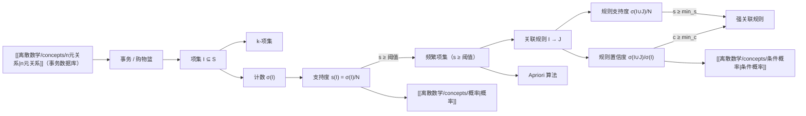

# 关联规则

> [!abstract]
> **关联规则**（association rule）是数据挖掘中的核心概念，用于从事务数据库中发现隐藏的关联模式。关联规则 $I \to J$ 表示"购买商品集合 $I$ 的顾客往往也会购买商品集合 $J$"，其强度由**支持度**（support）和**置信度**（confidence）两个指标度量。关联规则的挖掘过程包括：计算项集的计数与支持度、识别频繁项集、从频繁项集中提取高置信度的规则。经典应用场景是"购物篮分析"（market basket analysis），如著名的"啤酒与尿布"案例。
>
> - **支持度** $s(R) = N(R)/N$：规则在所有事务中成立的概率（普遍性）
> - **置信度** $c(R \to S) = N(R \cup S)/N(R)$：已知 $R$ 成立时 $S$ 也成立的条件概率（可靠性）
> - **频繁项集**：支持度不低于阈值 $s$ 的项集
> - **Apriori 算法**：基于反单调性的频繁项集挖掘算法

## 定义

> [!def] 事务与项集
> 设商店有 $m$ 种商品（**项**，items），每次购买活动产生一个**事务**（transaction）/ **购物篮**（basket），即所购商品的集合。
>
> - **项集**（itemset）：商品的集合 $I \subseteq S$（$S$ 为所有商品的集合）
> - **$k$-项集**（$k$-itemset）：包含 $k$ 个商品的项集
> - **事务数据库**：所有事务的集合 $T = \{t_1, t_2, \ldots, t_N\}$，可用 $(m+1)$ 元组表示（事务编号 + $m$ 个二进制标志位）

> [!def] 计数与支持度
> 设 $I$ 是一个项集，$T = \{t_1, t_2, \ldots, t_N\}$ 是事务集合（共 $N$ 笔事务）。
>
> - **计数**（count）：$\sigma(I) = |\{t_i \in T \mid I \subseteq t_i\}|$，即包含项集 $I$ 的事务数量
> - **支持度**（support）：$s(I) = \dfrac{\sigma(I)}{N}$，即随机选取的事务包含 $I$ 的概率
> - **支持阈值** $s$：应用中指定的最小支持度
> - **频繁项集**（frequent itemset）：支持度 $\geq s$ 的项集

> [!def] 关联规则（Association Rule）
> 设 $I$ 和 $J$ 是不相交的项集。**关联规则** $I \to J$ 的强度由两个指标度量：
>
> - **支持度**：
>
> $$s(I \to J) = \frac{\sigma(I \cup J)}{N} = \frac{\text{同时包含 } I \text{ 和 } J \text{ 的事务数}}{\text{总事务数}}$$
>
> 即事务同时包含 $I$ 和 $J$ 的概率（规则的**普遍性**）
>
> - **置信度**：
>
> $$c(I \to J) = \frac{\sigma(I \cup J)}{\sigma(I)} = \frac{\text{同时包含 } I \text{ 和 } J \text{ 的事务数}}{\text{包含 } I \text{ 的事务数}}$$
>
> 即在包含 $I$ 的事务中，也包含 $J$ 的[[离散数学/concepts/条件概率|条件概率]]（规则的**可靠性**）
>
> - **强关联规则**：支持度 $\geq$ 最小支持度 **且** 置信度 $\geq$ 最小置信度的关联规则

> [!def] Apriori 算法思想
> **Apriori 算法**是经典的频繁项集挖掘算法，基于以下**反单调性**（anti-monotonicity）原理：
>
> 如果某个项集不是频繁的，则它的所有超集也不是频繁的。
>
> 算法流程：
> 1. 扫描数据库，计算所有 1-项集的支持度，保留频繁的
> 2. 由频繁 $k$-项集组合生成 $(k+1)$-项集候选
> 3. 剪枝：删除包含非频繁子集的候选
> 4. 扫描数据库计算候选的支持度，保留频繁的
> 5. 重复步骤 2-4，直到无法生成新的频繁项集
> 6. 从频繁项集中提取高置信度的关联规则

## 核心性质

| 指标 | 公式 | 含义 | 范围 | 直觉 |
|:-----|:-----|:-----|:-----|:-----|
| **计数** $\sigma(I)$ | $\|\{t \in T \mid I \subseteq t\}\|$ | 包含 $I$ 的事务数量 | $0$ 到 $N$ | 绝对频次 |
| **支持度** $s(I)$ | $\sigma(I) / N$ | 随机事务包含 $I$ 的概率 | $[0, 1]$ | 普遍性 |
| **规则支持度** $s(I \to J)$ | $\sigma(I \cup J) / N$ | $I$ 和 $J$ 同时出现的概率 | $[0, 1]$ | 规则的适用范围 |
| **规则置信度** $c(I \to J)$ | $\sigma(I \cup J) / \sigma(I)$ | 已知 $I$ 时 $J$ 出现的条件概率 | $[0, 1]$ | 规则的可靠性 |

> [!info] 支持度与置信度的区别
> - **支持度**衡量规则的"普遍性"：$I$ 和 $J$ 同时出现的概率。支持度太低说明规则适用范围窄，可能是噪声
> - **置信度**衡量规则的"可靠性"：已知 $I$ 出现时 $J$ 也出现的概率。置信度太低说明规则不可靠
> - 一个有用的关联规则应该**同时具有较高的支持度和较高的置信度**
> - 例：规则 $\{A\} \to \{B\}$ 的支持度为 $0.1\%$（很少同时出现），置信度为 $99\%$（只要买了 $A$ 几乎必买 $B$）。规则虽然可靠，但适用范围很窄

> [!info] Apriori 的反单调性原理
> 反单调性是 Apriori 算法高效的关键：
>
> **若 $I$ 不是频繁项集，则对任意 $J \supset I$，$J$ 也不是频繁项集。**
>
> **证明**：若 $I \subseteq J$，则 $\sigma(J) \leq \sigma(I)$（包含 $J$ 的事务必然包含 $I$，但反之不然）。因此 $s(J) = \sigma(J)/N \leq \sigma(I)/N = s(I) < s$。
>
> 这意味着：只需检查频繁项集的超集，大大减少了搜索空间。

## 关系网络

## 章节扩展

本概念出自 **第09章 关系** 的 9.2 节，相关章节内容包括：

- **9.1 关系及其性质**：二元关系的定义与性质
- **9.2 n元关系及其应用**：本概念的直接来源，涵盖关系数据库与关联规则
- **第07章 离散概率**：支持度本质上是概率，置信度本质上是条件概率
- **第06章 计数**：项集的组合计数，频繁项集的搜索空间分析

## 补充

> [!info] 购物篮分析（Market Basket Analysis）
> 购物篮分析是关联规则最经典的应用场景。通过分析顾客的购买记录，发现商品之间的关联模式：
> - **经典案例**："啤酒与尿布"——沃尔玛数据挖掘发现购买尿布的年轻父亲往往同时购买啤酒，将两者摆放在一起后销量均上升
> - **实际应用**：商品推荐、货架摆放优化、促销组合设计、交叉销售策略
>
> 购物篮分析的一般流程：
> 1. 收集事务数据（每笔交易的商品列表）
> 2. 设定最小支持度阈值和最小置信度阈值
> 3. 使用 Apriori 等算法挖掘频繁项集
> 4. 从频繁项集中提取满足阈值的关联规则
> 5. 根据业务需求筛选和解释规则

> [!info] 关联规则的实际应用
> 关联规则的应用远超购物篮分析：
> - **医疗诊断**：项集为检查结果/症状的集合，事务为患者记录
> - **搜索引擎**：项集为关键词集合，事务为网页内容
> - **抄袭检测**：项集为句子集合，事务为文档内容
> - **网络安全**：项集为攻击模式集合，事务为网络传输数据
> - **推荐系统**：项集为用户行为特征，事务为用户会话

> [!info] 关联规则的局限性
> - **计算复杂度高**：可能的项集数量为 $2^m$（$m$ 为商品种类数），暴力枚举不可行
> - **阈值敏感**：最小支持度和置信度的选择对结果影响很大
> - **虚假关联**：高置信度不意味着因果关系（如"购买盐"和"购买任何商品"的置信度都很高）
> - **稀疏数据**：实际数据中大多数项集的支持度很低，频繁项集很少

## 参见

- [[离散数学/concepts/n元关系]] -- 事务数据库是 n元关系的一种形式
- [[离散数学/concepts/概率]] -- 支持度本质上是概率度量
- [[离散数学/concepts/组合]] -- 项集的组合计数与搜索空间分析
