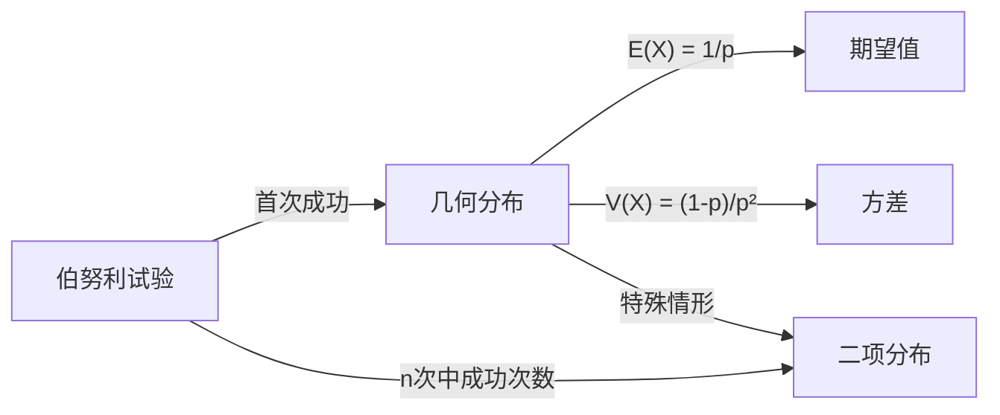

# 几何分布

> [!abstract]
> ==几何分布（Geometric Distribution）==描述在一系列独立的[[离散数学/concepts/伯努利试验]]中，**首次成功**所需的试验次数。若每次试验成功的概率为 $p$（$0 < p < 1$），则首次成功出现在第 $k$ 次试验的概率为 $P(X = k) = (1-p)^{k-1}p$。几何分布的[[离散数学/concepts/期望值]]为 $E(X) = 1/p$，[[离散数学/concepts/方差]]为 $V(X) = (1-p)/p^2$。几何分布具有独特的**无记忆性**——过去的失败不影响未来的成功概率。

## 定义

> [!def] 几何分布（Geometric Distribution）
> 设进行一系列独立的[[离散数学/concepts/伯努利试验]]，每次试验成功的概率为 $p$（$0 < p < 1$），失败的概率为 $q = 1 - p$。令 $X$ 表示**首次成功所需的试验次数**，则 $X$ 服从参数为 $p$ 的几何分布：
> $$P(X = k) = (1-p)^{k-1} p = q^{k-1} p, \quad k = 1, 2, 3, \ldots$$
>
> **直观含义**：首次成功出现在第 $k$ 次试验，意味着前 $k-1$ 次全部失败（概率 $q^{k-1}$），第 $k$ 次成功（概率 $p$）。

> [!def] 几何分布的期望值
> $$E(X) = \sum_{k=1}^{\infty} k \cdot q^{k-1} p$$
>
> **推导**：令 $S = \sum_{k=1}^{\infty} k q^{k-1}$，利用几何级数 $\sum_{k=0}^{\infty} q^k = \frac{1}{1-q}$（$|q| < 1$）对两边求导：
> $$\sum_{k=0}^{\infty} k q^{k-1} = \frac{1}{(1-q)^2} = \frac{1}{p^2}$$
>
> 因此 $S = \frac{1}{(1-q)^2} = \frac{1}{p^2}$，故：
> $$E(X) = p \cdot S = p \cdot \frac{1}{p^2} = \frac{1}{p}$$
>
> **直观理解**：如果每次成功概率为 $p$，平均需要 $1/p$ 次试验才能首次成功。例如抛硬币首次出现正面平均需要 $1/(1/2) = 2$ 次。

> [!def] 几何分布的方差
> $$V(X) = \frac{1-p}{p^2} = \frac{q}{p^2}$$
>
> **推导**：先求 $E(X^2)$：
> $$E(X^2) = \sum_{k=1}^{\infty} k^2 q^{k-1} p$$
>
> 利用恒等式 $\sum_{k=1}^{\infty} k^2 q^{k-1} = \frac{1+q}{(1-q)^3} = \frac{1+q}{p^3}$：
> $$E(X^2) = p \cdot \frac{1+q}{p^3} = \frac{1+q}{p^2}$$
>
> 因此：
> $$V(X) = E(X^2) - [E(X)]^2 = \frac{1+q}{p^2} - \frac{1}{p^2} = \frac{q}{p^2} = \frac{1-p}{p^2}$$

> [!def] 无记忆性（Memoryless Property）
> 几何分布是**唯一**具有无记忆性的离散分布。其含义为：
> $$P(X > m + n \mid X > m) = P(X > n)$$
>
> 对所有非负整数 $m, n$ 成立。
>
> **直观含义**：在已经失败了 $m$ 次的条件下，还需要再试验 $n$ 次以上才能成功的概率，等于从一开始就需要 $n$ 次以上才能成功的概率。**过去的失败不影响未来的成功概率**——每次试验都是"全新开始"。
>
> **证明**：
> $$P(X > m + n \mid X > m) = \frac{P(X > m + n)}{P(X > m)}$$
>
> 其中 $P(X > k) = \sum_{j=k+1}^{\infty} q^{j-1} p = p q^k \sum_{j=0}^{\infty} q^j = p q^k \cdot \frac{1}{1-q} = q^k$。
>
> 因此：$\frac{P(X > m + n)}{P(X > m)} = \frac{q^{m+n}}{q^m} = q^n = P(X > n)$。$\blacksquare$

> [!def] 累积分布函数
> $$P(X \leq k) = \sum_{j=1}^{k} q^{j-1} p = p \cdot \frac{1 - q^k}{1 - q} = 1 - q^k = 1 - (1-p)^k$$
>
> **直观含义**：前 $k$ 次试验中至少成功一次的概率为 $1 - (1-p)^k$。
>
> **推论**：$P(X > k) = (1-p)^k$，即前 $k$ 次全部失败的概率。

## 核心性质

| 编号 | 性质 | 公式/说明 |
|:---:|------|------|
| P1 | **概率质量函数** | $P(X = k) = (1-p)^{k-1}p$，$k = 1, 2, 3, \ldots$ |
| P2 | **期望值** | $E(X) = 1/p$，成功概率越大，首次成功越快 |
| P3 | **方差** | $V(X) = (1-p)/p^2$，成功概率越小，波动越大 |
| P4 | **无记忆性** | $P(X > m+n \mid X > m) = P(X > n)$，过去不影响未来 |
| P5 | **累积分布** | $P(X \leq k) = 1 - (1-p)^k$，前 $k$ 次至少成功一次的概率 |
| P6 | **唯一性** | 几何分布是唯一具有无记忆性的离散分布 |

## 关系网络

## 章节扩展

- **伯努利试验**：[[离散数学/concepts/伯努利试验]]是几何分布的基础模型，几何分布描述的是伯努利试验序列中首次成功的等待时间
- **期望值**：[[离散数学/concepts/期望值]] $E(X) = 1/p$ 是几何分布最重要的数字特征
- **方差**：[[离散数学/concepts/方差]] $V(X) = (1-p)/p^2$ 度量了几何分布的离散程度

## 补充

> [!info] 生活类比
> 想象你在玩一个中奖率为 $1\%$ 的抽奖游戏。几何分布告诉我们：你平均需要抽 $1/0.01 = 100$ 次才能首次中奖。但更重要的是"无记忆性"：如果你已经抽了50次都没中奖，不要觉得"下次该中了"——你从第51次开始，仍然平均需要再抽100次才能中奖。过去的失败不会让你"积攒运气"，每次抽奖都是独立的。

> [!info] 几何分布与二项分布的关系
> 几何分布和二项分布都基于[[离散数学/concepts/伯努利试验]]，但回答不同的问题：
> - **几何分布**：首次成功需要多少次试验？（"等待时间"问题）
> - **二项分布**：固定 $n$ 次试验中有多少次成功？（"计数"问题）
>
> 两者的联系：$P(X > n) = (1-p)^n$ 恰好是二项分布中 $n$ 次试验全部失败的概率。

> [!info] 几何分布的两种定义
> 注意：几何分布有两种常见的参数化方式：
> 1. **本笔记采用的形式**：$X$ 为首次成功的试验次数，$X \in \{1, 2, 3, \ldots\}$，$P(X = k) = q^{k-1}p$
> 2. **另一种形式**：$Y$ 为首次成功之前的失败次数，$Y \in \{0, 1, 2, \ldots\}$，$P(Y = k) = q^k p$
>
> 两者关系为 $Y = X - 1$，因此 $E(Y) = E(X) - 1 = (1-p)/p$，$V(Y) = V(X) = (1-p)/p^2$。阅读文献时需注意使用的是哪种定义。

## 参见

- [[离散数学/concepts/伯努利试验]]：几何分布的基础模型
- [[离散数学/concepts/期望值]]：几何分布的期望为 $1/p$
- [[离散数学/concepts/方差]]：几何分布的方差为 $(1-p)/p^2$
