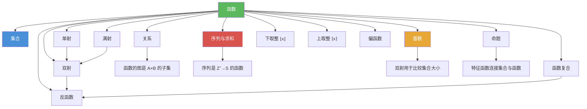

# 函数

> [!abstract] 概述
> ==函数（function）==是从定义域 $A$ 到值域 $B$ 的映射关系 $f: A \to B$，将 $B$ 中恰好一个元素分配给 $A$ 中每个元素。函数按映射特性可分为==单射==（一对一）、==满射==（覆盖值域）和==双射==（一一对应）。反函数仅当函数为双射时存在，函数复合==不满足交换律==。下取整 $\lfloor x \rfloor$ 与上取整 $\lceil x \rceil$ 是离散数学中极为重要的特殊函数。

## 定义

> [!def] 函数（Function）
>
> 设 $A$ 和 $B$ 为非空集合，从 $A$ 到 $B$ 的==函数== $f$ 是一种==将 $B$ 中恰好一个元素分配给 $A$ 中每个元素==的规则。记作 $f : A \to B$。
>
> - $A$ 称为==定义域==（domain），$B$ 称为==值域==（codomain）
> - 若 $f(a) = b$，则 $b$ 是 $a$ 的==像==（image），$a$ 是 $b$ 的==原像==（preimage）
> - $f$ 的所有像的集合称为 $f$ 的==像集==（range）：$\{f(a) \mid a \in A\}$
> - range $\subseteq$ codomain，两者不一定相等
> - 函数也称为==映射==（mapping）或==变换==（transformation）

> [!def] 单射、满射与双射
>
> | 类型 | 定义 | 等价表述 | 直觉 |
> |------|------|---------|------|
> | ==单射==（injective） | $f(a) = f(b) \Rightarrow a = b$ | $\forall a \forall b(a \neq b \to f(a) \neq f(b))$ | 不同输入产生不同输出 |
> | ==满射==（surjective） | $\forall b \in B, \exists a \in A, f(a) = b$ | range = codomain | 值域中每个元素都被映射到 |
> | ==双射==（bijection） | 既是单射又是满射 | 一一对应（one-to-one correspondence） | 输入与输出完美配对 |
>
> **有限集上的重要性质**：若 $A$ 是有限集，则 $f : A \to A$ 是单射当且仅当它是满射。此结论对无限集不成立。

> [!def] 反函数（Inverse Function）
>
> 设 $f$ 是从 $A$ 到 $B$ 的双射。$f$ 的==反函数== $f^{-1}$ 是从 $B$ 到 $A$ 的函数，满足 $f^{-1}(b) = a$ 当且仅当 $f(a) = b$。
>
> - 反函数存在的充要条件：$f$ 是双射
> - 若 $f$ 不是单射，某些 $b$ 有多个原像，无法唯一确定 $f^{-1}(b)$
> - 若 $f$ 不是满射，某些 $b$ 没有原像，$f^{-1}(b)$ 无定义
> - 注意：$f^{-1}$ 是反函数，不是倒数 $1/f$

> [!def] 函数复合（Composition of Functions）
>
> 设 $g : A \to B$，$f : B \to C$。$f$ 和 $g$ 的==复合== $f \circ g$ 是从 $A$ 到 $C$ 的函数：
> $$(f \circ g)(a) = f(g(a))$$
>
> - 复合的定义前提：$g$ 的值域必须是 $f$ 的定义域的子集
> - $(f \circ g)$ 的定义域是 $g$ 的定义域
> - 函数复合==不满足交换律==：$f \circ g \neq g \circ f$（一般情况）
> - 若 $f$ 是双射，则 $f^{-1} \circ f = \iota_A$，$f \circ f^{-1} = \iota_B$（恒等函数）

> [!def] 下取整与上取整函数
>
> - ==下取整函数== $\lfloor x \rfloor$：不超过 $x$ 的最大整数（向左取整）
> - ==上取整函数== $\lceil x \rceil$：不小于 $x$ 的最小整数（向右取整）
>
> 核心性质（$n$ 为整数，$x$ 为实数）：
>
> | 编号 | 性质 |
> |------|------|
> | (1a) | $\lfloor x \rfloor = n \iff n \leq x < n + 1$ |
> | (1b) | $\lceil x \rceil = n \iff n - 1 < x \leq n$ |
> | (2) | $x - 1 < \lfloor x \rfloor \leq x \leq \lceil x \rceil < x + 1$ |
> | (3a) | $\lfloor -x \rfloor = -\lceil x \rceil$ |
> | (3b) | $\lceil -x \rceil = -\lfloor x \rfloor$ |
> | (4a) | $\lfloor x + n \rfloor = \lfloor x \rfloor + n$ |
> | (4b) | $\lceil x + n \rceil = \lceil x \rceil + n$ |

> [!def] 阶乘函数
>
> $$n! = 1 \cdot 2 \cdots (n-1) \cdot n, \quad 0! = 1$$
>
> 增长极快，Stirling 公式：$n! \sim \sqrt{2\pi n}(n/e)^n$（$n \to \infty$）。

> [!def] 偏函数（Partial Function）
>
> 从 $A$ 到 $B$ 的==偏函数== $f$ 是对 $A$ 的某个子集中的每个元素分配 $B$ 中唯一元素的规则。对于不在定义域内的元素，$f$ 是未定义的。当定义域等于 $A$ 时，$f$ 是==全函数==（total function）。

## 核心性质

| 性质 | 描述 | 公式/条件 |
|------|------|----------|
| 函数相等 | 定义域、值域、映射规则三者完全相同 | $f = g \iff \text{dom}(f) = \text{dom}(g) \land \forall x(f(x) = g(x))$ |
| 严格单调蕴含单射 | 严格递增或严格递减的函数一定是单射 | $f$ 严格递增 $\Rightarrow$ $f$ 单射 |
| 反函数存在条件 | 仅当函数是双射时反函数才存在 | $f^{-1}$ 存在 $\iff$ $f$ 是双射 |
| 复合不满足交换律 | 函数复合的顺序不可交换 | $f \circ g \neq g \circ f$（一般情况） |
| 复合保持单射/满射 | 单射/满射的复合仍为单射/满射 | $f, g$ 均单射 $\Rightarrow$ $f \circ g$ 单射 |
| 有限集上单射等价满射 | 有限集上单射与满射互为充要条件 | $|A|$ 有限时，$f: A \to A$ 单射 $\iff$ $f$ 满射 |
| 下取整/上取整平移性质 | 加整数后取整等于取整后加整数 | $\lfloor x + n \rfloor = \lfloor x \rfloor + n$ |

## 关系网络

- [[集合]] 是函数的基础：函数的定义域和值域都是集合，函数的图是笛卡尔积的子集
- [[序列与求和]] 是从 $\mathbb{Z}^+$ 到集合的函数，序列的求和与函数的累加密切相关
- [[基数]] 利用双射来比较集合的"大小"，双射是定义等势关系的关键
- [[逻辑学/concepts/命题]] 中的特征函数将命题真值与集合成员关系联系起来
- **关系**是函数的推广：函数是满足"每个输入恰好对应一个输出"的特殊关系

## 章节扩展

### 第2章：基本结构

函数是第 2 章的 2.3 节，建立在集合和笛卡尔积的基础之上：

- **2.1 集合**：提供定义域、值域等基本概念；笛卡尔积是函数的图的基础
- **2.2 集合运算**：特征函数将集合运算转化为函数运算
- **2.3 函数**：函数的定义、单射/满射/双射、反函数、复合、取整函数、偏函数
- **2.4 序列与求和**：序列是定义域为 $\mathbb{Z}^+$（或其子集）的函数
- **2.5 基数**：利用双射定义集合的等势关系，比较无限集的大小
- **2.6 矩阵**：矩阵可视为从索引对到值的函数

### 第6章：计数

- **6.1 计数基础**：从 $m$ 元素集合到 $n$ 元素集合的函数共有 $n^m$ 个（乘法法则），单射函数有 $P(n,m)$ 个。

### 第9章：关系

- **9.1 函数作为二元关系的特例**：函数 $f: A \to B$ 可以形式化地定义为满足以下两个条件的==二元关系== $f \subseteq A \times B$：
  - **存在性**（existence）：$\forall a \in A,\ \exists b \in B,\ (a, b) \in f$（定义域中每个元素都有像）
  - **唯一性**（uniqueness）：$\forall a \in A,\ \forall b_1 \forall b_2 \in B,\ (a, b_1) \in f \land (a, b_2) \in f \to b_1 = b_2$（每个元素恰好有一个像）

  从关系的视角看，函数的图（graph）就是关系本身——一个有序对的集合。这一视角将函数统一到了关系的理论框架下，使得关系运算（如逆关系、复合关系）可以自然地应用于函数。注意：函数的逆关系 $f^{-1} \subseteq B \times A$ 不一定是函数（只有当 $f$ 是双射时才是），这正好解释了为什么反函数仅对双射存在。

## 补充

> [!info] 函数概念的历史演变
>
> 函数概念是数学中最核心的概念之一。"函数"（function）一词由 **Leibniz** 于 1673 年首次引入，最初用于描述与曲线相关的量。**Bernoulli**（1718）将函数定义为解析表达式，**Euler**（1755）进一步发展了函数理论。现代基于集合论的函数定义（作为有序对的集合）归功于 **Dirichlet** 提出的"任意对应"观念，打破了函数必须是解析表达式的限制，使离散数学中的函数（如特征函数、下取整函数等）获得了严格的数学基础。
>
> **学术来源**：Kleiner, I. (1989). "Evolution of the Function Concept: A Brief Survey." *The College Mathematics Journal*, 20(4), 282-300.
>
> **参考链接**：Graham, R. L., Knuth, D. E., & Patashnik, O. (1994). *Concrete Mathematics* (2nd ed.). Addison-Wesley. https://mitpress.mit.edu/9780262033848/

## 参见

- [[集合]] -- 集合的基本定义，函数的定义域和值域都是集合
- [[序列与求和]] -- 序列是定义域为正整数集的函数
- [[基数]] -- 利用双射比较集合大小，可数集与不可数集
- [[逻辑学/concepts/命题]] -- 特征函数将命题逻辑与集合论联系起来
