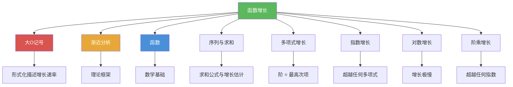

# 函数增长

> [!abstract] 概述
> ==函数增长（Growth of Functions）==研究不同类型函数在自变量趋于无穷时的增长速率差异，是==渐近分析==的实证基础。核心结论包括：==多项式的阶由最高次项决定==，==指数函数最终超过任何多项式==，==对数函数增长极慢==。常见增长函数按速度排序为 $1 < \log n < \sqrt{n} < n < n \log n < n^2 < 2^n < n!$，这一层级关系直接决定了算法复杂度的比较标准，是选择高效算法的理论依据。

## 定义

> [!def] 多项式的阶
>
> 设 $f(x) = a_n x^n + a_{n-1} x^{n-1} + \cdots + a_1 x + a_0$，其中 $a_n \neq 0$，则 $f(x) = \Theta(x^n)$。
>
> 即多项式的阶完全由其==最高次项==决定，低阶项和常数系数在渐近意义下可忽略。
>
> **证明要点**：当 $x > 1$ 时，利用三角不等式：
> $$|f(x)| \leq |a_n|x^n + |a_{n-1}|x^{n-1} + \cdots + |a_0| \leq x^n(|a_n| + |a_{n-1}| + \cdots + |a_0|)$$
> 取 $C = |a_n| + |a_{n-1}| + \cdots + |a_0|$，$k = 1$ 即得 $O(x^n)$。

> [!def] 指数增长 vs 多项式增长
>
> 若 $d > 0$ 且 $b > 1$，则 $n^d = O(b^n)$，但 $b^n \neq O(n^d)$。
>
> 即==指数函数最终超过任何多项式==，无论多项式的次数多高、指数函数的底数多接近 1。
>
> 直觉理解：$b^n = (1 + (b-1))^n$ 的二项式展开中，高次项的增长速度远超 $n^d$。

> [!def] 对数增长
>
> 对数函数 $\log_b n$（$b > 1$）的增长速度==极慢==，满足：
>
> - 对任意 $c > 0$ 和 $d > 0$：$(\log_b n)^c = O(n^d)$，但 $n^d \neq O((\log_b n)^c)$
> - 对数函数的增长慢于任何正幂次的幂函数
> - 对数底数的改变只影响常数因子：$\log_b n = \frac{\log_a n}{\log_a b} = O(\log_a n)$

> [!def] 常见增长函数的阶
>
> 以下函数按增长速度从慢到快排列：
>
> $$1 < \log n < \sqrt{n} < n < n\log n < n^2 < n^3 < 2^n < n!$$
>
> 更一般地：
> - 若 $d > c > 0$，则 $(\log_b n)^c = O(n^d)$，但 $n^d \neq O((\log_b n)^c)$
> - 若 $d > 0$，$b > 1$，则 $n^d = O(b^n)$，但 $b^n \neq O(n^d)$
> - 若 $c > b > 1$，则 $b^n = O(c^n)$，但 $c^n \neq O(b^n)$
> - 若 $c > 1$，则 $c^n = O(n!)$，但 $n! \neq O(c^n)$

## 核心性质

| 性质 | 描述 | 公式/条件 |
|------|------|----------|
| 多项式的阶 | 多项式的阶由最高次项决定 | $a_n x^n + \cdots + a_0 = \Theta(x^n)$（$a_n \neq 0$） |
| 指数超越多项式 | 指数函数最终超过任何多项式 | $n^d = O(b^n)$，但 $b^n \neq O(n^d)$（$d > 0, b > 1$） |
| 对数慢于幂函数 | 对数增长慢于任何正幂次幂函数 | $(\log n)^c = O(n^d)$，但 $n^d \neq O((\log n)^c)$（$c, d > 0$） |
| 底数无关性 | 对数底数只影响常数因子 | $\log_b n = O(\log_a n)$（$a, b > 1$） |
| 指数底数影响 | 更大的底数增长更快 | $b^n = O(c^n)$，但 $c^n \neq O(b^n)$（$c > b > 1$） |
| 阶乘超越指数 | 阶乘增长快于任何指数函数 | $c^n = O(n!)$，但 $n! \neq O(c^n)$（$c > 1$） |
| 阶乘的上界 | $n!$ 不超过 $n^n$ | $n! = 1 \cdot 2 \cdots n \leq n^n$，故 $n! = O(n^n)$ |
| 对数阶乘的估计 | $\log n!$ 的增长不超过 $n \log n$ | $\log n! \leq \log n^n = n\log n$，故 $\log n! = O(n\log n)$ |

## 关系网络

- [[大O记号]] -- 用形式化的数学语言描述函数增长速率的上界、下界和紧确界
- [[渐近分析]] -- 函数增长所属的理论框架，通过忽略常数因子和低阶项来比较增长趋势
- [[函数]] -- 函数增长的数学基础，增长分析建立在实值函数的定义之上
- [[序列与求和]] -- 求和公式（如 $1 + 2 + \cdots + n = \Theta(n^2)$）是分析函数增长的重要工具

## 章节扩展

### 第3章：算法

函数增长是第 3 章 3.2 节的核心内容，为算法复杂度分析提供实证基础：

- **3.1 算法**：算法的基本概念，为后续的复杂度分析提供度量对象
- **3.2 函数的增长**：系统介绍多项式阶、指数增长、对数增长等核心概念，建立常见增长函数的层级关系，以及函数组合（和、积）的增长估计规则
- **3.3 算法复杂度分析**：将函数增长的知识应用于具体算法，通过增长阶的比较来评估算法效率（如二分搜索 $O(\log n)$ 优于线性搜索 $O(n)$，归并排序 $O(n\log n)$ 优于冒泡排序 $O(n^2)$）

## 补充

> [!info] 函数增长的实际意义
>
> 不同增长阶的函数在 $n$ 较小时差异不大，但当 $n$ 增大时差异极其惊人。Sedgewick & Wayne（2011）给出了实用的经验法则：$n < 10$ 时所有算法都足够快；$n < 100$ 时 $O(n^2)$ 可接受；$n < 1000$ 时 $O(n^2)$ 开始吃力；$n > 10^6$ 时需要 $O(n \log n)$ 或更优的算法。
>
> 以下是基于单核 CPU（约 $10^9$ 次基本操作/秒）的实际运行时间参考：
>
> | 复杂度 | $n = 10^4$ | $n = 10^7$ | $n = 10^8$ |
> |--------|-----------|-----------|-----------|
> | $O(n)$ | $\approx 0.01$ ms | $\approx 0.01$ s | $\approx 0.1$ s |
> | $O(n \log n)$ | $\approx 0.13$ ms | $\approx 0.23$ s | $\approx 2.7$ s |
> | $O(n^2)$ | $\approx 0.1$ s | $\approx 1.2$ 天 | $\approx 3.2$ 年 |
> | $O(2^n)$ | 不可行 | 不可行 | 不可行 |
>
> **学术来源**：
> - Rosen, K. H. (2019). *Discrete Mathematics and Its Applications* (8th ed.). McGraw-Hill. Section 3.2.
> - Sedgewick, R. & Wayne, K. (2011). *Algorithms* (4th ed.). Addison-Wesley.

## 参见

- [[大O记号]] -- 用大O、大$\Omega$、大$\Theta$ 等记号形式化描述函数增长速率
- [[渐近分析]] -- 函数增长所属的渐近分析理论框架
- [[函数]] -- 函数增长分析的数学基础，建立在实值函数定义之上
- [[序列与求和]] -- 求和公式是分析函数增长的重要工具，如 $\sum_{i=1}^{n} i = \Theta(n^2)$
