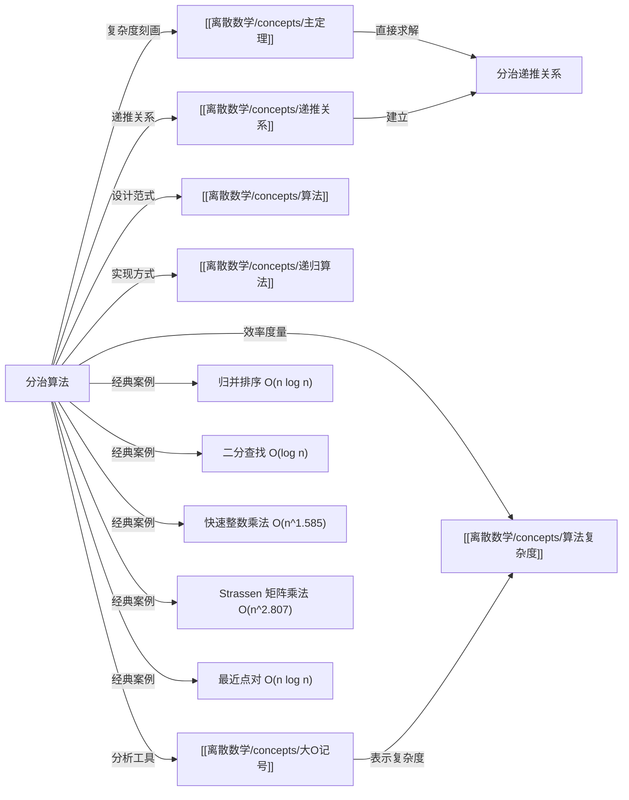

# 分治算法

> [!abstract]
> ==分治算法（Divide-and-Conquer Algorithm）==是一种将规模为 $n$ 的问题分解为若干规模更小的子问题、递归求解后合并结果的算法设计范式。其复杂度由==分治递推关系== $f(n) = af(n/b) + g(n)$ 刻画，其中 $a$ 为子问题个数，$b$ 为缩小因子，$g(n)$ 为合并开销。经典应用包括[[归并排序]] $O(n\log n)$、二分查找 $O(\log n)$、快速整数乘法 $O(n^{\log_2 3})$ 和 Strassen 矩阵乘法 $O(n^{\log_2 7})$。

## 定义

> [!def] 分治算法（Divide-and-Conquer Algorithm）
> 分治算法遵循"分而治之"（Divide et impera）的策略，包含三个步骤：
>
> 1. **分解（Divide）**：将规模为 $n$ 的问题分解为 $a$ 个规模为 $n/b$ 的子问题
> 2. **解决（Conquer）**：递归地求解每个子问题
> 3. **合并（Combine）**：将子问题的解合并为原问题的解，合并开销为 $g(n)$
>
> 若 $f(n)$ 表示求解规模为 $n$ 的问题所需的总操作数，则
>
> $$f(n) = af(n/b) + g(n)$$
>
> 这称为==分治递推关系==。
>
> - $a$：子问题的个数
> - $b$：问题规模缩小的因子（$b > 1$ 的整数）
> - $g(n)$：合并步骤的额外开销
> - 当 $n$ 不是 $b$ 的幂时，子问题规模取 $\lfloor n/b \rfloor$ 或 $\lceil n/b \rceil$

> [!def] 递推展开公式
> 设 $f(n) = af(n/b) + g(n)$，且 $n = b^k$（$k$ 为正整数）。反复展开递推关系：
>
> $$f(n) = a^k f(1) + \sum_{j=0}^{k-1} a^j g(n/b^j)$$
>
> 由于 $n/b^k = 1$，即 $f(n/b^k) = f(1)$，最终得到上述闭式。这是递归树法（recursion tree method）的代数基础，也是[[主定理]]证明的出发点。

## 核心性质

| 编号 | 经典算法 | 递推关系 | 参数 $(a, b, g(n))$ | 复杂度 | 说明 |
|:---:|---------|---------|:---:|:---:|------|
| 1 | 二分查找 | $f(n) = f(n/2) + 2$ | $(1, 2, 2)$ | $O(\log n)$ | 每次缩减为规模 $n/2$ 的子问题 |
| 2 | 最大最小值查找 | $f(n) = 2f(n/2) + 2$ | $(2, 2, 2)$ | $O(n)$ | 两个子序列分别查找后合并比较 |
| 3 | 归并排序 | $M(n) = 2M(n/2) + n$ | $(2, 2, n)$ | $O(n\log n)$ | 合并两个有序子列表需 $n$ 次比较 |
| 4 | 快速整数乘法 | $f(2n) = 3f(n) + Cn$ | $(3, 2, Cn)$ | $O(n^{\log_2 3})$ | 分解为 3 个 $n$ 位乘法，$\log_2 3 \approx 1.585$ |
| 5 | Strassen 矩阵乘法 | $f(n) = 7f(n/2) + 15n^2/4$ | $(7, 2, 15n^2/4)$ | $O(n^{\log_2 7})$ | 7 个子矩阵乘法，$\log_2 7 \approx 2.807$ |
| 6 | 最近点对 | $f(n) = 2f(n/2) + 7n$ | $(2, 2, 7n)$ | $O(n\log n)$ | 带状区域每个点至多比较 7 个其他点 |

| 编号 | 设计要素 | 影响 | 优化方向 |
|:---:|---------|------|---------|
| A | 子问题个数 $a$ | 越少越好 | 减少递归分支 |
| B | 规模缩小因子 $b$ | 越大越好 | 问题缩小得越快 |
| C | 合并开销 $g(n)$ | 越小越好 | 高效的合并策略 |

## 关系网络

## 章节扩展

### 第08章 高级计数技术 -- 8.3 分治算法与递推关系

分治算法是 8.3 节的核心主题，本节系统介绍了分治递推关系的建立与求解方法：

- **分治递推关系**：一般形式 $f(n) = af(n/b) + g(n)$，通过递推展开法可得闭式 $f(n) = a^k f(1) + \sum_{j=0}^{k-1} a^j g(n/b^j)$
- **Theorem 1**（$g(n) = c$ 的特殊情况）：$f(n) = af(n/b) + c$ 的解为 $O(n^{\log_b a})$（$a > 1$）或 $O(\log n)$（$a = 1$）
- **主定理**：$f(n) = af(n/b) + cn^d$ 的三种情况判定，详见[[离散数学/concepts/主定理]]
- **最近点对问题**：Michael Shamos 提出的分治算法，通过递归分割 + 带状区域检查实现 $O(n\log n)$ 复杂度

### 递归树法分析

递归树法是理解分治算法复杂度的直观方法，将递推关系展开为一棵树：

- **根节点**：原问题，工作量为 $g(n)$
- **第 $j$ 层**：$a^j$ 个子问题，每个规模为 $n/b^j$，每层总工作量 $a^j \cdot g(n/b^j)$
- **叶子节点**：$a^{\log_b n} = n^{\log_b a}$ 个，每个工作量为 $f(1)$
- **总工作量**：所有层的工作量之和

三种典型模式：
- 每层工作量递减（$a < b^d$）：根节点主导，$O(n^d)$
- 每层工作量相同（$a = b^d$）：$\log_b n$ 层等量相加，$O(n^d \log n)$
- 每层工作量递增（$a > b^d$）：叶子节点主导，$O(n^{\log_b a})$

## 补充

> [!info] 分治思想的历史与直觉
> "分而治之"（Divide et impera）的思想可追溯到古罗马的凯撒大帝。在计算机科学中，分治策略是最高效的算法设计范式之一。其核心直觉可以用"组织大型活动"来类比：如果要组织 1000 人的活动，直接管理所有人效率极低（$O(n^2)$ 的沟通成本）；更好的方式是将 1000 人分成若干小组，每组指定组长，再由组长管理组员——这就是分治思想的本质。
>
> 分治算法的效率取决于三个因素：子问题个数 $a$（越少越好）、规模缩小因子 $b$（越大越好）、合并开销 $g(n)$（越小越好）。[[离散数学/concepts/主定理]]精确地刻画了这三个因素如何共同决定最终复杂度。

> [!info] Strassen 矩阵乘法的突破意义
> Volker Strassen 于 1969 年发明的方法将两个 $n \times n$ 矩阵的乘法从传统的 $O(n^3)$ 降低到 $O(n^{\log_2 7}) \approx O(n^{2.807})$。这一突破打破了"矩阵乘法不可能快于 $O(n^3)$"的长期直觉，开启了快速矩阵乘法的研究热潮。此后 Coppersmith-Winograd 等算法进一步将复杂度降至 $O(n^{2.373})$ 以下。

## 参见

- [[离散数学/concepts/主定理]] -- 分治递推关系复杂度的直接判定方法
- [[离散数学/concepts/递推关系]] -- 递推关系的分类与求解方法
- [[离散数学/concepts/算法复杂度]] -- 算法效率的度量框架
- [[离散数学/concepts/算法]] -- 分治算法所属的算法设计范式
- [[离散数学/concepts/递归算法]] -- 分治算法的实现方式
- [[离散数学/concepts/大O记号]] -- 复杂度的渐近表示方法
