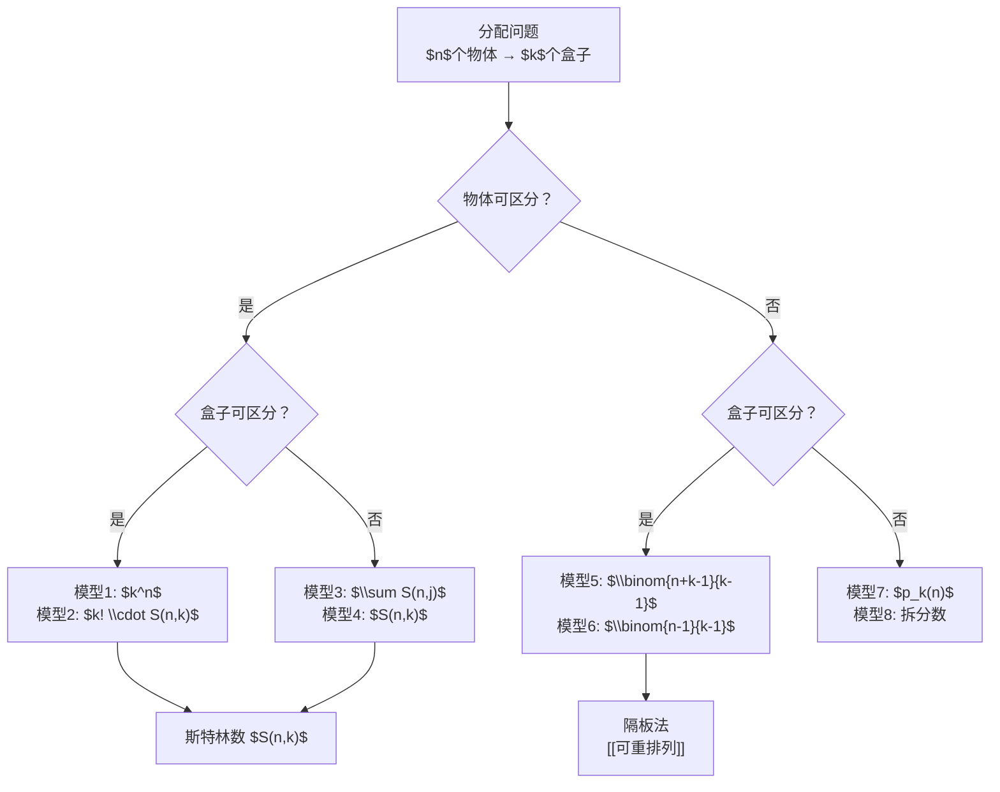

# 分配问题

> [!abstract]
> ==分配问题（Distribution Problem）==是组合计数中一个统一的框架：将 $n$ 个物体分配到 $k$ 个盒子中，根据物体和盒子是否可区分、是否允许空盒，共有 $2 \times 2 \times 2 = 8$ 种基本模型（实际常用12种变体）。该框架将排列、组合、可重组合、[[斯特林数]]等概念统一到一个体系中。

## 定义

> [!def] 分配问题（Distribution Problem）
> 将 $n$ 个物体分配到 $k$ 个盒子中，求所有满足条件的分配方案数。问题的具体形式由以下三个二元选择决定：
> - **物体是否可区分**（distinguishable / indistinguishable）
> - **盒子是否可区分**（distinguishable / indistinguishable）
> - **是否允许空盒**（boxes can be empty / no empty boxes）

> [!def] 十二种分配模型
> 根据物体可区分性（2种）、盒子可区分性（2种）、是否允许空盒（2种）的组合，以及"每盒至多一个物体"的约束，共形成12种经典模型。下表列出最常见的8种：

## 核心性质

| 编号 | 模型描述 | 公式 | 备注 |
|:---:|---------|------|------|
| 1 | 可区分物体 → 可区分盒子，允许空盒 | $k^n$ | 每个物体有 $k$ 个盒子可选 |
| 2 | 可区分物体 → 可区分盒子，不允许空盒 | $k! \cdot S(n, k)$ | 使用[[斯特林数]]，先分组再排列 |
| 3 | 可区分物体 → 不可区分盒子，允许空盒 | $\sum_{j=1}^{k} S(n, j)$ | 盒子不可区分，只关心分组方式 |
| 4 | 可区分物体 → 不可区分盒子，不允许空盒 | $S(n, k)$ | 恰好 $k$ 个非空等价类 |
| 5 | 不可区分物体 → 可区分盒子，允许空盒 | $\binom{n + k - 1}{k - 1}$ | 隔板法，见[[可重排列]] |
| 6 | 不可区分物体 → 可区分盒子，不允许空盒 | $\binom{n - 1}{k - 1}$ | 先每盒放1个，再隔板法 |
| 7 | 不可区分物体 → 不可区分盒子，允许空盒 | $p_k(n)$ | $n$ 的不超过 $k$ 部分的拆分数 |
| 8 | 不可区分物体 → 不可区分盒子，不允许空盒 | $p_k(n) - p_{k-1}(n)$ | 恰好 $k$ 部分的拆分数 |

| 编号 | 性质 | 说明 |
|:---:|------|------|
| 9 | **模型1 ↔ 可重排列** | 可区分物体分配到可区分盒子（允许空盒）等价于从 $k$ 类中取 $n$ 个的可重排列 $k^n$ |
| 10 | **模型5 ↔ 可重组合** | 不可区分物体分配到可区分盒子（允许空盒）等价于从 $k$ 类中取 $n$ 个的可重组合 $\binom{n+k-1}{k-1}$ |
| 11 | **模型2 ↔ 斯特林数** | 可区分物体分配到可区分盒子（不允许空盒）的核心工具是第二类[[斯特林数]] $S(n,k)$ |
| 12 | **对偶性** | "可区分物体→不可区分盒子"与"不可区分物体→可区分盒子"互为某种对偶，但公式不对称 |

## 关系网络

## 章节扩展

- **第6.5节**：本概念是Rosen教材第6.5节的总结性内容，将前述所有计数技术纳入统一框架。
- **整数拆分**：模型7和模型8涉及整数拆分数 $p_k(n)$，这是数论和组合数学的交叉领域，没有简单的闭式公式。
- **容斥原理的应用**：模型2（不允许空盒）可通过容斥原理从模型1（允许空盒）推导：
  $$
  \text{不允许空盒} = \sum_{j=0}^{k} (-1)^j \binom{k}{j} (k-j)^n
  $$

## 补充

> [!info] 容斥原理推导模型2
> 设 $A_i$ 为"第 $i$ 个盒子为空"的事件集合，则：
> $$|A_i| = (k-1)^n, \quad |A_i \cap A_j| = (k-2)^n, \quad \ldots$$
> 由容斥原理，至少一个盒子为空的方案数为 $\sum_{j=1}^{k} (-1)^{j+1} \binom{k}{j} (k-j)^n$，因此不允许空盒的方案数为：
> $$k^n - \sum_{j=1}^{k} (-1)^{j+1} \binom{k}{j} (k-j)^n = \sum_{j=0}^{k} (-1)^j \binom{k}{j} (k-j)^n$$
> 这也给出了 $k! \cdot S(n,k)$ 的显式表达式。

> [!info] 经典例题
> 将5个不同的球放入3个不同的盒子，不允许空盒：
> $$3! \cdot S(5,3) = 6 \times 25 = 150$$
> 其中 $S(5,3) = 25$ 可通过递推或查表得到。

## 参见

- [[可重排列]] — 隔板法与可重组合
- [[斯特林数]] — 第二类Stirling数及其递推关系
- [[多重集排列]] — 有限重复的排列计数
- [[排列]] — 基础排列概念
- [[组合]] — 基础组合概念
