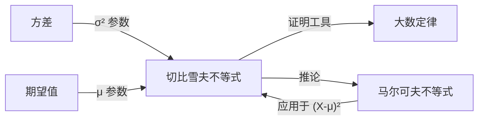

# 切比雪夫不等式

> [!abstract]
> ==切比雪夫不等式（Chebyshev's Inequality）==是概率论中最基本的不等式之一，它利用[[离散数学/concepts/随机变量]]的[[离散数学/concepts/方差]]给出偏离[[离散数学/concepts/期望值]]的概率上界。具体而言，对于期望为 $\mu$、方差为 $\sigma^2$ 的随机变量 $X$，有 $P(|X - \mu| \geq r) \leq \sigma^2/r^2$。该不等式是[[离散数学/concepts/马尔可夫不等式]]的直接推论，无需知道 $X$ 的具体分布即可使用，是证明**大数定律**、确定**样本量**等问题的核心工具。

## 定义

> [!def] 切比雪夫不等式（Chebyshev's Inequality）
> 设 $X$ 为[[离散数学/concepts/随机变量]]，$E(X) = \mu$，$V(X) = \sigma^2$（其中 $\sigma^2 < \infty$），则对任意 $r > 0$：
> $$P(|X - \mu| \geq r) \leq \frac{\sigma^2}{r^2}$$
>
> 等价形式（令 $r = k\sigma$）：
> $$P(|X - \mu| \geq k\sigma) \leq \frac{1}{k^2}$$
>
> **直观含义**：[[离散数学/concepts/随机变量]]偏离其期望超过 $k$ 个标准差的概率不超过 $1/k^2$。

> [!def] 切比雪夫不等式的证明
> **证明**（利用[[离散数学/concepts/马尔可夫不等式]]）：
>
> 令 $Y = (X - \mu)^2$，则 $Y$ 是非负随机变量。
> - $E(Y) = E\left[(X - \mu)^2\right] = V(X) = \sigma^2$
> - 事件 $\{|X - \mu| \geq r\}$ 等价于事件 $\{(X - \mu)^2 \geq r^2\}$，即 $\{Y \geq r^2\}$
>
> 由[[离散数学/concepts/马尔可夫不等式]]：
> $$P(Y \geq r^2) \leq \frac{E(Y)}{r^2} = \frac{\sigma^2}{r^2}$$
>
> 即 $P(|X - \mu| \geq r) \leq \sigma^2/r^2$。$\blacksquare$

> [!def] 应用一：确定样本量
> **问题**：要估计某人群的平均身高 $\mu$，希望估计误差不超过 $0.5$ 厘米的概率至少为 $0.95$。已知身高方差 $\sigma^2 = 25$（标准差 $\sigma = 5$ 厘米），至少需要多少个样本？
>
> **解法**：设 $\bar{X}_n = \frac{1}{n}\sum_{i=1}^n X_i$ 为样本均值，则 $E(\bar{X}_n) = \mu$，$V(\bar{X}_n) = \sigma^2/n$。
>
> 由切比雪夫不等式：
> $$P(|\bar{X}_n - \mu| \geq 0.5) \leq \frac{\sigma^2/n}{0.5^2} = \frac{25}{0.25n} = \frac{100}{n}$$
>
> 要求 $P(|\bar{X}_n - \mu| < 0.5) \geq 0.95$，即 $100/n \leq 0.05$，解得 $n \geq 2000$。
>
> **结论**：至少需要2000个样本。

> [!def] 应用二：证明大数定律（弱大数定律的切比雪夫证明）
> **定理**（弱大数定律）：设 $X_1, X_2, \ldots$ 是独立同分布的[[离散数学/concepts/随机变量]]序列，$E(X_i) = \mu$，$V(X_i) = \sigma^2 < \infty$，则对任意 $\varepsilon > 0$：
> $$\lim_{n \to \infty} P\left(\left|\frac{1}{n}\sum_{i=1}^n X_i - \mu\right| \geq \varepsilon\right) = 0$$
>
> **证明**：令 $\bar{X}_n = \frac{1}{n}\sum_{i=1}^n X_i$，则 $E(\bar{X}_n) = \mu$，$V(\bar{X}_n) = \sigma^2/n$。
>
> 由切比雪夫不等式：
> $$P(|\bar{X}_n - \mu| \geq \varepsilon) \leq \frac{\sigma^2/n}{\varepsilon^2} = \frac{\sigma^2}{n\varepsilon^2}$$
>
> 当 $n \to \infty$ 时，$\frac{\sigma^2}{n\varepsilon^2} \to 0$。$\blacksquare$

## 核心性质

| 编号 | 性质 | 说明 |
|:---:|------|------|
| P1 | **分布无关性** | 不需要知道 $X$ 的具体分布，只需期望和方差存在即可使用 |
| P2 | **上界的宽松性** | 切比雪夫不等式给出的上界通常比较宽松，实际概率往往远小于上界 |
| P3 | **马尔可夫不等式的推论** | 切比雪夫不等式是[[离散数学/concepts/马尔可夫不等式]]应用于 $(X-\mu)^2$ 的直接结果 |
| P4 | **标准差形式** | $P(\|X - \mu\| \geq k\sigma) \leq 1/k^2$，以标准差为单位度量偏差 |
| P5 | **大数定律的证明工具** | 是证明弱大数定律的经典方法之一 |
| P6 | **样本量确定** | 在统计推断中用于确定所需的样本量以保证估计精度 |

## 关系网络

## 章节扩展

- **方差**：[[离散数学/concepts/方差]] $\sigma^2$ 是切比雪夫不等式的核心参数，方差越小，上界越紧
- **马尔可夫不等式**：[[离散数学/concepts/马尔可夫不等式]]是切比雪夫不等式的基础，切比雪夫不等式是其最重要的推论
- **期望值**：[[离散数学/concepts/期望值]] $\mu$ 是切比雪夫不等式中度量偏差的基准点

## 补充

> [!info] 生活类比
> 假设一家工厂生产的灯泡平均寿命为1000小时（期望值），标准差为100小时（方差为10000）。切比雪夫不等式告诉我们：灯泡寿命偏离平均值超过300小时（即 $k = 3$ 个标准差）的概率不超过 $1/9 \approx 11.1\%$。也就是说，超过95%的灯泡寿命在700到1300小时之间。虽然这个估计偏保守（实际可能远好于此），但它不需要知道灯泡寿命的具体分布就能给出保证。

> [!info] 切比雪夫不等式 vs 正态分布
> 对于标准正态分布 $N(0,1)$，实际概率 $P(|X| \geq 2) \approx 0.0455$，而切比雪夫不等式给出的上界为 $1/4 = 0.25$。切比雪夫不等式确实很宽松，但它的优势在于**适用于任何分布**——当你不知道数据服从什么分布时，切比雪夫不等式是唯一可用的通用工具。

> [!info] 切比雪夫不等式的等价形式
> 切比雪夫不等式也可以表述为"下界"形式：
> $$P(|X - \mu| < r) \geq 1 - \frac{\sigma^2}{r^2}$$
>
> 或用标准差表示：
> $$P(\mu - k\sigma < X < \mu + k\sigma) \geq 1 - \frac{1}{k^2}$$
>
> 例如 $k = 2$ 时，至少有 $75\%$ 的数据落在 $\mu \pm 2\sigma$ 范围内；$k = 3$ 时，至少有 $88.9\%$ 的数据落在 $\mu \pm 3\sigma$ 范围内。

## 参见

- [[离散数学/concepts/方差]]：切比雪夫不等式的核心参数
- [[离散数学/concepts/马尔可夫不等式]]：切比雪夫不等式的基础，是其最重要的推论
- [[离散数学/concepts/期望值]]：切比雪夫不等式中度量偏差的基准
