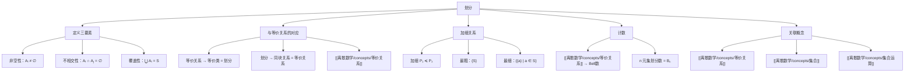

# 划分

> [!abstract] 概述
> ==划分==（partition）是集合 $S$ 的一组==非空、两两不交==的子集，其并集恰好为 $S$。划分将集合不重叠、不遗漏地分成若干"块"。划分与[[离散数学/concepts/等价关系]]之间存在==一一对应==：每个等价关系的等价类构成一个划分，每个划分也唯一确定一个等价关系。==划分的加细==（refinement）描述了划分之间的粗细关系：若 $P_1$ 的每个块都包含在 $P_2$ 的某个块中，则称 $P_1$ 是 $P_2$ 的加细。

## 定义

> [!def] 划分（Partition）
>
> 集合 $S$ 的==划分==是 $S$ 的一组不相交的非空子集 $\{A_i \mid i \in I\}$（$I$ 为指标集），使得：
>
> 1. 对所有 $i \in I$，$A_i \neq \emptyset$（==非空性==）
> 2. 当 $i \neq j$ 时，$A_i \cap A_j = \emptyset$（==不相交性==）
> 3. $\bigcup_{i \in I} A_i = S$（==并集为全集==）
>
> 每个子集 $A_i$ 称为划分的一个==块==（block）或==部分==（part）。

> [!def] 划分的加细（Refinement）
>
> 设 $P_1$ 和 $P_2$ 都是集合 $S$ 的划分。若 $P_1$ 的每个块都包含在 $P_2$ 的某个块中，则称 $P_1$ 是 $P_2$ 的==加细==（refinement），记作 $P_1 \preceq P_2$。
>
> 直观地说，加细是将原来的某些块进一步拆分为更小的块。最粗的划分是 $\{S\}$（只有一个块），最细的划分是 $\{\{a\} \mid a \in S\}$（每个元素独占一块）。

> [!def] 从划分构造等价关系
>
> 给定集合 $S$ 的划分 $\{A_i \mid i \in I\}$，定义关系 $R$：
>
> $$(x, y) \in R \iff \exists i \in I: x \in A_i \text{ 且 } y \in A_i$$
>
> 即 $x$ 和 $y$ 属于划分中的同一个块。则 $R$ 是 $S$ 上的等价关系，其等价类恰好是 $A_i$（$i \in I$）。

## 核心性质

| 性质 | 描述 | 说明 |
|:-----|:-----|:-----|
| ==非空性== | 每个块 $A_i \neq \emptyset$ | 空块不贡献任何元素 |
| ==不相交性== | $i \neq j \Rightarrow A_i \cap A_j = \emptyset$ | 元素不会被分到多个块 |
| ==覆盖性== | $\bigcup A_i = S$ | 每个元素恰好属于一个块 |
| ==与等价关系一一对应== | 划分 $\leftrightarrow$ 等价关系 | 核心对偶性 |
| ==最粗划分== | $\{S\}$ | 只有一个块，对应全关系 $S \times S$ |
| ==最细划分== | $\{\{a\} \mid a \in S\}$ | 每个元素独占一块，对应相等关系 |
| ==加细是偏序== | $\preceq$ 满足自反、反对称、传递 | 划分集上的偏序关系 |
| ==块的个数== | 称为划分的秩（rank） | 最细划分秩为 $|S|$，最粗划分秩为 1 |

## 关系网络

- **前置知识**：[[离散数学/concepts/集合]]（划分是集合的子集族）、[[离散数学/concepts/集合运算]]（划分涉及并集和交集运算）
- **核心关联**：划分与等价关系的一一对应是离散数学中最重要的对偶性之一。划分提供"几何直观"（将集合分块），等价关系提供"代数工具"（用关系运算研究分块结构）
- **后继概念**：[[离散数学/concepts/等价关系]]（与划分一一对应）、Bell 数（划分的计数）

## 章节扩展

### 第09章：关系

划分是 Rosen 第8版第9章第9.5节的重要内容，与等价关系共同构成"分类"理论的两个面。

**划分三条件的验证**：判断一个集合族是否为划分，必须逐一验证三个条件：
1. 非空性：每个子集都不能为空
2. 不相交性：任意两个不同子集的交集为空
3. 覆盖性：所有子集的并集等于全集

常见错误是遗漏某个条件。例如 $\{\{1,2\}, \{3,4\}, \{5\}\}$ 不是 $\{1,2,3,4,5,6\}$ 的划分，因为并集缺少元素 6。

**从划分构造等价关系的传递性证明**：设 $(a,b) \in R$ 且 $(b,c) \in R$，则 $a,b$ 在同一块 $X$ 中，$b,c$ 在同一块 $Y$ 中。因为 $b \in X \cap Y$ 且 $X \neq \emptyset$、$Y \neq \emptyset$，由不相交性得 $X = Y$。故 $a,c$ 也在同一块中，即 $(a,c) \in R$。这里不相交性是关键——它保证了"同一元素不能同时属于两个不同的块"。

**划分的加细与偏序**：划分集上的加细关系 $\preceq$ 构成偏序。例如，对 $\{1,2,3\}$：
- $\{\{1\},\{2\},\{3\}\} \preceq \{\{1,2\},\{3\}\} \preceq \{\{1,2,3\}\}$
- $\{\{1\},\{2\},\{3\}\}$ 和 $\{\{1,3\},\{2\}\}$ 不可比较（都不是对方的加细）

## 补充

> [!info] 划分在数学和计算机科学中的应用
>
> 划分的概念在多个领域有重要应用：
>
> - **代数**：陪集分解是群对正规子群的划分，商群建立在划分的基础上
> - **拓扑学**：拓扑空间中的连通分支构成空间的一个划分
> - **数据库**：关系的水平分片（horizontal fragmentation）本质上是元组集合的划分
> - **并行计算**：域分解（domain decomposition）将计算区域划分为子区域分配给不同处理器
> - **聚类分析**：聚类算法的输出就是数据集的一个划分
>
> 划分的计数（Bell 数）是组合数学中的经典问题，与第二类 Stirling 数密切相关：$B_n = \sum_{k=1}^{n} S(n,k)$，其中 $S(n,k)$ 是将 $n$ 个元素划分为恰好 $k$ 个非空块的方式数。

> [!warning] 常见误区
>
> - 划分要求子集非空：$\{\{1,2\}, \emptyset, \{3\}\}$ 不是合法的划分
> - 划分要求不遗漏：$\{\{1,2\}, \{3\}\}$ 不是 $\{1,2,3,4\}$ 的划分（缺少 4）
> - 划分要求不重叠：$\{\{1,2\}, \{2,3\}, \{4\}\}$ 不是合法的划分（2 同时出现在两个块中）
> - 划分与覆盖不同：覆盖允许重叠和空集，划分不允许

## 参见

- [[离散数学/concepts/等价关系]] -- 与划分一一对应，等价类构成划分
- [[离散数学/concepts/集合]] -- 划分的对象，子集和幂集的概念
- [[离散数学/concepts/集合运算]] -- 划分涉及并集和交集运算
