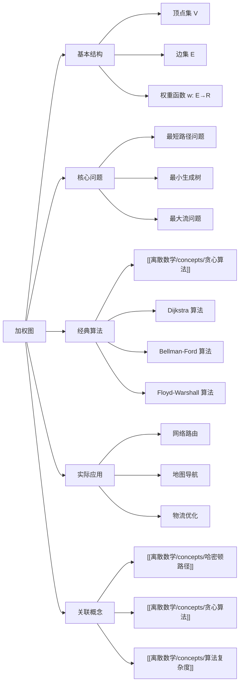

# 加权图

> [!abstract] 概述
> ==加权图==（weighted graph）是在图的基础上为每条边赋予一个==权重==（weight）的图结构，形式化表示为权重函数 $w: E \to \mathbb{R}$。权重可以表示距离、费用、时间、容量等现实量度。加权图的核心问题之一是==最短路径问题==（shortest path problem）：给定源顶点 $s$ 和目标顶点 $t$，在所有从 $s$ 到 $t$ 的路径中找到总权重最小的路径。==Dijkstra 算法==是求解单源最短路径的经典贪心算法，其时间复杂度为 $O(|E| + |V|\log|V|)$（使用最小堆实现）。加权图广泛应用于网络路由、地图导航、物流优化等领域。

## 定义

> [!def] 加权图（Weighted Graph）
>
> 一个==加权图==是一个三元组 $G = (V, E, w)$，其中：
>
> - $V$ 是==顶点==集（vertices）
> - $E \subseteq V \times V$ 是==边==集（edges）
> - $w: E \to \mathbb{R}$ 是==权重函数==（weight function），为每条边 $e \in E$ 分配一个实数权重 $w(e)$
>
> 权重可以是正数、负数或零。若所有权重均为非负数（$w(e) \geq 0, \forall e \in E$），则称该加权图为==非负加权图==。

> [!def] 路径权重与最短路径（Path Weight & Shortest Path）
>
> 设 $P = (e_1, e_2, \ldots, e_k)$ 是加权图 $G$ 中从顶点 $s$ 到顶点 $t$ 的一条路径，则路径 $P$ 的==权重==定义为：
>
> $$w(P) = \sum_{i=1}^{k} w(e_i)$$
>
> 从 $s$ 到 $t$ 的==最短路径==是所有 $s$-$t$ 路径中权重最小的路径：
>
> $$d(s, t) = \min\{w(P) \mid P \text{ 是从 } s \text{ 到 } t \text{ 的路径}\}$$
>
> 若 $s$ 到 $t$ 不存在路径，则 $d(s, t) = +\infty$。

> [!def] Dijkstra 算法（Dijkstra's Algorithm）
>
> ==Dijkstra 算法==用于求解==非负加权图==中的==单源最短路径==问题。给定源顶点 $s$，算法计算 $s$ 到所有其他顶点的最短距离。
>
> **核心思想**（贪心策略）：维护一个距离集合 $D$，初始时 $D(s) = 0$，$D(v) = +\infty$（$v \neq s$）。每次从尚未确定最短路径的顶点中选取 $D$ 值最小的顶点 $u$，将其标记为"已确定"，然后通过 $u$ ==松弛==（relax）其所有邻居的距离：
>
> $$D(v) = \min\big(D(v),\ D(u) + w(u, v)\big)$$
>
> **算法步骤**：
> 1. 初始化：$D(s) = 0$，$D(v) = +\infty$（$v \neq s$），所有顶点标记为未访问
> 2. 重复以下步骤直到所有顶点已访问：
>    - 从未访问顶点中选取 $D$ 值最小的顶点 $u$
>    - 标记 $u$ 为已访问
>    - 对 $u$ 的每个未访问邻居 $v$，执行松弛操作
> 3. 算法终止时，$D(v)$ 即为 $s$ 到 $v$ 的最短距离
>
> **时间复杂度**：使用最小堆（优先队列）实现为 $O(|E| + |V|\log|V|)$。

## 核心性质

| 性质 | 描述 | 备注 |
|:-----|:-----|:-----|
| ==非负权重前提== | Dijkstra 算法要求所有边权重 $w(e) \geq 0$ | 存在负权边时可能得到错误结果 |
| ==贪心最优子结构== | 最短路径的子路径仍是最短路径 | 最优子结构是贪心策略正确性的基础 |
| ==松弛单调性== | 每次松弛操作只会减小或保持距离值不变 | $D(v)$ 单调递减直至收敛到最短距离 |
| ==确定性== | 一旦顶点被标记为已访问，其最短距离不再改变 | 仅在非负权重条件下成立 |
| ==单源性== | Dijkstra 算法一次运行求解从源点到所有其他顶点的最短路径 | 不同于 Floyd-Warshall 的全源最短路径 |
| ==负权环检测== | 非负加权图不存在负权环 | 若存在负权环，最短路径可能无下界 |

## 关系网络

- **前置知识**：图的基本概念（顶点、边、路径）
- **核心关联**：加权图通过权重函数扩展了图的建模能力，使图能够表示距离、费用等带量度的现实问题。Dijkstra 算法是贪心策略在图论中的经典应用
- **后继概念**：[[离散数学/concepts/哈密顿路径]]（加权图中的哈密顿路径即旅行商问题 TSP）

## 章节扩展

### 第10章：图论

加权图是 Rosen 第8版第10章中图论应用的重要扩展内容。在基本图论概念（路径、连通性）的基础上，加权图引入了权重函数，使图论能够解决更丰富的优化问题。

**Dijkstra 算法的正确性证明**：Dijkstra 算法的正确性基于贪心选择性质和最优子结构。关键不变式：当顶点 $u$ 被标记为已访问时，$D(u)$ 已经是最短距离。证明采用反证法——假设存在更短的路径经过某个未访问顶点，则由于所有边权重非负，该未访问顶点的距离值应更小，与 $u$ 是当前最小距离顶点的选择矛盾。

**与其他最短路径算法的比较**：

| 算法 | 适用条件 | 时间复杂度 | 特点 |
|:-----|:---------|:-----------|:-----|
| Dijkstra | 非负权重 | $O(\|E\| + \|V\|\log\|V\|)$ | 贪心策略，效率高 |
| Bellman-Ford | 允许负权边 | $O(\|V\| \cdot \|E\|)$ | 可检测负权环 |
| Floyd-Warshall | 允许负权边 | $O(\|V\|^3)$ | 全源最短路径 |

### 第11章：树

加权连通图上的==最小生成树==（Minimum Spanning Tree, MST）是第11章的核心内容之一。

**Prim 算法**：从任意顶点出发，贪心地选择与当前生成树相连的最小权重边，逐步扩展生成树直到包含所有顶点。时间复杂度 $O(n^2)$（朴素）或 $O(e \log n)$（最小堆）。

**Kruskal 算法**：将所有边按权重排序，依次选择不形成环的最小权重边。使用并查集（Union-Find）检测环，时间复杂度 $O(e \log e)$。

**割性质**（Cut Property）：设 $S$ 是顶点集的一个子集，$e$ 是跨越割 $(S, V-S)$ 的最小权重边，则 $e$ 属于某棵最小生成树。

## 补充

> [!info] 加权图的实际应用
>
> 加权图在现实世界中有着广泛的应用：
>
> - **网络路由**：OSPF 协议使用 Dijkstra 算法计算最短路由路径，权重可以是链路带宽、延迟等
> - **地图导航**：Google Maps、高德地图等导航系统以道路交叉路口为顶点、道路为边、行驶距离/时间为权重，求解最短路径
> - **物流优化**：配送路线规划中，仓库和客户地点构成顶点，运输成本/距离构成权重
> - **社交网络分析**：以用户交互频率为权重，发现最紧密的社交关系链

> [!tip] Dijkstra 算法的实现要点
>
> - 使用**最小堆**（优先队列）维护未访问顶点的距离值，可将朴素实现的 $O(|V|^2)$ 优化为 $O(|E| + |V|\log|V|)$
> - **松弛操作**是 Dijkstra 算法的核心步骤，每次通过已确定顶点更新其邻居的距离估计值
> - 实际应用中常配合**前驱数组**（predecessor array）记录最短路径的具体走向

> [!warning] 常见误区
>
> - Dijkstra 算法**不能处理负权边**：若图中存在负权边，贪心选择可能导致错误结果，应改用 Bellman-Ford 算法
> - 最短路径**不一定是边数最少的路径**：加权图中，边数少但权重大的路径可能不如边数多但权重小的路径
> - 权重可以为零：零权边不违反非负条件，Dijkstra 算法仍然正确

## 参见

- [[离散数学/concepts/哈密顿路径]] -- 加权图中的哈密顿路径与旅行商问题
- [[离散数学/concepts/贪心算法]] -- Dijkstra 算法是贪心策略的经典实例
- [[离散数学/concepts/算法复杂度]] -- 最短路径算法的时间复杂度分析
