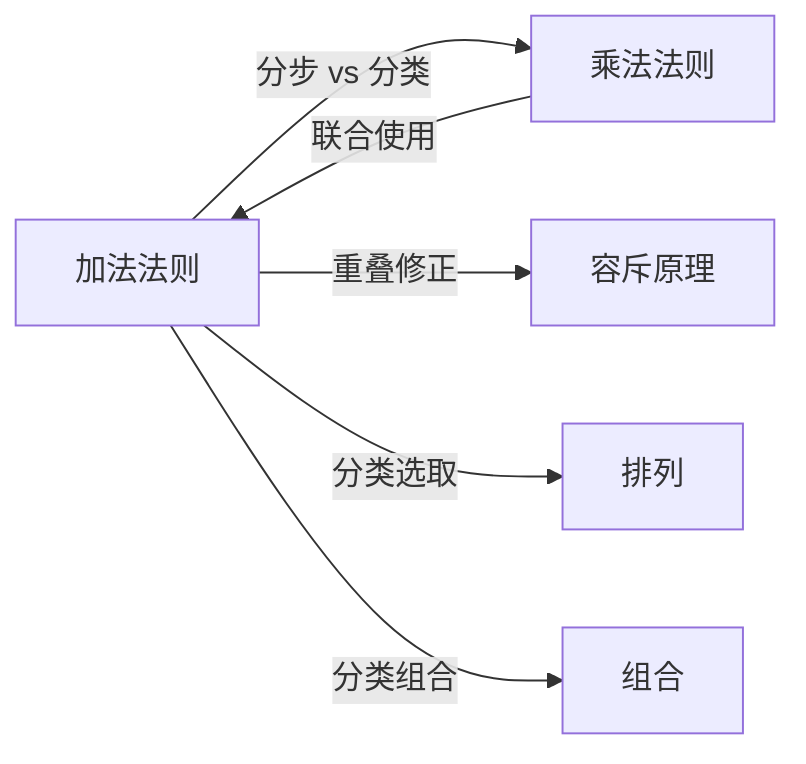

# 加法法则

> [!abstract]
> ==加法法则（Sum Rule）==是组合计数的另一基本法则。如果一个任务有 $k$ 类**互斥**的完成方式，第 $i$ 类有 $n_i$ 种方法，且各类之间**没有重叠**，则完成该任务的总方法数为各类方法数的**总和**：
> $$N = n_1 + n_2 + \cdots + n_k = \sum_{i=1}^{k} n_i$$

## 定义

> [!def] 加法法则（基本形式）
> 若一个任务可以通过两类**互斥**的方式完成：
> - 第一类方式有 $n_1$ 种方法
> - 第二类方式有 $n_2$ 种方法
>
> 且两类方式**不产生相同的完成结果**（即没有重叠），则完成该任务共有 $n_1 + n_2$ 种方法。
>
> **关键条件**：各类方式之间两两互斥，即任意一种完成方式恰好属于某一类。

> [!def] 加法法则（推广形式）
> 若一个任务有 $k$ 类互斥的完成方式，第 $i$ 类有 $n_i$ 种方法（$i = 1, 2, \ldots, k$），且各类之间没有重叠，则总方法数为：
> $$N = \sum_{i=1}^{k} n_i$$

> [!def] 典型应用场景
> 1. **分类计数**：从 $n$ 位男生和 $m$ 位女生中选一位代表，共有 $n + m$ 种选法
> 2. **字符串计数**：长度为 $n$ 的位串中，以 1 开头或以 1 结尾的位串数 = 以 1 开头的数量 + 以 1 结尾的数量 - 既以 1 开头又以 1 结尾的数量（需配合[[容斥原理]]）
> 3. **集合划分**：若集合 $S$ 被划分为不相交的子集 $S_1, S_2, \ldots, S_k$，则 $|S| = \sum_{i=1}^{k} |S_i|$

## 核心性质

| 编号 | 性质 | 说明 |
|:---:|------|------|
| P1 | **互斥性要求** | 各类方式之间必须两两不重叠，否则会产生重复计数 |
| P2 | **无序性** | 各类方式之间没有顺序关系，交换类别编号不影响总和 |
| P3 | **与乘法法则互补** | 加法法则处理"分类"（OR 关系），[[乘法法则]]处理"分步"（AND 关系） |
| P4 | **可推广为容斥原理** | 当分类之间存在重叠时，需要用[[容斥原理]]修正重复计数 |
| P5 | **与集合基数对应** | 加法法则本质上是有限集不相交并集的基数公式：$|A \cup B| = |A| + |B|$（当 $A \cap B = \emptyset$ 时） |

## 关系网络

## 章节扩展

- **容斥原理**：当各类方式之间存在重叠时，[[容斥原理]]对加法法则进行修正，减去重叠部分
- **乘法法则**：[[乘法法则]]与加法法则经常联合使用——先分类（加法），再分步（乘法）
- **排列与组合**：在复杂的排列组合问题中，常需要先用加法法则分类，再用乘法法则在每类中计数

## 补充

> [!info] 生活类比
> 假设你要从北京到上海，可以选择飞机（3个航班）或高铁（5个班次），且航班和班次是完全不同的交通方式（互斥）。那么总选择数 = $3 + 5 = 8$ 种。注意：如果某趟"飞机+高铁"联运被同时算在两类中，就不能直接相加。

> [!info] 常见陷阱
> - **忽略互斥条件**：如果两类方式有重叠（同一种完成方式被两类都包含），直接相加会导致重复计数，必须使用[[容斥原理]]
> - **混淆与乘法法则**：加法法则对应"满足至少一个条件"（OR），乘法法则对应"同时满足多个条件"（AND）
> - **遗漏分类**：需要确保所有可能的完成方式都被恰好分入某一类，不能有遗漏

## 参见

- [[乘法法则]]：处理分步计数的法则
- [[容斥原理]]：处理集合重叠的推广加法法则
- [[排列]]：有序选取的计数方法
- [[组合]]：无序选取的计数方法
