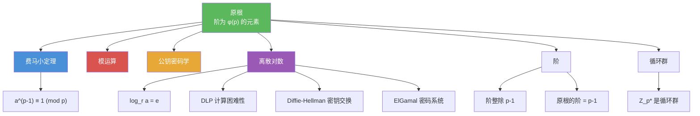

# 原根

> [!abstract] 概述
> ==原根==（primitive root）是模 $p$（$p$ 为素数）下具有"最大阶"的元素：若 $r$ 的各次幂 $r^1, r^2, \ldots, r^{p-1}$ 恰好遍历 $\mathbb{Z}_p^*$ 中的所有 $p-1$ 个非零元素，则称 $r$ 为模 $p$ 的原根。原根的存在性保证了 $\mathbb{Z}_p^*$ 是==循环群==。基于原根定义的==离散对数==（discrete logarithm）问题——已知 $r^e \equiv a \pmod{p}$ 求 $e$——目前==没有已知的多项式时间算法==，这一计算困难性是 Diffie-Hellman 密钥交换、ElGamal 密码系统等公钥密码方案安全性的基石。

## 定义

> [!def] 原根（Primitive Root）
>
> 若 $r \in \mathbb{Z}_p$（$p$ 为素数），且 $\mathbb{Z}_p$ 中每个非零元素都是 $r$ 的某个幂次（模 $p$），则称 $r$ 为==模 $p$ 的原根==。
>
> 等价定义：$r$ 是模 $p$ 的原根，当且仅当 $r$ 在 $\mathbb{Z}_p^*$ 中的==阶==（order）为 $p-1$，即 $r^{p-1} \equiv 1 \pmod{p}$ 且对任意 $1 \leq k < p-1$，$r^k \not\equiv 1 \pmod{p}$。
>
> 重要事实：每个素数 $p$ 都存在原根。

> [!def] 离散对数（Discrete Logarithm）
>
> 设 $p$ 为素数，$r$ 是模 $p$ 的原根，$a \in \{1, 2, \ldots, p-1\}$。若
>
> $$r^e \equiv a \pmod{p}, \quad 0 \leq e \leq p-1$$
>
> 则称 $e$ 为 $a$ 模 $p$ 以 $r$ 为底的==离散对数==，记作 $\log_r a = e$。
>
> 离散对数与普通对数类似，但运算在模 $p$ 下进行。

> [!def] 离散对数问题（DLP）
>
> ==离散对数问题（Discrete Logarithm Problem, DLP）==：已知素数 $p$、原根 $r$ 和 $a \in \mathbb{Z}_p^*$，求 $e$ 使得 $r^e \equiv a \pmod{p}$。
>
> 目前==没有已知的多项式时间算法==可以求解一般情况下的离散对数问题。已知的最好算法（如数域筛法）的时间复杂度为亚指数级 $O(e^{c(\ln p)^{1/3}(\ln \ln p)^{2/3}})$。

## 核心性质

| 性质 | 描述 | 说明 |
|------|------|------|
| 存在性 | 每个素数 $p$ 都有原根 | $\mathbb{Z}_p^*$ 是循环群 |
| 阶 | 原根的阶为 $\varphi(p) = p - 1$ | 阶是使 $r^k \equiv 1 \pmod{p}$ 的最小正整数 $k$ |
| 阶整除性 | 任意元素的阶整除 $p - 1$ | 由费马小定理 $a^{p-1} \equiv 1 \pmod{p}$ |
| 原根个数 | 模 $p$ 恰有 $\varphi(p-1)$ 个原根 | $\varphi$ 为 Euler 函数 |
| 离散对数唯一性 | $\log_r a$ 在 $[0, p-2]$ 中唯一 | 由原根定义保证 |
| DLP 困难性 | 无已知多项式时间算法 | 亚指数级算法是当前最优 |
| 类比性质 | $\log_r(ab) \equiv \log_r a + \log_r b \pmod{p-1}$ | 离散对数保持乘法变加法 |

## 关系网络

- [[费马小定理]] 保证 $a^{p-1} \equiv 1 \pmod{p}$，即任意元素的阶整除 $p-1$，原根的阶恰好等于 $p-1$
- [[模运算]] 是原根与离散对数运算的基本框架
- [[公钥密码学]] 中 DLP 的计算困难性是 Diffie-Hellman 密钥交换和 ElGamal 密码系统安全性的基础

## 章节扩展

### 第4章：数论与密码学

原根与离散对数是第 4.4 节的进阶内容，连接了数论理论与密码学应用：

- **4.4 解同余方程**：原根的存在性是理解 $\mathbb{Z}_p^*$ 结构的基础
- **4.4 费马小定理**：任意元素的阶整除 $p-1$ 是费马小定理的直接推论
- **4.6 密码学**：离散对数问题（DLP）是 Diffie-Hellman 密钥交换、ElGamal 密码系统安全性的数学基础

## 补充

> [!info] 原根与离散对数的学术背景
>
> 原根的概念由 **Euler** 在 18 世纪系统研究。Euler 证明了每个素数都有原根，并研究了原根的个数（$\varphi(p-1)$ 个）。离散对数问题（DLP）的计算困难性最早在 1976 年由 **Diffie 和 Hellman** 在其开创性论文 "New Directions in Cryptography" 中被用于构造公钥密码系统。DLP 的困难性与整数分解问题（IFP）一起构成了现代公钥密码学的两大数学基础。目前已知的 DLP 求解算法包括 Baby-step Giant-step 算法（$O(\sqrt{p})$ 时间和空间）、Pollard's rho 算法（$O(\sqrt{p})$ 时间、$O(1)$ 空间）以及数域筛法（亚指数时间）。对于椭圆曲线上的离散对数问题（ECDLP），目前没有亚指数算法，这是椭圆曲线密码学（ECC）相比 RSA 的优势所在。
>
> **学术来源**：Rosen, K. H. (2019). *Discrete Mathematics and Its Applications* (8th ed.). McGraw-Hill, Section 4.4, Definitions 3--4.
>
> **参考链接**：[Discrete Logarithm - Wikipedia](https://en.wikipedia.org/wiki/Discrete_logarithm)

## 参见

- [[费马小定理]] -- 任意元素的阶整除 $p-1$，原根的阶恰好为 $p-1$
- [[模运算]] -- 原根与离散对数运算的基本框架
- [[公钥密码学]] -- DLP 的计算困难性是 Diffie-Hellman 和 ElGamal 安全性的基础
