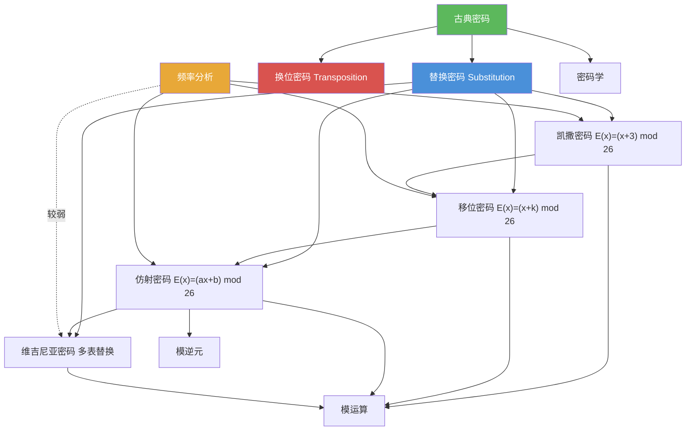

# 古典密码

> [!abstract] 概述
> ==古典密码==（Classical Ciphers）是密码学历史上最早出现的加密方法，均属于==对称密钥密码==范畴，即加密和解密使用相同密钥或可互推的密钥。主要包括==凯撒密码==（固定移位 3 的替换密码）、==仿射密码==（线性变换替换 $E(x)=(ax+b) \bmod 26$）、==维吉尼亚密码==（多表替换，使用密钥字符串）和==换位密码==（基于排列的字母重排）。这些密码的安全性依赖于==密钥的保密性==（Kerckhoffs 原则），其中除维吉尼亚密码外均可通过==频率分析==有效破解。

## 定义

> [!def] 凯撒密码（Caesar Cipher）
>
> ==凯撒密码==是最古老的加密方法之一，由 Julius Caesar 使用。将每个字母在字母表中==向后移动 3 位==：
>
> $$E(x) = (x + 3) \bmod 26$$
>
> 其中 $x \in \mathbb{Z}_{26}$ 是字母的数值编码（$A=0, B=1, \ldots, Z=25$）。
>
> 解密函数：$D(y) = (y - 3) \bmod 26$。
>
> - 密钥空间大小：$|\mathcal{K}| = 1$（移位量固定为 3）
> - 安全性：极低，仅 25 种可能的移位量，穷举即可破解

> [!def] 移位密码（Shift Cipher）
>
> ==移位密码==是凯撒密码的推广，将移位量从固定的 3 推广为任意整数 $k$：
>
> $$E(x) = (x + k) \bmod 26$$
>
> 解密函数：$D(y) = (y - k) \bmod 26$。
>
> - 密钥空间大小：$|\mathcal{K}| = 26$
> - 整数 $k$ 称为==密钥（key）==
> - 本质上是 $\mathbb{Z}_{26}$ 上的加法密码

> [!def] 仿射密码（Affine Cipher）
>
> ==仿射密码==使用形如
>
> $$E(x) = (ax + b) \bmod 26$$
>
> 的加密函数，其中 $a, b$ 为整数。$E$ 是双射当且仅当 $\gcd(a, 26) = 1$。
>
> ==解密方法==：已知密文 $y = (ax + b) \bmod 26$，则
>
> $$y - b \equiv ax \pmod{26}$$
> $$x \equiv \bar{a}(y - b) \pmod{26}$$
>
> 其中 $\bar{a}$ 是 $a$ 模 $26$ 的==逆元==（由 [[模逆元]] 保证存在）。
>
> - 密钥空间大小：$|\mathcal{K}| = \varphi(26) \times 26 = 12 \times 26 = 312$
> - $\gcd(a, 26) = 1$ 意味着 $a \in \{1, 3, 5, 7, 9, 11, 15, 17, 19, 21, 23, 25\}$

> [!def] 维吉尼亚密码（Vigenere Cipher）
>
> ==维吉尼亚密码==是一种==分组密码==，密钥是一个字母串 $k_1 k_2 \cdots k_m$。对明文块 $p_1 p_2 \cdots p_m$，密文块为：
>
> $$(p_1 + k_1) \bmod 26,\ (p_2 + k_2) \bmod 26,\ \ldots,\ (p_m + k_m) \bmod 26$$
>
> 本质上是对每个位置使用不同的移位量，相当于多个移位密码的组合。
>
> - 密钥空间大小：$|\mathcal{K}| = 26^m$（$m$ 为密钥长度）
> - 16 世纪由法国外交官 Blaise de Vigenere 发明
> - 曾被称为 "le chiffre indéchiffrable"（不可破译的密码）

> [!def] 换位密码（Transposition Cipher）
>
> ==换位密码==是一种==分组密码==，使用集合 $\{1, 2, \ldots, m\}$ 的一个==排列== $\sigma$ 作为密钥。将明文分成大小为 $m$ 的块，每块 $p_1 p_2 \cdots p_m$ 加密为：
>
> $$c_1 c_2 \cdots c_m = p_{\sigma(1)} p_{\sigma(2)} \cdots p_{\sigma(m)}$$
>
> 解密使用逆排列 $\sigma^{-1}$。
>
> - 与替换密码不同，换位密码不改变字母本身，只改变字母的位置
> - 密钥空间大小：$|\mathcal{K}| = m!$（$m$ 为块大小）

> [!def] 频率分析（Frequency Analysis）
>
> ==频率分析==是破解替换密码的主要工具，基于以下事实：英文中不同字母的出现频率有显著差异。
>
> 英文中最常见的 9 个字母及其近似频率：
>
> | 字母 | E | T | A | O | I | N | S | H | R |
> |:----:|:-:|:-:|:-:|:-:|:-:|:-:|:-:|:-:|:-:|
> | 频率 | 13% | 9% | 8% | 8% | 7% | 7% | 7% | 6% | 6% |
>
> 破解步骤：
> 1. 统计密文中每个字母的出现频率
> 2. 假设最常见密文字母对应明文 E（或 T、A 等）
> 3. 推算密钥参数
> 4. 解密并验证是否得到有意义的文本

## 核心性质

| 性质 | 描述 | 说明 |
|------|------|------|
| 凯撒密码密钥空间 | $|\mathcal{K}| = 1$ | 移位量固定为 3，安全性极低 |
| 移位密码密钥空间 | $|\mathcal{K}| = 26$ | 仅 25 种非平凡移位，穷举即可破解 |
| 仿射密码双射条件 | $\gcd(a, 26) = 1$ | $a$ 必须与 26 互素，共有 12 个合法值 |
| 仿射密码密钥空间 | $|\mathcal{K}| = 312$ | $\varphi(26) \times 26 = 12 \times 26$ |
| 维吉尼亚密码密钥空间 | $|\mathcal{K}| = 26^m$ | 随密钥长度 $m$ 指数增长，抗穷举 |
| 换位密码密钥空间 | $|\mathcal{K}| = m!$ | 随块大小 $m$ 阶乘增长 |
| 频率分析有效性 | 对单表替换密码有效 | 凯撒密码、移位密码、仿射密码均可被频率分析破解 |
| 维吉尼亚密码抗频率分析 | 多表替换平滑频率分布 | 每个位置的字母频率趋于均匀分布 |
| 替换 vs 换位 | 替换改变字母，换位改变位置 | 两类密码的基本操作原理不同 |

## 关系网络

- [[密码学]] 是古典密码的上位概念：古典密码属于对称密钥密码学的历史分支
- [[模运算]] 是所有古典密码的数学基础：凯撒密码、移位密码、仿射密码、维吉尼亚密码均基于模 26 运算
- [[模逆元]] 是仿射密码解密的关键：需要计算 $a$ 模 26 的逆元 $\bar{a}$ 来恢复明文

## 章节扩展

### 第4章：数论与密码学

古典密码是第 4 章 4.6 节的前半部分内容，展示了模运算在密码学中的基础应用：

- **4.6 密码学**：凯撒密码（移位 3）、移位密码（推广移位量 $k$）、仿射密码（线性变换 $E(x)=(ax+b) \bmod 26$）、维吉尼亚密码（多表替换）、换位密码（排列重排）、频率分析破解方法
- **4.4 解同余方程**：模逆元的计算是仿射密码解密的核心工具，$\bar{a}$ 的存在性由 $\gcd(a, 26) = 1$ 保证
- **4.2 整数表示与运算**：模运算的定义和性质是所有古典密码算法的数学基础

## 补充

> [!info] 古典密码的历史与学术背景
>
> 凯撒密码（Caesar Cipher）以罗马统帅 Julius Caesar 命名，据 Suetonius 的记载，Caesar 在军事通信中使用将字母移位 3 位的加密方法。仿射密码是移位密码的推广，其数学结构对应 $\mathbb{Z}_{26}$ 上的仿射变换。维吉尼亚密码由意大利密码学家 Giovan Battista Bellaso 于 1553 年首次描述，后因法国外交官 Blaise de Vigenere 的推广而得名，在长达 300 年的时间里被认为不可破译，直到 19 世纪被 Charles Babbage 和 Friedrich Kasiski 独立破解（通过 Kasiski 测试确定密钥长度）。换位密码的历史同样悠久，古希腊斯巴达人使用的 Scytale（密码棒）就是一种物理形式的换位密码。
>
> **学术来源**：Rosen, K. H. (2019). *Discrete Mathematics and Its Applications* (8th ed.). McGraw-Hill, Section 4.6.
>
> **参考链接**：Singh, S. (1999). *The Code Book: The Science of Secrecy from Ancient Egypt to Quantum Cryptography*. Fourth Estate.

## 参见

- [[密码学]] -- 密码学的基本概念、密码系统五元组、对称密钥 vs 公钥密码学
- [[模运算]] -- 所有古典密码算法的数学基础
- [[模逆元]] -- 仿射密码解密的关键工具，$\bar{a}$ 的计算方法
