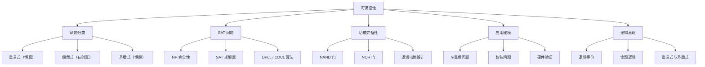

# 可满足性

> [!abstract] 概述
> ==可满足性==（satisfiability）是指一个复合命题存在至少一组真值赋值使其为真的性质。可满足的命题包括==重言式==（所有赋值都为真）和==偶然式==（部分赋值为真），而==不可满足的==命题即==矛盾式==（没有任何赋值使其为真）。可满足性问题（SAT）是计算机科学中的核心问题，1971年被 Cook 证明为第一个==NP 完全==问题，广泛应用于硬件验证、软件测试和人工智能规划等领域。

## 定义

> [!def] 可满足性
>
> 一个复合命题称为**可满足的**（satisfiable），如果存在至少一组真值赋值使其为真。如果不存在任何赋值使其为真，则称为**不可满足的**（unsatisfiable）。
>
> 形式化地，设 $S$ 为一个命题公式，$S$ 是可满足的当且仅当：
>
> $$\exists \text{ 赋值 } v \text{ 使得 } v(S) = T$$
>
> 判定一个命题是否可满足的问题称为 **SAT 问题**（Boolean Satisfiability Problem）。

## 核心性质

| 性质 | 描述 | 关系 |
|:-----|:-----|:-----|
| 重言式一定可满足 | 所有赋值都使其为真 | 重言式 $\subset$ 可满足命题 |
| 偶然式也可满足 | 至少一组赋值使其为真 | 偶然式 $\subset$ 可满足命题 |
| 矛盾式不可满足 | 没有任何赋值使其为真 | 矛盾式 $\cap$ 可满足命题 $= \emptyset$ |
| 否定与可满足性的关系 | 命题不可满足 $\iff$ 其否定是重言式 | $\neg S$ 是重言式 $\iff S$ 不可满足 |
| SAT 的 NP 完全性 | SAT 是第一个被证明的 NP 完全问题（Cook-Levin 定理） | 所有 NP 问题可多项式归约为 SAT |

**功能完备性**（Functional Completeness）：

| 运算符集合 | 是否功能完备 | 说明 |
|:-----------|:------------|:-----|
| $\{\neg, \land, \lor\}$ | 是 | 每个命题可化为合取范式或析取范式 |
| $\{\neg, \land\}$ | 是 | $p \lor q \equiv \neg(\neg p \land \neg q)$（德摩根定律） |
| $\{\neg, \lor\}$ | 是 | $p \land q \equiv \neg(\neg p \lor \neg q)$ |
| $\{\text{NAND}\}$ | 是 | NAND 单独功能完备，$\neg p \equiv p \mid p$ |
| $\{\text{NOR}\}$ | 是 | NOR 单独功能完备 |

其中 **NAND**（与非）$p \mid q \equiv \neg(p \land q)$，**NOR**（或非）$p \downarrow q \equiv \neg(p \lor q)$。

## 关系网络

- **前置知识**：[[命题逻辑]]（复合命题的真值语义）、[[离散数学/concepts/逻辑等价]]（等价律与化简）
- **核心关联**：[[逻辑学/concepts/重言式与矛盾式]]（命题分类的理论基础）
- **应用延伸**：逻辑电路设计（NAND/NOR 的功能完备性）、组合优化问题的 SAT 建模

## 章节扩展

### 第1章：逻辑与证明基础

可满足性是第1章第1.3节（命题等价）的重要组成部分，与逻辑等价和功能完备性密切相关。

**n-皇后问题的 SAT 建模**：

将 $n$ 个皇后放置在 $n \times n$ 棋盘上，使得没有两个皇后互相攻击。变量 $p(i,j)$ 表示"在位置 $(i,j)$ 有皇后"。

$$Q = \underbrace{\bigwedge_{i=1}^{n}\bigvee_{j=1}^{n} p(i,j)}_{\text{每行至少一个}} \;\wedge\; \underbrace{\bigwedge_{i=1}^{n}\bigwedge_{1 \le j < k \le n}(\neg p(i,j) \lor \neg p(i,k))}_{\text{每行至多一个}} \;\wedge\; \underbrace{\bigwedge_{j=1}^{n}\bigwedge_{1 \le i < k \le n}(\neg p(i,j) \lor \neg p(k,j))}_{\text{每列至多一个}} \;\wedge\; Q_{\text{对角线}}$$

当 $n = 8$ 时，共有 92 个解。

**数独问题的 SAT 建模**：

变量 $p(i,j,n)$ 表示"在第 $i$ 行第 $j$ 列填入数字 $n$"，共 $9 \times 9 \times 9 = 729$ 个变量。约束包括：已知数字、每行/每列/每个 $3 \times 3$ 子网格包含所有数字 1-9、每个格子恰好一个数字。现代 SAT 求解器可在不到 10 毫秒内解决数独问题。

## 补充

> [!info] 学术参考
>
> - **Rosen, K. H.** *Discrete Mathematics and Its Applications*, 8th ed., McGraw-Hill, Section 1.3.
>   URL: https://www.mheducation.com/highered/product/discrete-mathematics-applications-rosen/M9781259676512.html
> - **Cook, S. A.** (1971). "The Complexity of Theorem Proving Procedures." *Proceedings of the 3rd Annual ACM Symposium on Theory of Computing*, 151-158（Cook-Levin 定理，SAT 的 NP 完全性证明）。
>   URL: https://doi.org/10.1145/800157.805047
> - **Mathkour, H.** (2023). "On the Structure of the Boolean Satisfiability Problem: A Survey." *IEEE Access*（SAT 求解器技术综述）。
>   URL: https://doi.org/10.1109/ACCESS.2023.3248866
> - **De Morgan, A.** (1847). *Formal Logic: or, The Calculus of Inference, Necessary and Probable*. Taylor and Walton（德摩根定律的原始文献）。

## 参见

- [[离散数学/concepts/逻辑等价]] — 等价律与逻辑化简
- [[命题逻辑]] — 复合命题的真值语义
- [[逻辑学/concepts/重言式与矛盾式]] — 命题分类的理论基础
