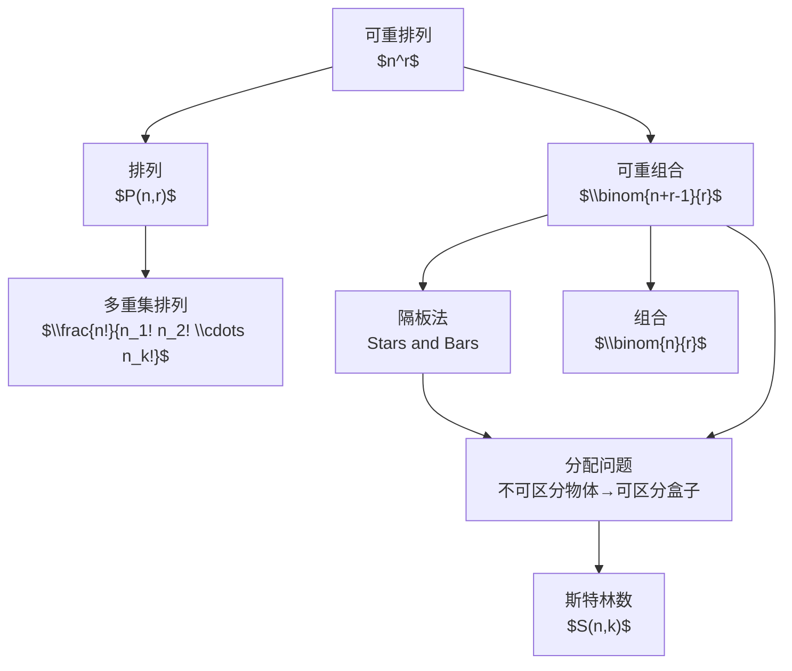

# 可重排列

> [!abstract]
> ==可重排列与可重组合==是计数理论中处理"允许重复选取"问题的两大核心工具。可重排列关注有序选取（排列数 $n^r$），可重组合关注无序选取（通过隔板法得到 $\binom{n+r-1}{r}$）。两者在密码学、分配问题、组合优化等领域有广泛应用。

## 定义

> [!def] 可重排列（r-Permutation with Repetition）
> 从 $n$ 个不同类型的物体中，**允许重复**地选取 $r$ 个物体进行有序排列，其排列数为：
> $$
> P(n, r)_{\text{rep}} = n^r
> $$
> 其中每个位置都有 $n$ 种选择，由乘法原理直接得出。

> [!def] 可重组合（r-Combination with Repetition / 隔板法）
> 从 $n$ 个不同类型的物体中，**允许重复**地选取 $r$ 个物体（不计顺序），其组合数为：
> $$
> C(n, r)_{\text{rep}} = \binom{n + r - 1}{r} = \binom{n + r - 1}{n - 1}
> $$
> 该公式也称为**隔板法**（Stars and Bars）公式。

> [!def] 隔板法（Stars and Bars Theorem）
> 将 $r$ 个不可区分的星号（代表被选物体）排成一排，用 $n - 1$ 个隔板分成 $n$ 组（每组对应一类物体），则不同的分组方式数为：
> $$
> \binom{r + n - 1}{n - 1}
> $$
> **直观理解**：$r$ 个星号和 $n - 1$ 个隔板共占 $r + n - 1$ 个位置，从中选 $n - 1$ 个位置放隔板（或等价地选 $r$ 个位置放星号），即得公式。

## 核心性质

| 编号 | 性质 | 公式 / 说明 |
|:---:|------|------------|
| 1 | **可重排列的乘法原理** | 每个位置独立选择，共 $r$ 个位置，每个位置 $n$ 种选择，故总数为 $n^r$ |
| 2 | **可重组合 = 隔板法** | $\binom{n+r-1}{r}$，本质是将 $r$ 个不可区分物品分配到 $n$ 个可区分盒子 |
| 3 | **对称形式** | $\binom{n+r-1}{r} = \binom{n+r-1}{n-1}$，由二项式系数对称性直接得出 |
| 4 | **退化情况** | 当不允许重复时（每类最多选1个），$\binom{n+r-1}{r}$ 退化为 $\binom{n}{r}$（需 $r \leq n$） |
| 5 | **隔板法图示** | 选3类水果共5个：$\star\star \mid \star \mid \star\star$ 表示"2个第1类、1个第2类、2个第3类" |
| 6 | **与分配问题的等价性** | 可重组合数等于"将 $r$ 个不可区分物体放入 $n$ 个可区分盒子"的方案数 |
| 7 | **生成函数联系** | 可重组合的生成函数为 $(1 + x + x^2 + \cdots)^n = \frac{1}{(1-x)^n}$，$x^r$ 的系数恰为 $\binom{n+r-1}{r}$ |

## 关系网络

## 章节扩展

- **第6.5节**：本概念是Rosen教材第6.5节的核心内容，与[[多重集排列]]、[[分配问题]]共同构成"高级计数技术"模块。
- **隔板法的推广**：当要求某些盒子至少装1个物体时，可先每盒预放1个，转化为 $\binom{r-n+n-1}{n-1} = \binom{r-1}{n-1}$（要求 $r \geq n$）。
- **应用场景**：密码学中密钥空间计算、投票问题中票数分配、整数方程 $x_1 + x_2 + \cdots + x_n = r$ 的非负整数解个数。

## 补充

> [!info] 隔板法的严格证明
> 设 $x_i$ 表示第 $i$ 类物体被选取的个数，则可重组合问题等价于求方程
> $$x_1 + x_2 + \cdots + x_n = r, \quad x_i \geq 0$$
> 的非负整数解的个数。将 $r$ 个星号排成一行，插入 $n-1$ 个隔板将其分为 $n$ 段，第 $i$ 段的星号数即为 $x_i$。$r$ 个星号与 $n-1$ 个隔板共 $r+n-1$ 个位置，选其中 $n-1$ 个放隔板，得 $\binom{r+n-1}{n-1}$ 种方案。

> [!info] 经典例题
> 从5种水果中任选10个（可重复），有多少种选法？
> $$\binom{10+5-1}{10} = \binom{14}{10} = \binom{14}{4} = 1001$$

## 参见

- [[排列]] — 不允许重复的排列
- [[组合]] — 不允许重复的组合
- [[多重集排列]] — 有限重复次数的排列
- [[分配问题]] — 物体分配到盒子的计数模型
- [[斯特林数]] — 将元素划分为非空集合的方法数
