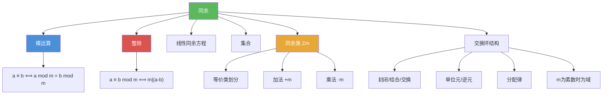

# 同余

> [!abstract] 概述
> ==同余（congruence modulo $m$）==是整数集上由高斯系统发展的核心等价关系：设 $m$ 为正整数，若 $m \mid (a - b)$，则称 $a$ ==同余于== $b$ 模 $m$，记作 $a \equiv b \pmod{m}$。同余关系满足==自反性==、==对称性==、==传递性==，将整数集划分为 $m$ 个==同余类==（等价类），构成集合 $\mathbb{Z}_m = \{0, 1, \ldots, m-1\}$。在 $\mathbb{Z}_m$ 上定义加法 $+_m$ 和乘法 $\cdot_m$ 后，它构成一个==交换环==（commutative ring），但乘法逆元不一定存在。

## 定义

> [!def] 同余（Congruence Modulo $m$）
>
> 设 $a, b$ 为整数，$m$ 为正整数。若 $m \mid (a - b)$，则称 $a$ ==同余于== $b$ 模 $m$，记作 $a \equiv b \pmod{m}$。
>
> - $a \equiv b \pmod{m}$ 是整数集上的==二元关系==（relation）
> - $a \bmod m$ 是整数集上的==函数==（function）
> - 等价刻画：$a \equiv b \pmod{m} \iff a \bmod m = b \bmod m \iff \exists k \in \mathbb{Z}, a = b + km$

> [!def] 同余类与 $\mathbb{Z}_m$
>
> 同余关系 $\equiv \pmod{m}$ 的==等价类==称为==同余类==（congruence class）。模 $m$ 的所有同余类构成的集合为
>
> $$\mathbb{Z}_m = \{[0], [1], \ldots, [m-1]\} = \{0, 1, \ldots, m-1\}$$
>
> 其中 $[a] = \{a + km \mid k \in \mathbb{Z}\}$。

> [!def] $\mathbb{Z}_m$ 上的运算与交换环结构
>
> 在 $\mathbb{Z}_m$ 上定义：
> - ==加法==：$a +_m b = (a + b) \bmod m$
> - ==乘法==：$a \cdot_m b = (a \cdot b) \bmod m$
>
> $(\mathbb{Z}_m, +_m, \cdot_m)$ 构成==交换环==：满足封闭性、结合律、交换律、单位元（加法单位元 $0$，乘法单位元 $1$）、加法逆元、分配律。注意：乘法逆元==不一定存在==（例如 $2$ 在 $\mathbb{Z}_6$ 中没有乘法逆元），因此 $\mathbb{Z}_m$ 一般不是域。只有当 $m$ 为素数时，$\mathbb{Z}_m$ 才是域。

## 核心性质

| 性质 | 描述 | 说明 |
|------|------|------|
| 自反性 | $a \equiv a \pmod{m}$ | 因为 $m \mid 0$ |
| 对称性 | $a \equiv b \pmod{m} \Rightarrow b \equiv a \pmod{m}$ | 因为 $m \mid (a-b) \Rightarrow m \mid (b-a)$ |
| 传递性 | $a \equiv b$ 且 $b \equiv c \pmod{m} \Rightarrow a \equiv c \pmod{m}$ | 因为 $m \mid (a-b)$ 且 $m \mid (b-c) \Rightarrow m \mid (a-c)$ |
| 加法保持性 | $a \equiv b$ 且 $c \equiv d \pmod{m} \Rightarrow a+c \equiv b+d \pmod{m}$ | Theorem 5 |
| 乘法保持性 | $a \equiv b$ 且 $c \equiv d \pmod{m} \Rightarrow ac \equiv bd \pmod{m}$ | Theorem 5 |
| 除法限制 | $ac \equiv bc \pmod{m}$ 不能推出 $a \equiv b \pmod{m}$ | 除非 $\gcd(c, m) = 1$ |
| 同余类划分 | $\mathbb{Z}_m$ 将整数集划分为 $m$ 个不相交的等价类 | 等价关系的标准性质 |
| 交换环结构 | $\mathbb{Z}_m$ 配合 $+_m$ 和 $\cdot_m$ 构成交换环 | $m$ 为素数时构成域 |

## 关系网络

- [[模运算]] 提供同余的计算工具：$a \equiv b \pmod{m}$ 当且仅当 $a \bmod m = b \bmod m$
- [[整除]] 是同余的定义基础：$a \equiv b \pmod{m}$ 定义为 $m \mid (a - b)$
- [[线性同余方程]] $ax \equiv b \pmod{m}$ 的可解性依赖于 $\gcd(a, m) \mid b$
- [[集合]] 中的等价关系理论为同余类的划分提供形式化框架

## 章节扩展

### 第4章：数论与密码学

同余是第 4 章的核心概念（4.1 节），贯穿整个数论与密码学：

- **4.1 整除与模运算**：同余的定义（Definition 3）、等价关系性质（Theorem 3-5）、$\mathbb{Z}_m$ 上的算术运算、交换环结构
- **4.4 解同余方程**：线性同余方程 $ax \equiv b \pmod{m}$、中国剩余定理
- **4.5 密码学应用**：RSA 加密的核心运算 $c = m^e \bmod n$ 本质上是同余运算
- **4.6 素性测试**：费马小定理 $a^{p-1} \equiv 1 \pmod{p}$ 是 Miller-Rabin 素性测试的基础

### 第9章：关系

- **9.5 同余关系是等价关系的经典实例**：同余关系 $a \equiv b \pmod{m}$ 是[[离散数学/concepts/等价关系]]在整数集上的一个经典实例。它完美地满足等价关系的三大性质：
  - **自反性**：$a \equiv a \pmod{m}$（因为 $m \mid 0$）
  - **对称性**：$a \equiv b \pmod{m} \Rightarrow b \equiv a \pmod{m}$（因为 $m \mid (a-b) \Rightarrow m \mid (b-a)$）
  - **传递性**：$a \equiv b$ 且 $b \equiv c \pmod{m} \Rightarrow a \equiv c \pmod{m}$（因为 $m \mid (a-b)$ 且 $m \mid (b-c) \Rightarrow m \mid (a-c)$）

  同余关系的==等价类==就是==同余类== $[a] = \{a + km \mid k \in \mathbb{Z}\}$，由此产生的==划分==将整数集分为 $m$ 个互不相交的同余类，构成商集 $\mathbb{Z}/m\mathbb{Z} = \mathbb{Z}_m$。同余关系的特殊性在于：它不仅是等价关系，还与算术运算兼容（加法和乘法保持同余），这使得 $\mathbb{Z}_m$ 上的代数运算具有良好的定义（well-defined），从而构成交换环。一般的等价关系不一定具有这种运算兼容性。

## 补充

> [!info] 同余概念的历史渊源
>
> 同余的概念由德国数学家 ==卡尔-弗里德里希-高斯==（Carl Friedrich Gauss, 1777--1855）在 18 世纪末系统发展。高斯在其 1801 年出版的划时代著作《算术研究》（*Disquisitiones Arithmeticae*）中，首次将同余符号 $\equiv$ 引入数学，并建立了模运算的完整理论体系。高斯被誉为"数学王子"，他曾说："数学是科学的皇后，而数论是数学的皇后。"同余理论的建立使数论从零散的命题集合变为一个结构化的理论体系，为后来的代数数论、密码学等奠定了基础。
>
> **学术来源**：Rosen, K. H. (2019). *Discrete Mathematics and Its Applications* (8th ed.). McGraw-Hill, Section 4.1.
>
> **参考链接**：Gauss, C. F. (1801). *Disquisitiones Arithmeticae*. Ireland, K. F., & Rosen, M. I. (1990). *A Classical Introduction to Modern Number Theory* (2nd ed.). Springer-Verlag.

## 参见

- [[模运算]] -- $\bmod$ 函数的定义与运算规则，同余的计算工具
- [[整除]] -- 同余的定义基础，$a \equiv b \pmod{m}$ 当且仅当 $m \mid (a - b)$
- [[线性同余方程]] -- 形如 $ax \equiv b \pmod{m}$ 的方程及其求解方法
- [[集合]] -- 等价关系与等价类的划分理论为同余类提供形式化基础
- [[离散数学/theorems/费马小定理]] -- $a^{p-1} \equiv 1 \pmod{p}$（$p$ 为素数），同余理论的重要定理
