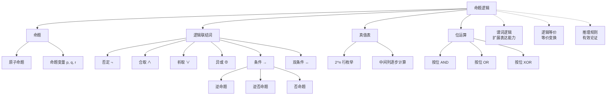

# 命题逻辑

> [!abstract] 概述
> ==命题逻辑（propositional logic）== 是基于==命题==（只能为真或为假的陈述句）和==逻辑联结词==的形式逻辑系统。它通过六种联结词（否定 $\neg$、合取 $\land$、析取 $\lor$、异或 $\oplus$、条件 $\to$、双条件 $\leftrightarrow$）将原子命题组合为复合命题，并利用==真值表==系统性地判定复合命题的真值。命题逻辑是整个形式逻辑体系的基石，也是数字电路设计与布尔代数的理论基础。

## 定义

> [!def] 命题逻辑
>
> **命题逻辑**是一种形式逻辑系统，其基本组成单元是==命题（proposition）==——即要么为真（T）要么为假（F）的陈述句。不能再分解为更简单命题的称为==原子命题==，用小写字母 $p, q, r, \ldots$ 表示。
>
> 通过以下六种==逻辑联结词==，原子命题可以组合为==复合命题==：
>
> | 联结词 | 符号 | 读法 | 真值条件 |
> |:------:|:----:|:----:|:--------:|
> | 否定 | $\neg p$ | 非 $p$ | 与 $p$ 真值相反 |
> | 合取 | $p \land q$ | $p$ 与 $q$ | $p$ 和 $q$ 同时为真时为真 |
> | 析取 | $p \lor q$ | $p$ 或 $q$ | $p$ 和 $q$ 同时为假时为假（==包含或==） |
> | 异或 | $p \oplus q$ | $p$ 异或 $q$ | $p$ 和 $q$ 恰好一个为真时为真 |
> | 条件 | $p \to q$ | 若 $p$ 则 $q$ | $p$ 为真且 $q$ 为假时为假 |
> | 双条件 | $p \leftrightarrow q$ | $p$ 当且仅当 $q$ | $p$ 和 $q$ 真值相同时为真 |
>
> **条件语句** $p \to q$ 中，$p$ 称为==假设/前件==，$q$ 称为==结论/后件==。其三种变形为：
>
> | 名称 | 形式 | 与原命题等价？ |
> |:----:|:----:|:--------------:|
> | 逆命题（converse） | $q \to p$ | 不一定 |
> | ==逆否命题（contrapositive）== | $\neg q \to \neg p$ | **一定等价** |
> | 否命题（inverse） | $\neg p \to \neg q$ | 不一定 |
>
> **运算符优先级**（由高到低）：$\neg > \land > \lor > \to > \leftrightarrow$

## 核心性质

| 性质 | 描述 | 公式 |
|:----:|:-----|:-----|
| 逆否等价 | 条件语句与其逆否命题逻辑等价 | $p \to q \equiv \neg q \to \neg p$ |
| 双条件分解 | 双条件等价于两个方向条件的合取 | $p \leftrightarrow q \equiv (p \to q) \land (q \to p)$ |
| 条件-析取等价 | 条件语句可化为否定与析取 | $p \to q \equiv \neg p \lor q$ |
| 真值表完备性 | $n$ 个变量的真值表有 $2^n$ 行，覆盖所有赋值组合 | — |
| 位运算对应 | 逻辑运算可直接映射到计算机位运算 | $1 \leftrightarrow T$，$0 \leftrightarrow F$ |
| 实质蕴涵 | 当 $p$ 为假时，$p \to q$ 恒为真（无论 $q$ 取何值） | $F \to T = T$，$F \to F = T$ |

## 关系网络

- **向上扩展**：[[谓词逻辑]] 在命题逻辑基础上引入谓词和量词，能表达涉及变量的一般性陈述
- **横向关联**：[[离散数学/concepts/逻辑等价]] 研究命题之间的等价关系，提供化简逻辑表达式的系统方法
- **应用方向**：[[推理规则]] 基于命题逻辑建立有效论证的模式，是数学证明的理论基础

## 章节扩展

### 第1章：逻辑与证明基础

命题逻辑是第1章的核心起点（Rosen 第8版 1.1-1.3 节）：

- **1.1 命题逻辑**：定义命题、六种联结词、真值表构造、条件语句的逆/逆否/否命题、位运算
- **1.2 命题逻辑的应用**：自然语言翻译、系统规约与一致性检验、布尔搜索、逻辑谜题（骑士与无赖）、逻辑电路
- **1.3 命题等价**：重言式/矛盾式/偶然式的分类、基本等价律表（含 De Morgan 律）、链式推导法、可满足性与 SAT 问题

命题逻辑为后续的谓词逻辑（1.4-1.5）、推理规则（1.6）和证明方法（1.7-1.8）提供了必要的逻辑基础。

### 第5章：归纳与递归

- **5.3 递归定义与结构归纳**：合式公式（well-formed formula）通过递归方式定义：(1) 命题变量是合式公式；(2) 若 $p$ 是合式公式则 $\neg p$ 也是；(3) 若 $p, q$ 是合式公式则 $(p \land q)$、$(p \lor q)$ 等也是。结构归纳法用于证明关于所有合式公式的性质。

### 第12章：布尔代数

==布尔代数==是==命题逻辑==的代数化。两者之间存在完美的同构对应关系：

| 命题逻辑 | 布尔代数 |
|:---------|:---------|
| $\vee$（析取） | $+$（布尔或） |
| $\wedge$（合取） | $\cdot$（布尔与） |
| $\neg$（否定） | $\bar{}$（布尔非） |
| T（真） | $1$ |
| F（假） | $0$ |

命题逻辑中的所有逻辑等价式都可以翻译为布尔恒等式。例如，德摩根定律 $\neg(p \vee q) \equiv \neg p \wedge \neg q$ 对应布尔恒等式 $\overline{x+y} = \bar{x} \cdot \bar{y}$。积之和展开式（DNF）对应命题逻辑中的主析取范式，和之积展开式（CNF）对应主合取范式。

### 第13章：计算建模

- **13.3 不带输出的有限状态机**：有限自动机与命题逻辑之间存在深层对应关系。DFA 的状态转移可以看作对输入符号的"条件判断"——每个状态根据输入符号决定下一步转移，类似于命题逻辑中的条件语句。有限自动机接受的字符串集合（正则语言）与命题逻辑的可满足性问题都属于可判定问题，但其计算复杂度不同。此外，布尔电路（第12章）与有限状态机都是将逻辑运算映射为物理计算设备的模型。

## 补充

> [!info] 历史与学术背景
>
> 命题逻辑的系统化发展可追溯到古希腊哲学家亚里士多德（公元前384-322年）对三段论推理的研究。现代命题逻辑的代数化处理归功于英国数学家 **George Boole**（1815-1864），他在 1854 年出版的《The Laws of Thought》中首次引入了用代数方法处理逻辑推理的框架，即**布尔代数**。1938 年，**Claude Shannon** 在其 MIT 硕士论文中首次将布尔代数应用于继电器电路设计，标志着逻辑学与计算机工程的正式结合。
>
> 条件语句 $p \to q$ 的真值定义（即"实质蕴涵"）在逻辑哲学中引发了长期争论。当 $p$ 为假时 $p \to q$ 恒为真，这一特性被称为"实质蕴涵怪论"，表明数学中的条件语句不要求前件和后件之间存在因果关系。
>
> **来源**：
> - Boole, G. (1854). *An Investigation of the Laws of Thought*. Walton and Maberly.
> - Shannon, C. E. (1938). "A Symbolic Analysis of Relay and Switching Circuits." *Transactions of the American Institute of Electrical Engineers*, 57(12), 713-723. https://doi.org/10.1109/T-AIEE.1938.5057767
> - Lewis, C. I. (1917). "The Issues Concerning Material Implication." *The Journal of Philosophy*, 14(13), 350-356. https://doi.org/10.2307/2940058

## 参见

- [[谓词逻辑]] — 扩展命题逻辑，引入谓词和量词
- [[离散数学/concepts/逻辑等价]] — 两个复合命题在所有赋值下真值相同
- [[推理规则]] — 从前提推出结论的有效推理模式
- [[逻辑学/concepts/命题]] — 命题的基本概念（逻辑学知识库）
- [[逻辑学/concepts/实质蕴涵]] — 条件语句的深入讨论
