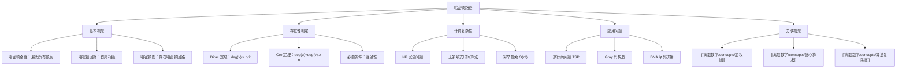

# 哈密顿路径

> [!abstract] 概述
> ==哈密顿路径==（Hamiltonian path）是图中经过每个==顶点==恰好一次的路径。若该路径的起点和终点相同（即首尾相连形成回路），则称为==哈密顿回路==（Hamiltonian circuit/cycle）。与==欧拉路径==（遍历每条边恰好一次）不同，哈密顿路径关注的是顶点的遍历。判断一个图是否存在哈密顿路径/回路是==NP 完全==问题，没有已知的多项式时间算法。==Dirac 定理==和==Ore 定理==给出了哈密顿回路存在的充分条件（基于顶点度数）。哈密顿路径的加权版本即为著名的==旅行商问题==（TSP），是组合优化领域的核心问题之一。

## 定义

> [!def] 哈密顿路径（Hamiltonian Path）
>
> 设 $G = (V, E)$ 是一个简单图，$|V| = n$。$G$ 中的一条==哈密顿路径==是一个包含 $G$ 中所有 $n$ 个顶点的==简单路径==，即经过每个顶点恰好一次的路径：
>
> $$P = (v_1, v_2, \ldots, v_n)$$
>
> 其中 $v_i \in V$，$v_i \neq v_j$（$i \neq j$），且 $\{v_i, v_{i+1}\} \in E$（$1 \leq i \leq n-1$）。

> [!def] 哈密顿回路（Hamiltonian Circuit / Hamiltonian Cycle）
>
> 若一条哈密顿路径的起点和终点之间存在边，即 $\{v_n, v_1\} \in E$，则称该路径构成一个==哈密顿回路==：
>
> $$C = (v_1, v_2, \ldots, v_n, v_1)$$
>
> 哈密顿回路经过每个顶点恰好一次并回到起点，是哈密顿路径的特殊情况。

> [!def] 哈密顿图（Hamiltonian Graph）
>
> 若图 $G$ 中存在哈密顿回路，则称 $G$ 为==哈密顿图==。

> [!def] 旅行商问题（Traveling Salesman Problem, TSP）
>
> 在==加权完全图== $K_n$ 中，==旅行商问题==要求找到一条经过所有 $n$ 个顶点恰好一次并返回起点的回路，使得回路的总权重最小：
>
> $$\min \sum_{i=1}^{n-1} w(v_i, v_{i+1}) + w(v_n, v_1)$$
>
> TSP 是哈密顿回路问题在加权图上的优化版本，是经典的==NP 困难==问题。

## 核心性质

| 性质 | 描述 | 备注 |
|:-----|:-----|:-----|
| ==NP 完全性== | 判断哈密顿路径/回路的存在性是 NP 完全问题 | 不存在已知的多项式时间算法 |
| ==与欧拉路径的区别== | 哈密顿路径遍历所有顶点，欧拉路径遍历所有边 | 两者关注对象不同，不可混淆 |
| ==Dirac 定理== | 简单图 $G$（$n \geq 3$）中若 $\deg(v) \geq n/2$（$\forall v$），则 $G$ 是哈密顿图 | 充分条件，非必要条件 |
| ==Ore 定理== | 简单图 $G$（$n \geq 3$）中若 $\deg(u) + \deg(v) \geq n$（$\forall$ 不相邻 $u,v$），则 $G$ 是哈密顿图 | Dirac 定理的推广 |
| ==必要条件== | 哈密顿图必须是==连通图== | 不连通图不可能存在哈密顿路径 |
| ==子图必要条件== | 删除任意 $k$ 个顶点后，剩余连通分支数不超过 $k$ | 用于判断图不是哈密顿图 |

## 关系网络

- **前置知识**：图的基本概念（路径、连通性、顶点度数）
- **核心关联**：哈密顿路径与欧拉路径是图论中两个经典遍历问题，前者遍历顶点、后者遍历边。两者在判定难度上存在本质差异——欧拉路径有多项式时间判定算法，而哈密顿路径是 NP 完全的
- **后继概念**：[[离散数学/concepts/加权图]]（加权哈密顿回路即旅行商问题 TSP）

## 章节扩展

### 第10章：图论

哈密顿路径是 Rosen 第8版第10章中图论的重要概念，与欧拉路径并列讨论，体现了"遍历"这一核心主题的两个不同维度。

**哈密顿路径与欧拉路径的本质区别**：

| 比较维度 | 哈密顿路径 | 欧拉路径 |
|:---------|:-----------|:---------|
| 遍历对象 | 每个顶点恰好一次 | 每条边恰好一次 |
| 判定复杂性 | NP 完全 | 多项式时间（$O(|E|)$） |
| 存在性条件 | 仅有充分条件（Dirac、Ore） | 充要条件（度数为奇数的顶点个数） |
| 应用场景 | 旅行商问题、调度问题 | 一笔画问题、邮递员问题 |

**Dirac 定理与 Ore 定理的关系**：Ore 定理是 Dirac 定理的推广。若 $\deg(v) \geq n/2$ 对所有 $v$ 成立，则对任意两个不相邻顶点 $u, v$，有 $\deg(u) + \deg(v) \geq n/2 + n/2 = n$，满足 Ore 条件。因此 Dirac 定理是 Ore 定理的推论。

**NP 完全性说明**：哈密顿路径问题是 NP 完全的，意味着：
- 可以在多项式时间内**验证**一个给定的路径是否为哈密顿路径（只需检查是否包含所有顶点且无重复）
- 但不存在已知的多项式时间算法来**判定**哈密顿路径是否存在
- 对于 $n$ 个顶点的图，穷举所有排列需要 $O(n!)$ 时间，实际中不可行

## 补充

> [!info] 哈密顿路径的实际应用
>
> 哈密顿路径及旅行商问题在多个领域有重要应用：
>
> - **Gray 码**：$n$ 位 Gray 码对应 $n$ 维超立方体 $Q_n$ 中的一条哈密顿路径，相邻码字仅有一位不同，用于数字通信和误差检测
> - **DNA 序列拼接**：在生物信息学中，DNA 片段的拼接可建模为在有向图（de Bruijn 图）中寻找哈密顿路径
> - **旅行商问题**：物流配送、芯片钻孔、电路板布线等场景中，需要在多个地点之间找到最短巡回路线
> - **调度问题**：任务调度中，若任务之间存在先后约束，可建模为哈密顿路径问题

> [!tip] 判断哈密顿路径的实用策略
>
> - **充分条件优先**：先检查 Dirac/Ore 条件，若满足则直接判定存在哈密顿回路
> - **必要条件排除**：检查连通性、删除顶点后的连通分支数等必要条件，若不满足则判定不存在
> - **小图穷举**：对于顶点数较少的图（$n \leq 10$），可直接穷举所有排列
> - **启发式算法**：对于大规模问题，使用近似算法（如最近邻启发式、2-opt 局部搜索）求近似解

> [!warning] 常见误区
>
> - **不要混淆哈密顿路径与欧拉路径**：哈密顿遍历顶点，欧拉遍历边，两者是不同的问题
> - **Dirac/Ore 定理是充分条件而非充要条件**：不满足这些条件的图仍可能是哈密顿图（如长度 $\geq 5$ 的奇数环 $C_n$）
> - **完全图 $K_n$ 一定存在哈密顿回路**：$K_n$ 中有 $(n-1)!/2$ 条不同的哈密顿回路
> - **二分图中的哈密顿路径**：完全二分图 $K_{m,n}$ 存在哈密顿回路的充要条件是 $m = n$

## 参见

- [[离散数学/concepts/加权图]] -- 加权图中的哈密顿回路即旅行商问题
- [[离散数学/concepts/贪心算法]] -- TSP 的近似算法常采用贪心策略
- [[离散数学/concepts/算法复杂度]] -- 哈密顿路径的 NP 完全性分析
