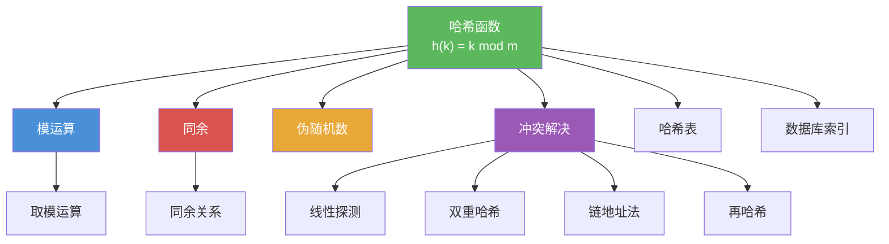

# 哈希函数

> [!abstract] 概述
> ==哈希函数==（hashing function）是将记录的关键字 $k$ 映射到存储位置 $h(k)$ 的函数，最常用的形式是==除法法== $h(k) = k \bmod m$，其中 $m$ 为可用存储位置数。哈希函数应易于计算且为满射，使所有存储位置都可能被使用。当两个不同关键字映射到同一位置时产生==冲突==（collision），常用==线性探测== $h(k, i) = (h(k) + i) \bmod m$ 或==双重哈希==等方法解决。哈希函数是计算机科学中==哈希表==、数据库索引、缓存系统等的核心数据结构基础。

## 定义

> [!def] 哈希函数（Hashing Function）
>
> ==哈希函数== $h$ 将记录的关键字 $k$ 映射到存储位置 $h(k)$。最常用的哈希函数是：
>
> $$h(k) = k \bmod m$$
>
> 其中 $m$ 为可用的存储位置数。
>
> 哈希函数的设计要求：
> - **易于计算**：以便快速定位文件
> - **满射（onto）**：使所有存储位置都可能被使用
> - $h(k) = k \bmod m$ 满足这两个要求

> [!def] 冲突与冲突解决（Collision and Collision Resolution）
>
> 当两个不同的关键字被映射到同一存储位置时，称为==冲突==（collision）。
>
> 常用的冲突解决方法：
>
> | 方法 | 公式 | 说明 |
> |------|------|------|
> | ==线性探测== | $h(k, i) = (h(k) + i) \bmod m$ | 从初始位置依次检查后续位置 |
> | ==双重哈希== | $h(k, i) = (h(k) + i \cdot g(k)) \bmod p$ | 第二个哈希函数决定探测步长 |
> | ==链地址法== | 每个位置维护链表 | 冲突元素加入同一链表 |
> | ==再哈希== | 使用第二个哈希函数 | 确定不同的探测序列 |

> [!def] 折叠法（Folding Method）
>
> ==折叠法==是另一种常见的哈希函数构造方法：将关键字分成等长的几段，将各段相加后取模。
>
> 例如，对关键字 $123456789$，可分为 $123 + 456 + 789 = 1368$，再取模。

## 核心性质

| 性质 | 描述 | 说明 |
|------|------|------|
| 除法法 | $h(k) = k \bmod m$ | 最简单、最常用的哈希函数 |
| 折叠法 | 分段求和后取模 | 适用于长关键字 |
| 模数选择 | $m$ 应为素数 | 减少冲突的聚集效应 |
| 线性探测 | $h(k, i) = (h(k) + i) \bmod m$ | 简单但可能产生聚集 |
| 双重哈希 | 使用两个哈希函数 | 减少聚集，分布更均匀 |
| 链地址法 | 每个位置维护链表 | 不受表满限制 |
| 负载因子 | $\alpha = n/m$ | 影响冲突概率和查找效率 |

## 关系网络

- [[模运算]] 是哈希函数 $h(k) = k \bmod m$ 的数学基础
- [[同余]] 提供了哈希映射的理论框架：$h(k_1) = h(k_2)$ 当且仅当 $k_1 \equiv k_2 \pmod{m}$
- [[伪随机数]] 生成器中的线性同余法与哈希函数共享模运算的数学基础

## 章节扩展

### 第4章：数论与密码学

哈希函数是第 4.5 节"同余的应用"中的第一个应用实例：

- **4.5 同余的应用**：哈希函数是模运算在计算机科学中的典型应用
- **4.5 冲突解决**：线性探测、双重哈希等冲突解决策略
- **4.6 密码学**：密码学哈希函数（如 SHA-256）是数字签名、消息认证码的基础，与本章的简单哈希函数有本质区别

## 补充

> [!info] 哈希函数的学术背景与实际应用
>
> 哈希函数是计算机科学中最重要的基础数据结构之一。除了本节介绍的除法法 $h(k) = k \bmod m$ 外，常见的哈希函数还包括乘法法（$h(k) = \lfloor m(kA \bmod 1)\rfloor$，其中 $A \approx (\sqrt{5}-1)/2$）和全域哈希（universal hashing，从哈希函数族中随机选取）。在实际的哈希表实现中（如 Java 的 HashMap、Python 的 dict），$m$ 通常选择素数或 $2$ 的幂，以减少冲突。当负载因子过高时，需要进行动态扩容（rehashing）。Donald Knuth 在《The Art of Computer Programming》Vol. 3 中对哈希技术有详尽的分析（Knuth, 1997, Vol. 3, Sec. 6.4）。密码学哈希函数（如 SHA-256、BLAKE2）与本章讨论的简单哈希函数有本质区别：密码学哈希函数要求抗原像攻击、抗第二原像攻击和抗碰撞攻击。
>
> **学术来源**：Rosen, K. H. (2019). *Discrete Mathematics and Its Applications* (8th ed.). McGraw-Hill, Section 4.5.
>
> **参考链接**：Knuth, D. E. (1997). *The Art of Computer Programming, Vol. 3: Sorting and Searching* (2nd ed.). Addison-Wesley, Section 6.4.

## 参见

- [[模运算]] -- 哈希函数 $h(k) = k \bmod m$ 的数学基础
- [[同余]] -- 哈希映射的理论框架
- [[伪随机数]] -- 线性同余法与哈希函数共享模运算基础
