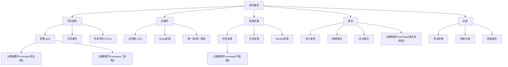

# 图的着色

> [!abstract] 概述
> ==图的着色==（graph coloring）是图论中最经典的问题之一，核心思想是用尽可能少的颜色对图的顶点或边进行着色，使得相邻元素颜色不同。==顶点着色==中，图的==色数== $\chi(G)$ 是所需最少颜色数，色数的确定是 NP 困难问题。==四色定理==是图论史上最著名的定理之一，它断言任何==平面图==的色数不超过 4。==边着色==由 Vizing 定理给出上下界。着色问题在考试排期、频率分配、寄存器分配等实际场景中有广泛应用。

## 定义

> [!def] 顶点着色（Vertex Coloring）
>
> 给定图 $G = (V, E)$，一个==顶点着色==是一个映射 $f: V \to \{1, 2, \ldots, k\}$，使得对于 $G$ 中的每条边 $\{u, v\} \in E$，都有 $f(u) \neq f(v)$。
>
> - 满足上述条件的着色称为==正常着色==（proper coloring）
> - 图 $G$ 的==色数== $\chi(G)$（chromatic number）是使正常着色存在的最小整数 $k$
> - 若 $\chi(G) = k$，则称 $G$ 为==k-色图==
> - 若 $\chi(G) \leq 2$，则 $G$ 是==二部图==（参见 [[离散数学/concepts/二部图]]）

> [!def] 色数（Chromatic Number）
>
> 图 $G$ 的==色数== $\chi(G)$ 满足以下基本性质：
>
> - $\chi(G) = 1$ 当且仅当 $G$ 没有边（空图）
> - $\chi(G) = 2$ 当且仅当 $G$ 是非空==二部图==
> - 对于完全图 $K_n$，$\chi(K_n) = n$（每个顶点互不相邻，需要不同颜色）
> - 对于圈图 $C_n$：$\chi(C_n) = \begin{cases} 2 & \text{若 } n \text{ 为偶数} \\ 3 & \text{若 } n \text{ 为奇数} \end{cases}$
> - 对于任意图 $G$：$1 \leq \chi(G) \leq n$（$n$ 为顶点数）

> [!def] 边着色（Edge Coloring）与 Vizing 定理
>
> 给定图 $G = (V, E)$，一个==边着色==是对每条边分配颜色，使得相邻边（共享一个端点的边）颜色不同。
>
> - 图 $G$ 的==边色数== $\chi'(G)$ 是正常边着色所需的最少颜色数
> - 图 $G$ 的==最大度==记为 $\Delta(G)$
>
> ==Vizing 定理==：对于任意简单图 $G$，
>
> $$\Delta(G) \leq \chi'(G) \leq \Delta(G) + 1$$
>
> - 满足 $\chi'(G) = \Delta(G)$ 的图称为==第一类图==（Class 1）
> - 满足 $\chi'(G) = \Delta(G) + 1$ 的图称为==第二类图==（Class 2）
> - 二部图一定是第一类图：$\chi'(G) = \Delta(G)$

> [!def] 贪心着色算法（Greedy Coloring）
>
> ==贪心着色==是一种启发式着色算法，按某种顺序遍历顶点，为每个顶点分配与其所有已着色邻居不同的最小颜色编号。
>
> - 算法步骤：
>   1. 选择顶点的一个排列顺序 $v_1, v_2, \ldots, v_n$
>   2. 依次为每个 $v_i$ 分配 $\{1, 2, \ldots, n\}$ 中最小的、未被 $v_i$ 的已着色邻居使用的颜色
> - 贪心着色使用的颜色数不超过 $\max_{i} \{\deg(v_i) + 1\}$
> - 对于任意顺序，贪心着色使用的颜色数不超过 $\Delta(G) + 1$
> - 着色结果依赖于顶点排列顺序，不同顺序可能产生不同结果

## 核心性质

| 性质 | 描述 | 备注 |
|:-----|:-----|:-----|
| ==色数下界== | $\chi(G) \geq \omega(G)$（团数） | 完全子图的顶点需要不同颜色 |
| ==色数上界== | $\chi(G) \leq \Delta(G) + 1$（最大度） | 贪心着色保证 |
| ==四色定理== | $\chi(G) \leq 4$（$G$ 为平面图） | 历史性结果 |
| ==二部图色数== | $\chi(G) = 2$（非空二部图） | 等价判定条件 |
| ==奇圈色数== | $\chi(C_{2k+1}) = 3$ | 奇数圈需要 3 种颜色 |
| ==色多项式== | $P(G, k)$ 表示用 $k$ 种颜色的正常着色数 | $\chi(G)$ 是使 $P(G,k) > 0$ 的最小 $k$ |
| ==Vizing 定理== | $\Delta(G) \leq \chi'(G) \leq \Delta(G) + 1$ | 边着色的核心定理 |

## 关系网络

- **前置知识**：[[离散数学/concepts/完全图]]（完全图的色数是基础案例）、[[离散数学/concepts/二部图]]（2-色图等价于二部图）
- **核心关联**：图的着色将组合问题与实际调度问题紧密联系，色数是衡量图复杂度的重要参数
- **后继概念**：[[离散数学/concepts/平面图]]（四色定理是平面图与着色的桥梁）

## 章节扩展

### 第10章：图论

==四色定理==（Four Color Theorem）是图论史上最著名的未解问题之一，最终于 1976 年由 Appel 和 Haken 借助计算机证明。定理内容为：**每个平面图都是 4-可着色的**，即 $\chi(G) \leq 4$ 对所有平面图 $G$ 成立。

**四色定理的历史脉络**：

- **1852 年**：Francis Guthrie 在给英国地图着色时首次提出猜想
- **1879 年**：Kempe 发表了"证明"，但 11 年后 Heawood 发现了漏洞
- **1890 年**：Heawood 修复了 Kempe 的方法，证明了==五色定理==（$\chi(G) \leq 5$ 对平面图成立）
- **1976 年**：Appel 和 Haken 使用计算机检查了 1936 种（后缩减为 1476 种）不可约构形，完成了四色定理的证明
- **1997 年**：Robertson、Sanders、Seymour 和 Thomas 给出了简化证明
- **2005 年**：Georges Gonthier 使用 Coq 证明助手给出了形式化验证

**四色定理的意义**：它是数学史上第一个主要借助计算机完成的证明，引发了关于"计算机证明是否算真正的数学证明"的哲学讨论。

**贪心着色与顶点顺序**：贪心着色的质量高度依赖于顶点的排列顺序。对于最大度 $\Delta$ 的图，存在某种排列顺序使得贪心着色恰好使用 $\Delta + 1$ 种颜色；但也存在排列顺序使得贪心着色可能使用远多于 $\chi(G)$ 的颜色。选择好的排列顺序是实际应用中的关键优化方向。

**着色问题的计算复杂性**：判定 $\chi(G) \leq k$ 对 $k \geq 3$ 是 NP 完全问题。这意味着不存在已知的多项式时间算法来确定一般图的色数。但对特殊图类（如二部图、平面图、完美图），色数可以在多项式时间内确定。

## 补充

> [!info] 着色问题的实际应用
>
> 图的着色在现实世界中有广泛的应用：
>
> - **考试排期**：将课程视为顶点，有共同学生的课程之间连边。色数即为所需的最少考试时间段数
> - **频率分配**：将发射塔视为顶点，距离过近的塔之间连边。色数即为所需的最少频率数
> - **地图着色**：将地图区域视为顶点，相邻区域之间连边。四色定理保证最多需要 4 种颜色
> - **寄存器分配**：编译器优化中，将变量视为顶点，同时存活的变量之间连边。色数即为所需的最少寄存器数
> - **时间表安排**：将任务视为顶点，冲突任务之间连边。着色即为无冲突调度

> [!tip] 色数的常用估计方法
>
> - **下界估计**：找到 $G$ 中最大的完全子图 $K_r$，则 $\chi(G) \geq r$
> - **上界估计**：利用贪心着色，$\chi(G) \leq \Delta(G) + 1$；Brooks 定理改进为 $\chi(G) \leq \Delta(G)$（除非 $G$ 是完全图或奇圈）
> - **二部图判定**：若 $G$ 不含奇圈，则 $\chi(G) \leq 2$

> [!warning] 常见误区
>
> - 色数 $\chi(G)$ 不一定等于最大团数 $\omega(G)$。例如 $C_5$ 的团数为 2，但色数为 3
> - 贪心着色不一定能得到最优着色，即使选择"看起来合理"的顶点顺序
> - 四色定理仅适用于平面图，非平面图（如 $K_5$）的色数可以大于 4
> - 边着色和顶点着色是不同的问题，色数 $\chi(G)$ 和边色数 $\chi'(G)$ 一般不相等

## 参见

- [[离散数学/concepts/平面图]] -- 四色定理的研究对象，平面图的色数不超过 4
- [[离散数学/concepts/二部图]] -- 色数为 2 的图，等价于不含奇圈的图
- [[离散数学/concepts/完全图]] -- 完全图 $K_n$ 的色数为 $n$，是色数上界的极值案例
- [[离散数学/concepts/算法复杂度]] -- 确定色数是 NP 困难问题
