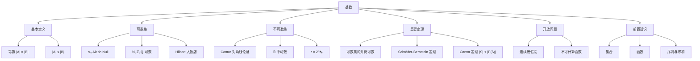

# 基数

> [!abstract] 概述
> ==基数==（cardinality）是集合大小的度量，通过==双射==（bijection）来比较集合的"大小"，这一标准同时适用于有限集和无限集。==可数集==（包括 $\mathbb{N}$、$\mathbb{Z}$、$\mathbb{Q}$）的基数为 $\aleph_0$，而==Cantor 对角线论证法==证明了 $\mathbb{R}$ 是不可数的。==Schröder-Bernstein 定理==提供了不直接构造双射即可证明等势的强大工具，==Cantor 定理==则表明 $|S| < |\mathcal{P}(S)|$ 恒成立，==连续统假设==在标准集合论公理下是不可判定的。

## 定义

> [!def] 等势（Same Cardinality）
>
> 集合 $A$ 和 $B$ ==基数相等==（have the same cardinality）当且仅当存在从 $A$ 到 $B$ 的双射，记作 $|A| = |B|$。对有限集，$|A| = |B|$ 就是两个集合元素个数相同；对无限集，$|A| = |B|$ 提供了一种比较相对大小的标准。
>
> - 若存在从 $A$ 到 $B$ 的单射，则 $|A| \leq |B|$
> - 若 $|A| \leq |B|$ 且 $|A| \neq |B|$，则 $|A| < |B|$

> [!def] 可数集（Countable Set）
>
> ==可数集==是有限集或与正整数集 $\mathbb{Z}^+$ 等势的集合。当无限集 $S$ 可数时，记 $|S| = \aleph_0$（读作"aleph null"）。==不可数集==（uncountable set）是非可数的集合。
>
> 一个无限集是可数的，当且仅当它的元素可以排成一个序列 $a_1, a_2, a_3, \ldots$（以正整数为索引）。

> [!def] Cantor 对角线论证法（Cantor Diagonalization Argument）
>
> 1879 年由 Georg Cantor 引入的一种证明方法，用于证明实数集是不可数的。核心思想：假设 $(0,1)$ 中的实数可列，构造一个新实数 $r$，其第 $i$ 位小数与第 $i$ 个实数的第 $i$ 位小数不同，从而 $r$ 不在列表中，产生矛盾。

> [!def] Schröder-Bernstein 定理
>
> 若 $|A| \leq |B|$ 且 $|B| \leq |A|$，则 $|A| = |B|$。换言之，若存在从 $A$ 到 $B$ 的单射 $f$ 和从 $B$ 到 $A$ 的单射 $g$，则存在从 $A$ 到 $B$ 的双射。

> [!def] Cantor 定理
>
> 对任意集合 $S$，$|S| < |\mathcal{P}(S)|$，即集合的基数严格小于其幂集的基数。证明采用自指构造：令 $T = \{s \in S \mid s \notin f(s)\}$，则 $T$ 不在任何函数 $f: S \to \mathcal{P}(S)$ 的像中。

> [!def] 连续统假设（Continuum Hypothesis）
>
> ==连续统假设==断言：不存在基数 $X$ 使得 $\aleph_0 < X < \mathfrak{c}$（其中 $\mathfrak{c} = |\mathbb{R}| = 2^{\aleph_0}$）。Gödel（1940）证明了它不能被 ZF 公理证伪，Cohen（1963）证明了它不能被 ZF 公理证明，因此在标准集合论中是==不可判定==的。

## 核心性质

| 性质 | 表述 | 关键要点 |
|:-----|:-----|:---------|
| ==等势判定== | $|A| = |B| \Leftrightarrow$ 存在双射 $f: A \to B$ | 有限集：元素个数相同；无限集：可建立一一对应 |
| ==基数比较== | $|A| \leq |B| \Leftrightarrow$ 存在单射 $f: A \to B$ | 不要求 $A \subseteq B$ |
| ==可数集基数== | $|\mathbb{Z}^+| = |\mathbb{Z}| = |\mathbb{Q}| = \aleph_0$ | 有理数稠密但与稀疏的正整数等势 |
| ==实数不可数== | $|\mathbb{R}| = \mathfrak{c} > \aleph_0$ | Cantor 对角线论证法 |
| ==可数集的并== | 可数集的并仍可数 | 交替排列 $a_1, b_1, a_2, b_2, \ldots$ |
| ==Schröder-Bernstein== | $|A| \leq |B|$ 且 $|B| \leq |A|$ $\Rightarrow$ $|A| = |B|$ | 无需直接构造双射 |
| ==Cantor 定理== | $|S| < |\mathcal{P}(S)|$ 对任意 $S$ 成立 | 推论：$\aleph_0 < 2^{\aleph_0} = \mathfrak{c}$ |
| ==连续统假设== | $\aleph_0$ 与 $\mathfrak{c}$ 之间不存在其他基数 | ZF 公理下不可判定 |
| ==不可计算函数== | 程序集合可数，函数集合不可数 | 因此存在不可计算函数 |

## 关系网络

- **前置知识**：[[集合]]（基数是集合大小的度量）、[[函数]]（双射是等势的核心工具）、[[序列与求和]]（可数集的元素可排成序列）
- **核心关联**：可数集的判定依赖于能否构造双射或排列为序列；不可计算函数的存在性论证利用了"程序可数、函数不可数"这一事实
- **历史脉络**：Cantor（1874-1891）建立超限数理论，Gödel（1940）和 Cohen（1963）分别证明连续统假设的一致性与独立性

## 章节扩展

### 第2章：基本结构

基数是 Rosen 第8版第2章第2.5节的核心内容，将集合大小的概念从有限集推广到无限集。

**可数集的典型证明**：
- 奇数集可数：双射 $f(n) = 2n - 1$
- 整数集 $\mathbb{Z}$ 可数：$f(n) = \begin{cases} n/2 & n \text{ 为偶数} \\ -(n-1)/2 & n \text{ 为奇数} \end{cases}$
- 有理数集 $\mathbb{Q}^+$ 可数：按分子分母之和 $p+q$ 分组，沿对角线遍历并跳过重复

**Hilbert 大饭店**：有可数无穷多个房间且全满的大饭店，通过将房间 $n$ 的客人移到房间 $n+1$，可以腾出房间 1 给新客人。这揭示了"满射"在有限集和无限集上的本质区别。

**Cantor 对角线论证法**：假设 $(0,1)$ 中实数可列为 $r_1, r_2, \ldots$，小数展开为 $r_i = 0.d_{i1}d_{i2}\ldots$，构造 $r = 0.d_1 d_2 \ldots$，其中 $d_i = \begin{cases} 4 & d_{ii} \neq 4 \\ 5 & d_{ii} = 4 \end{cases}$，则 $r$ 与每个 $r_i$ 都至少在第 $i$ 位不同，故 $r$ 不在列表中，矛盾。

**不可计算函数的存在性**：程序集合可数（有限字母表上的字符串），但从 $\mathbb{Z}^+$ 到 $\{0,1,\ldots,9\}$ 的函数集合不可数（可建立与 $(0,1)$ 的双射），因此存在不可计算函数。

## 补充

> [!info] 学术参考
>
> - **Rosen, K. H.** *Discrete Mathematics and Its Applications*, 8th ed., McGraw-Hill, Section 2.5.
>   URL: https://www.mheducation.com/highered/product/discrete-mathematics-applications-rosen/M9781259676512.html
> - **Cantor, G.** (1891). "Ueber eine elementare Frage der Mannigfaltigkeitslehre." *Jahresbericht der Deutschen Mathematiker-Vereinigung*, 1, 75-78（对角线论证法的原始论文）。
> - **Turing, A. M.** (1936). "On Computable Numbers, with an Application to the Entscheidungsproblem." *Proceedings of the London Mathematical Society*, 2(42), 230-265（对角线论证法在停机问题证明中的应用）。
>   URL: https://doi.org/10.1112/plms/s2-42.1.230
> - **Hallett, M.** (1984). *Cantorian Set Theory and Limitation of Size*. Oxford University Press, Chapter 7（Schröder-Bernstein 定理的链构造技巧）。
> - **Hrbacek, K. & Jech, T.** (1999). *Introduction to Set Theory* (3rd ed.). Marcel Dekker, Chapter 3。

## 参见

- [[集合]] — 基数是集合大小的度量
- [[函数]] — 双射是等势判定的核心工具
- [[序列与求和]] — 可数集的元素可排成序列
