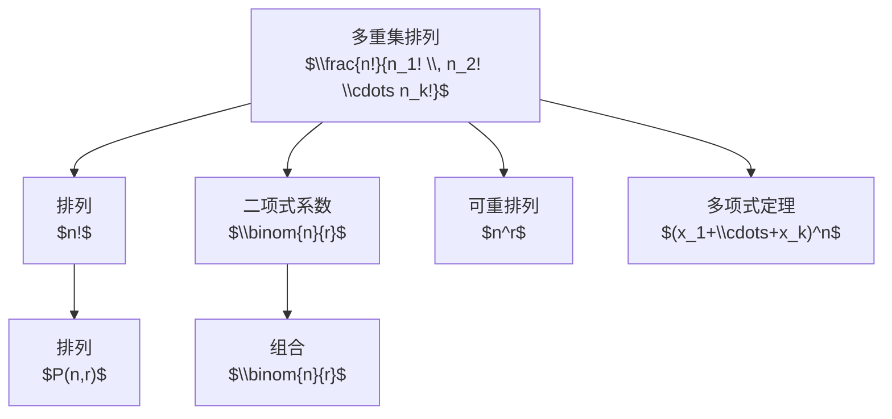

# 多重集排列

> [!abstract]
> ==多重集排列（Permutation of Multiset）==解决的是"当元素存在重复时，不同排列有多少种"的问题。其核心公式 $\frac{n!}{n_1! \, n_2! \cdots n_k!}$ 是排列计数从"全不同"到"有重复"的自然推广，在概率论、统计学和编码理论中有广泛应用。

## 定义

> [!def] 多重集（Multiset）
> 多重集是集合的推广，允许同一元素出现多次。一个多重集可以表示为：
> $$M = \{n_1 \cdot a_1, \; n_2 \cdot a_2, \; \cdots, \; n_k \cdot a_k\}$$
> 其中 $a_i$ 是第 $i$ 种不同元素，$n_i$ 是该元素的重数（出现次数），总元素数为 $n = n_1 + n_2 + \cdots + n_k$。

> [!def] 多重集排列数（Number of Permutations of a Multiset）
> 设多重集 $M$ 包含 $k$ 种不同元素，第 $i$ 种元素有 $n_i$ 个，总元素数 $n = \sum_{i=1}^{k} n_i$，则 $M$ 的所有不同排列的总数为：
> $$
> \frac{n!}{n_1! \, n_2! \, \cdots \, n_k!}
> $$
> 该数也称为**多项式系数**（Multinomial Coefficient），记作 $\binom{n}{n_1, n_2, \ldots, n_k}$。

## 核心性质

| 编号 | 性质 | 公式 / 说明 |
|:---:|------|------------|
| 1 | **退化到普通排列** | 当所有 $n_i = 1$（即 $k = n$）时，$\frac{n!}{1! \cdot 1! \cdots 1!} = n!$，退化为全排列 |
| 2 | **退化到可重排列** | 当只有1种元素（$k=1$）时，$\frac{n!}{n!} = 1$，即只有一种排列 |
| 3 | **与二项式系数的关系** | 当 $k = 2$ 时，$\frac{n!}{n_1! \, n_2!} = \binom{n}{n_1}$，即二项式系数 |
| 4 | **多项式定理** | $(x_1 + x_2 + \cdots + x_k)^n$ 展开式中 $x_1^{n_1} x_2^{n_2} \cdots x_k^{n_k}$ 的系数恰为 $\frac{n!}{n_1! \, n_2! \cdots n_k!}$ |
| 5 | **与可重排列的区别** | [[可重排列]]中每类物体数量无限（排列数 $n^r$）；多重集排列中每类物体数量有限（由重数 $n_i$ 决定） |

## 关系网络

## 章节扩展

- **第6.5节**：本概念是Rosen教材第6.5节的重要内容，与[[可重排列]]并列，分别处理"有限重复"和"无限重复"两种场景。
- **经典例题 — MISSISSIPPI**：单词 MISSISSIPPI 中，M 出现1次，I 出现4次，S 出现4次，P 出现2次，总字母数 $n = 11$，不同排列数为：
  $$
  \frac{11!}{1! \times 4! \times 4! \times 2!} = \frac{39916800}{1 \times 24 \times 24 \times 2} = \frac{39916800}{1152} = 34650
  $$
- **概率应用**：在等概率假设下，从多重集中随机抽取一个排列，每种特定排列出现的概率为 $\frac{n_1! \, n_2! \cdots n_k!}{n!}$。

## 补充

> [!info] 公式推导思路
> 若 $n$ 个物体**全不相同**，则有 $n!$ 种排列。但由于第 $i$ 种元素的 $n_i$ 个个体**不可区分**，交换它们不产生新排列，因此需要除以 $n_i!$。对所有 $k$ 种元素都做此修正，得到 $\frac{n!}{n_1! \, n_2! \cdots n_k!}$。

> [!info] 多项式系数的递推关系
> $$\binom{n}{n_1, n_2, \ldots, n_k} = \sum_{i=1}^{k} \binom{n-1}{n_1, \ldots, n_i - 1, \ldots, n_k}$$
> 类似于二项式系数的帕斯卡恒等式，该递推关系体现了"第一步选择哪类元素"的思想。

## 参见

- [[排列]] — 不允许重复的全排列与部分排列
- [[可重排列]] — 每类物体数量无限的排列与组合
- [[组合]] — 不允许重复的组合
- [[分配问题]] — 物体分配到盒子的计数模型
