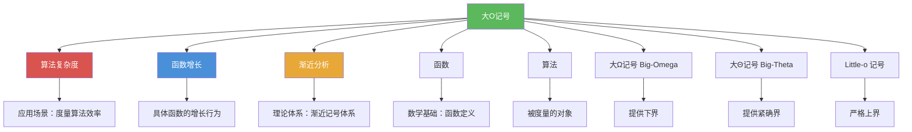

# 大O记号

> [!abstract] 概述
> ==大O记号（Big-O Notation）==是描述函数增长速率上限的数学工具，记作 $f(x) = O(g(x))$，表示存在常数 $C$ 和 $k$ 使得 $|f(x)| \le C|g(x)|$ 对所有 $x > k$ 成立。大O记号由德国数学家 **Paul Bachmann** 于 1894 年首次引入，后经 **Edmund Landau** 推广，因此也称为 Bachmann-Landau 记号。大O记号是==渐近分析==体系的核心，与==大$\Omega$记号==（下界）、==大$\Theta$记号==（紧确界）和==Little-o记号==（严格上界）共同构成完整的渐近记号体系，是==算法复杂度分析==的理论基础。

## 定义

> [!def] 大O记号（Big-O Notation）
>
> 设 $f$ 和 $g$ 是从整数集或实数集到实数集的函数。若存在常数 $C$ 和 $k$ 使得
>
> $$|f(x)| \leq C|g(x)| \quad \text{对所有 } x > k$$
>
> 则称 $f(x)$ 是 $O(g(x))$，读作"$f(x)$ 是大O的 $g(x)$"。
>
> - 常数 $C$ 和 $k$ 称为该关系的==证人（witnesses）==
> - 直觉含义：$f(x)$ 的增长速度不超过 $g(x)$ 的某个常数倍
> - 若 $f(x) = O(g(x))$ 且 $|h(x)| > |g(x)|$（$x$ 足够大时），则 $f(x) = O(h(x))$

> [!def] 大$\Omega$记号（Big-Omega Notation）
>
> 设 $f$ 和 $g$ 是从整数集或实数集到实数集的函数。若存在正常数 $C$ 和 $k$ 使得
>
> $$|f(x)| \geq C|g(x)| \quad \text{对所有 } x > k$$
>
> 则称 $f(x)$ 是 $\Omega(g(x))$，读作"$f(x)$ 是大Omega的 $g(x)$"。
>
> - 大$\Omega$ 提供函数增长的==下界==
> - 关键对偶关系：$f(x) = \Omega(g(x))$ 当且仅当 $g(x) = O(f(x))$

> [!def] 大$\Theta$记号（Big-Theta Notation）
>
> $f(x) = \Theta(g(x))$ 当且仅当 $f(x) = O(g(x))$ 且 $f(x) = \Omega(g(x))$。
>
> 等价定义：存在正常数 $C_1$、$C_2$ 和 $k$ 使得
>
> $$C_1|g(x)| \leq |f(x)| \leq C_2|g(x)| \quad \text{对所有 } x > k$$
>
> - $\Theta$ 表示两个函数==同阶增长（same order）==
> - $f(x) = \Theta(g(x))$ 当且仅当 $f(x) = O(g(x))$ 且 $g(x) = O(f(x))$

> [!def] Little-o 记号
>
> $f(x) = o(g(x))$（读作"$f(x)$ 是 little-o 的 $g(x)$"）当且仅当
>
> $$\lim_{x \to \infty} \frac{f(x)}{g(x)} = 0$$
>
> - Little-o 表示 $f(x)$ 的增长==严格小于== $g(x)$
> - $f(x) = o(g(x))$ 蕴含 $f(x) = O(g(x))$，但反之不成立
> - 例如：$x^2 = o(x^3)$，$x\log x = o(x^2)$，但 $x^2 + x + 1 \neq o(x^2)$

## 核心性质

| 性质 | 描述 | 公式/条件 |
|------|------|----------|
| 多项式的大O估计 | 多项式的阶由最高次项决定 | $a_n x^n + \cdots + a_0 = O(x^n)$ |
| 多项式的大$\Theta$估计 | 多项式的紧确界等于最高次项 | $a_n x^n + \cdots + a_0 = \Theta(x^n)$（$a_n \neq 0$） |
| 和的大O估计 | 两个大O函数之和取较大者 | $f_1 = O(g_1)$，$f_2 = O(g_2)$ $\Rightarrow$ $f_1 + f_2 = O(\max(g_1, g_2))$ |
| 同阶函数之和 | 同为 $O(g)$ 的函数之和仍为 $O(g)$ | $f_1 = O(g)$，$f_2 = O(g)$ $\Rightarrow$ $f_1 + f_2 = O(g)$ |
| 积的大O估计 | 两个大O函数之积 | $f_1 = O(g_1)$，$f_2 = O(g_2)$ $\Rightarrow$ $f_1 \cdot f_2 = O(g_1 \cdot g_2)$ |
| 传递性 | 大O关系可传递 | $f = O(g)$ 且 $g = O(h)$ $\Rightarrow$ $f = O(h)$ |
| Little-o 蕴含大O | 严格上界蕴含上界 | $f = o(g)$ $\Rightarrow$ $f = O(g)$ |
| O 与 $\Omega$ 的对偶性 | 上下界互为对偶 | $f = \Omega(g)$ $\iff$ $g = O(f)$ |

> [!def] 常见大O复杂度层级
>
> 以下复杂度按增长速度从慢到快排列：
>
> $$O(1) < O(\log n) < O(n) < O(n \log n) < O(n^2) < O(2^n) < O(n!)$$
>
> | 复杂度 | 术语 | 典型算法 |
> |--------|------|---------|
> | $\Theta(1)$ | 常数复杂度 | 取列表首元素 |
> | $\Theta(\log n)$ | 对数复杂度 | 二分搜索 |
> | $\Theta(n)$ | 线性复杂度 | 线性搜索 |
> | $\Theta(n\log n)$ | 线性对数复杂度 | 归并排序 |
> | $\Theta(n^2)$ | 多项式复杂度 | 冒泡排序、插入排序 |
> | $\Theta(2^n)$ | 指数复杂度 | 穷举搜索 |
> | $\Theta(n!)$ | 阶乘复杂度 | 旅行商问题穷举 |

## 关系网络

- [[算法复杂度]] -- 大O记号的核心应用场景，用于度量算法的时间和空间效率
- [[函数增长]] -- 提供具体函数的增长行为，是大O记号分析的对象
- [[渐近分析]] -- 大O记号所属的理论体系，包含五种渐近记号的完整框架
- [[函数]] -- 大O记号的数学基础，定义在实值函数之上
- [[算法]] -- 大O记号所度量的对象，通过复杂度分析比较不同算法的效率

## 章节扩展

### 第3章：算法

大O记号是第 3 章的核心数学工具，贯穿 3.2 节和 3.3 节：

- **3.1 算法**：算法的伪代码描述与基本概念，为复杂度分析提供度量对象
- **3.2 函数的增长**：系统介绍大O、大$\Omega$、大$\Theta$、Little-o 四种渐近记号的定义、性质与运算规则，以及常见函数的增长阶比较
- **3.3 算法复杂度分析**：将大O记号应用于具体算法（线性搜索 $\Theta(n)$、二分搜索 $\Theta(\log n)$、冒泡排序 $\Theta(n^2)$、归并排序 $O(n\log n)$），分析最坏情况、平均情况和最好情况

## 补充

> [!info] 大O记号的历史与学术来源
>
> 大O记号由德国数学家 **Paul Bachmann** 于 1894 年在其解析数论著作 *Analytische Zahlentheorie* 中首次引入，后经 **Edmund Landau**（1909）在解析数论研究中广泛推广使用，因此也被称为"Bachmann-Landau 记号"。**Donald Knuth** 在 1976 年的论文 "Big Omicron and Big Omega and Big Theta" 中进一步规范了 $O$、$\Omega$、$\Theta$ 三种记号的定义与用法，使其成为计算机科学中算法分析的通用标准。
>
> 忽略常数因子的核心原因在于：当 $n$ 足够大时，常数因子的影响被增长阶完全主导。例如 $0.001n^2$ 最终会超过 $1000n\log n$。不同编程语言或硬件平台之间的常数因子差异可达 10-100 倍，但这些差异无法改变算法的渐近阶。
>
> **学术来源**：
> - Bachmann, P. (1894). *Analytische Zahlentheorie*. Leipzig: Teubner.
> - Landau, E. (1909). *Handbuch der Lehre von der Verteilung der Primzahlen*. Leipzig: Teubner.
> - Knuth, D. E. (1976). "Big Omicron and Big Omega and Big Theta." *ACM SIGACT News*, 6(2), 18-24.

## 参见

- [[算法]] -- 大O记号所度量的对象，算法的效率通过大O记号来描述
- [[算法复杂度]] -- 大O记号在算法分析中的具体应用，包括时间复杂度与空间复杂度
- [[函数增长]] -- 常见增长函数的比较与排序，是大O记号分析的基础
- [[渐近分析]] -- 大O记号所属的理论体系，包含完整的渐近记号框架
- [[函数]] -- 大O记号的数学基础，渐近记号定义在实值函数之上
