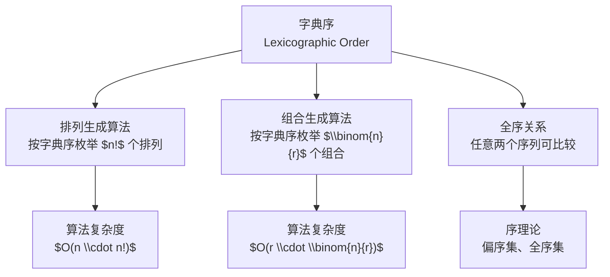

# 字典序

> [!abstract]
> ==字典序（Lexicographic Order）==是将字母表顺序（词典排列方式）推广到任意有限序列上的全序关系。在离散数学中，字典序是系统性枚举排列和组合的基础框架，[[排列生成算法]]和[[组合生成算法]]都基于字典序来保证枚举的完备性和无重复性。

## 定义

> [!def] 字典序（Lexicographic Order）
> 设 $\Sigma$ 是一个具有全序关系 $<$ 的字母表。对于 $\Sigma$ 上的两个序列 $a = (a_1, a_2, \ldots, a_m)$ 和 $b = (b_1, b_2, \ldots, b_n)$，定义 $a <_{\text{lex}} b$ 当且仅当：
> - 存在某个位置 $i \leq \min(m, n)$，使得 $a_i < b_i$，且对所有 $j < i$，有 $a_j = b_j$；或者
> - $m < n$，且对所有 $j \leq m$，有 $a_j = b_j$（即 $a$ 是 $b$ 的真前缀）。
>
> **直观理解**：与英语词典中单词的排列方式完全一致——从左到右逐位比较，第一个不同的位置决定顺序。

> [!def] 排列的字典序
> 设所有排列基于元素的自然顺序（如 $1 < 2 < \cdots < n$）。排列 $p = (p_1, p_2, \ldots, p_n)$ 的字典序定义为：从左到右逐位比较，第一个不同的位置上数值较小的排列在前。
>
> **例**：$n = 3$ 时，所有排列按字典序为：
> $123 < 132 < 213 < 231 < 312 < 321$

> [!def] 组合的字典序
> $r$-组合表示为递增序列 $c = (c_1, c_2, \ldots, c_r)$，其中 $c_1 < c_2 < \cdots < c_r$。字典序定义为从左到右逐位比较。
>
> **例**：从 $\{1,2,3,4,5\}$ 中取3个的组合按字典序为：
> $123 < 124 < 125 < 134 < 135 < 145 < 234 < 235 < 245 < 345$

## 核心性质

| 编号 | 性质 | 说明 |
|:---:|------|------|
| 1 | **全序性** | 字典序是集合上所有序列之间的全序关系，任意两个不同序列都可比较 |
| 2 | **首末元素确定性** | 排列的字典序首元素为 $(1, 2, \ldots, n)$，末元素为 $(n, n-1, \ldots, 1)$；组合的首元素为 $(1, 2, \ldots, r)$，末元素为 $(n-r+1, \ldots, n)$ |
| 3 | **后继的唯一性** | 除末元素外，每个排列/组合在字典序中有唯一的后继；除首元素外，有唯一的前驱 |
| 4 | **与生成算法的关系** | [[排列生成算法]]和[[组合生成算法]]的核心步骤都是"求当前序列在字典序中的后继" |
| 5 | **推广性** | 字典序可推广到任意长度的字符串、笛卡尔积的元素、子集等，是计算机科学中最常用的序之一 |

## 关系网络

## 章节扩展

- **第6.6节**：本概念是Rosen教材第6.6节的基础，直接服务于排列和组合的生成算法。
- **子集的字典序**：可以将子集编码为特征向量（如 $\{1,3\}$ 编码为 $(1,0,1,0,0)$），然后按字典序枚举所有 $2^n$ 个子集。
- **Topological Sort与字典序**：在有向无环图（DAG）的拓扑排序中，当存在多个可选节点时，按字典序选择可得到唯一的字典序最小的拓扑排序。

## 补充

> [!info] 字典序与格雷序的对比
> | 特性 | 字典序 | 格雷序（Gray Code） |
> |------|--------|-------------------|
> | 相邻序列差异 | 可能变化多位 | 恰好变化一位 |
> | 生成算法复杂度 | $O(n \cdot n!)$ | $O(n!)$ |
> | 适用场景 | 通用枚举 | 硬件设计、汉诺塔 |
> | 直观性 | 符合直觉 | 不太直观 |

> [!info] 判断字典序后继的存在性
> 对于排列 $p$，若存在 $i$ 使得 $p_i < p_{i+1}$，则 $p$ 不是字典序最后一个排列。等价地，若 $p$ 不是完全递减序列 $(n, n-1, \ldots, 1)$，则存在后继。这一性质是[[排列生成算法]]的终止条件。

## 参见

- [[排列生成算法]] — 基于字典序的排列枚举算法
- [[组合生成算法]] — 基于字典序的组合枚举算法
- [[排列]] — 排列的基本概念
- [[组合]] — 组合的基本概念
